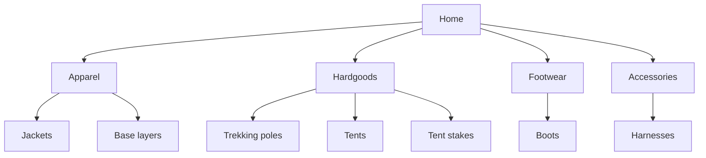
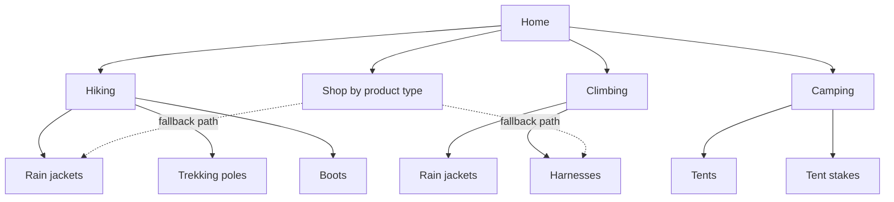

import Scenario from "../../../components/Scenario.astro";

<Scenario label="The redesign brief">
  <Fragment slot="facts">
    
Tree test results (before)

    <table class="not-prose w-full text-xs">
      <tr><td class="pr-2 font-semibold text-slate-500">Rain jacket</td><td>34% success, avg 3 wrong turns</td></tr>
      <tr><td class="pr-2 font-semibold text-slate-500">Trekking poles</td><td>51% success, avg 2 wrong turns</td></tr>
      <tr><td class="pr-2 font-semibold text-slate-500">Tent stakes</td><td>88% success, avg 0.4 wrong turns</td></tr>
    </table>
    
Card sort signal

    

      
🥾 82% grouped "rain jacket" under a self-named "Hiking" pile

      
🧗 61% grouped it under "Climbing" too, not exclusively

    

  </Fragment>

Trailhead's support team logged 40 "can't find it" tickets in a month,
all pointing at the same handful of products — rain jackets and
trekking poles worst, tent stakes barely at all. Before rebuilding
anything, the team needed to know: is this a labeling problem, a
hierarchy problem, or both — and for which products?

</Scenario>

## Step 1 — Audit the existing structure

**Guiding question: before proposing anything new, what does the
current tree actually look like, end to end?**

The live site's structure, drawn out (not guessed at — pulled straight
from the nav's HTML):

This is a perfectly coherent tree — for a warehouse manager. Every
product has exactly one home, matching exactly one purchasing category.
That's the implementation model, mapped 1:1 onto the visitor-facing nav.

## Step 2 — Find the mismatch, don't guess at it

**Guiding question: which specific products are actually hard to find,
and is the cause the same for all of them?**

Two techniques, used together because they answer different questions:

- **Open card sort** (24 participants, no menu shown): sort 30 product
  names into self-named piles. 82% of participants independently
  created a pile they called "Hiking" and put the rain jacket in it.
  61% *also* put it in a "Climbing" pile — a genuine cross-listing
  signal, not noise.
- **Tree test** (60 participants, given only the existing menu labels
  and a task like "find something to keep you dry hiking in the rain",
  no visual design shown): measures whether the *current* tree lets
  people complete real tasks, isolated from how the page looks.

| Product        | Tree test success | Card-sort category            | Diagnosis                              |
| -------------- | ------------------ | ------------------------------ | ---------------------------------------- |
| Rain jacket    | 34%                 | Hiking (82%), Climbing (61%)   | Wrong branch *and* needs 2 branches      |
| Trekking poles | 51%                 | Hiking (74%)                    | Wrong branch, one clear home             |
| Tent stakes    | 88%                 | Camping (91%)                   | Already fine — "Hardgoods" happened to work here because campers browse there anyway |

Tent stakes score well under the *old* nav not because "Hardgoods" is a
good label, but because campers shopping for a tent already land in
that section and stakes are a natural add-on nearby — a reminder that a
tree test measures the whole path, not just the label at the top.

## Step 3 — Redesign around the activity, not the warehouse

**Guiding question: what's the smallest structural change that fixes
the diagnosed products without breaking the ones that already work?**

Two decisions worth naming explicitly:

1. **Rain jackets are cross-listed** under both Hiking and Climbing —
   the product page is one page; the taxonomy just gives it two valid
   paths in. This directly answers the card-sort signal instead of
   forcing a single "best" category onto a product that genuinely
   serves two activities.
2. **"Shop by product type" stays, as a secondary path** — a smaller,
   flatter branch for returning visitors who already think in
   warehouse terms ("I know I want a jacket, skip the activity
   question"). The old hierarchy isn't deleted, it's demoted from the
   only path to a fallback one — because the tree test showed some
   visitors do search or browse this way successfully already, and a
   redesign that removes a working path for some visitors to fix it for
   others is trading one findability problem for another.

## Trade-offs

**Breadth vs. depth, revisited with real numbers.** The old tree was 4
top-level categories, avg depth 2 (Home → Department → Product). The
new tree is 3 activity categories + 1 fallback, same depth — breadth
barely changed. What actually moved was **label-to-mental-model
alignment**, not tree shape. This matters: a redesign that only
flattens or widens the tree without fixing labels can leave findability
just as broken, dressed up differently.

**When flat beats hierarchical.** For a catalog this size (roughly 200
SKUs), 3-4 top-level branches work. A catalog of 20,000 SKUs (a large
general retailer) can't use 3-4 branches without each one becoming
another unnavigable dumping ground — it needs more top-level branches,
faceted filtering within them, and heavier reliance on search, because
no hierarchy shallow enough to browse quickly can also be narrow enough
to be useful at that scale. Flat works when the total item count is low
enough that a single unstructured list is scannable; hierarchy earns
its complexity cost only once flat stops being scannable.

## Edge cases

- **Cross-listed items multiply maintenance cost.** Every product
  reachable from two branches needs both breadcrumbs, both sets of
  filters, and both to be updated if the product changes — cross-listing
  fixes findability but isn't free; it's a deliberate trade of ongoing
  maintenance for immediate findability, not a free win.
- **Taxonomies rot as the catalog grows.** "Hiking" made sense at 200
  SKUs. At 2,000, "Hiking" alone becomes another dumping ground exactly
  like "Hardgoods" was — the fix that solved this redesign has a shelf
  life, not a permanent one, and re-testing after growth is part of
  maintaining an IA, not a one-time project.
- **A label that's right for one audience can be wrong for another.**
  "Hiking" assumes the visitor already knows they're hiking. A total
  beginner shopping for "something for walking outside" may not
  self-classify as a hiker yet — which is exactly why the fallback
  "Shop by product type" path and search both stay, rather than betting
  everything on one taxonomy being right for every visitor.

**Extend it yourself: what would change about this redesign for a
mobile-first version, where there's no room to show 4 top-level
branches plus a search bar all at once on first load? And separately —
suppose Trailhead's catalog grows 10x over two years by adding running,
cycling, and fishing gear. Which parts of this redesign keep working
unchanged, and which ones would need to be re-tested from scratch?**
This redesign is a worked case, not a template to copy onto every
catalog — the technique (audit, card sort, tree test, redesign,
re-test) generalizes; the specific tree does not.
