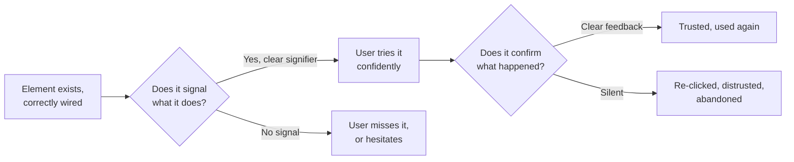

import Scenario from "../../../components/Scenario.astro";
import LevelIntro from "../../../components/LevelIntro.astro";

<Scenario>
  <Fragment slot="facts">
    

      
👻 "Archive" — plain text, no border, no icon, no cursor change

      
🖱️ Looks identical whether hovered or not

      
🤷 Nothing visibly happens for half a second after clicking

    

    

      
📊 Usability test: 6 of 10 users never tried clicking it

      
🔁 3 of the other 4 clicked it two or three times, unsure it registered

    

  </Fragment>

A designer wants a clean inbox, so the "Archive" label on each row is styled as plain gray text — no button outline, no background, no icon. It is wired up correctly: clicking it fires the right request and the row disappears from the list. In a usability test, six of ten people never try clicking it at all. Of the four who do, three click it two or three times each, because nothing on screen changed in the first instant after the click.

| What the code does                          | What the user experiences                                       |
| ------------------------------------------- | --------------------------------------------------------------- |
| The label is a real, correctly wired button | It reads as decorative text — nothing about it says "clickable" |
| The click handler fires instantly on click  | No visible change for ~400ms while the row animates out         |
| The row is removed exactly once per click   | Repeated clicking, unsure if the first click "took"             |

**Before reading on: the button has zero bugs. So why did six out of ten people never even try it?**

</Scenario>

Nothing here is broken code — the click handler is correct, the request succeeds, the row disappears. What failed is something upstream of all of that: the button never looked like something you could click, and once clicked, it never confirmed that anything had happened.

<LevelIntro
  items={[
    "Affordances vs. signifiers — what looks usable vs. what says how",
    "Feedback loops — confirming an action actually landed",
    "Interaction patterns — reusable, recognizable solutions",
  ]}
/>

Think of a real door with a flat metal plate on it. Nothing about a flat
plate suggests "pull" — most people push it first, feel it not budge, then
try pulling. The door was never broken. It just never told anyone which way
it opens. A "push" or "pull" label fixes it without changing the door
itself — the label is a hint layered on top of what the door can already do.

Quick translation for the technical words in the scenario:

| Term             | Plain version                                                                |
| ---------------- | ---------------------------------------------------------------------------- |
| Click handler    | The code that runs when something is clicked                                 |
| Wired up         | Connected correctly to the code that does the work                           |
| Fires a request  | Sends a message asking the system to do something                            |
| Renders/animates | The visual change that plays out on screen                                   |
| Usability test   | Watching real people try to use something, without help, to see what happens |

- An **affordance** is what an object or element can actually do — a button can be clicked, a slider can be dragged, a switch can be flipped. The plain-text "Archive" label had a real affordance (it truly was clickable) but no way to communicate it.
- A **signifier** is the visible signal that tells someone an affordance exists — a border, a shadow, a cursor change, an underline. The door-plate example has an affordance (you can pull it) with no signifier at all; the "Archive" button has the same gap.
- A **feedback loop** is what happens after the action: does the interface confirm the click landed, or does it leave the user guessing and re-clicking? The 400ms of silence after the click is a missing feedback loop, not a missing feature.
- An **interaction pattern** is a reusable, already-learned solution to a common problem — a dropdown, a toggle switch, a modal, a swipe-to-delete row. Using an established pattern means the user's past experience does the explaining for you, instead of every screen teaching its own private rules from scratch.
- **Predictable is not the same as boring.** A pattern being familiar (a checkbox looks like a checkbox everywhere) is what makes it fast and safe to use. What varies without breaking that safety is the surface: color, motion, icon style, copy — personality can live in the skin of an interaction without living in its rules.
- The skill this unit builds is **noticing the gap between what an element can do and what it visibly says it can do** — because a correctly coded interaction that never signals its own affordance, or never confirms its own outcome, fails the person using it exactly as badly as a real bug would.

| Failure in the scenario                 | What it's actually missing           |
| --------------------------------------- | ------------------------------------ |
| Plain gray text, no border or hover cue | A signifier for a real affordance    |
| No visible change in the first instant  | A feedback loop confirming the click |
| A hand-rolled label instead of a button | An established interaction pattern   |
