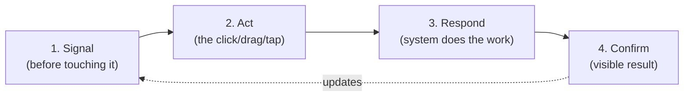

import Scenario from "../../../components/Scenario.astro";
import LevelIntro from "../../../components/LevelIntro.astro";
import Checkpoint from "../../../components/Checkpoint.astro";

L1 established that a correctly coded element can still fail if it never
signals what it does or never confirms what happened. L2 works out the
actual model behind that: every interaction has a "before" half and an
"after" half, and a pattern is what lets you skip re-inventing either one.

<LevelIntro
  items={[
    "The interaction loop: signal, act, respond, confirm",
    "Real affordance vs. perceived affordance (the signifier)",
    "Why a familiar pattern is fast precisely because it's boring",
  ]}
/>

## One interaction, four moments

A click is not a single event — it is a small round-trip with a before and
an after. Before writing any of them off as "just styling," what would
actually go wrong if each one were silently skipped?



| Moment  | Question it answers                     | Skipped, it looks like                                 |
| ------- | --------------------------------------- | ------------------------------------------------------ |
| Signal  | Can I do something here?                | The plain-text "Archive" label from L1 — no cue at all |
| Act     | Did my input register?                  | A button with no `:active` state — feels unresponsive  |
| Respond | Is the system doing what I asked?       | A slow request with no spinner — feels frozen          |
| Confirm | Did it actually work, and what changed? | The row vanishing with zero transition or message      |

Signal and Confirm are the two moments L1 named directly (signifier, feedback loop). Act and Respond are the two in between — the actual work happening, and the interface proving it noticed the attempt at all.

<Checkpoint question="A 'Save' button has a visible press animation (Act) and a spinner while the request is in flight (Respond), but the button itself looks completely identical to normal body text until you hover over it. Is this interaction fully fixed?">

No — it fixed two of the four moments and left one open. Act and Respond are both solid: the button visibly presses, and a spinner shows the system is working. But Signal, the very first moment, is still missing — nothing about the element's resting appearance says "this is clickable" before someone happens to move a cursor over it. On a touch device there's no hover at all, so that group of users gets no signal whatsoever until they stumble onto it by accident. Each of the four moments has to hold on its own; fixing three doesn't compensate for the fourth being absent for an entire class of users.

</Checkpoint>

## Real affordance vs. the signifier that announces it

Don Norman's distinction, still the reference: an **affordance** is a real, physical or logical possibility — a chair affords sitting whether or not it looks sittable, a `<div>` with a click handler affords clicking whether or not it looks clickable. A **signifier** is the perceivable signal that tells someone the affordance is there — a cursor change, a shadow, an underline, a raised edge.

The gap between the two is where most "it works but nobody uses it" bugs live: the affordance was never missing, only its signifier was.

```css
/* No affordance signaled at rest — L1's exact bug */
.archive-label {
  color: #6b7280;
  cursor: default; /* actively hides the one free signifier a browser gives you */
}

/* Minimal signifiers restored, same underlying element */
.archive-button {
  color: #6b7280;
  cursor: pointer;
  border-radius: 6px;
  transition:
    background-color 120ms ease,
    transform 80ms ease;
}
.archive-button:hover {
  background-color: rgba(107, 114, 128, 0.1);
}
.archive-button:active {
  transform: scale(0.97);
}
.archive-button:focus-visible {
  outline: 2px solid #38bdf8;
  outline-offset: 2px;
}
```

Nothing about what the button _does_ changed between the two blocks — the click handler, the request, the row removal are identical. Only the signifiers changed: `cursor: pointer` restores the one signal browsers give you for free, `:hover` and `:active` cover Signal and Act, and `:focus-visible` extends the same signal to keyboard users, who never trigger `:hover` at all.

| Signifier              | Which moment it covers | Who loses it if it's missing          |
| ---------------------- | ---------------------- | ------------------------------------- |
| `cursor: pointer`      | Signal                 | Mouse/trackpad users                  |
| `:hover` style change  | Signal                 | Mouse/trackpad users                  |
| `:active` style change | Act                    | Everyone — confirms the press landed  |
| `:focus-visible` ring  | Signal                 | Keyboard-only and screen-reader users |
| Loading/spinner state  | Respond                | Everyone, on any slower request       |

## Why a pattern is fast precisely because it's boring

A brand-new, never-seen-before interaction has to teach itself from nothing — every signifier has to be discovered by trial. Given that, what does reusing a _known_ pattern actually buy you that a novel one can't?

- An **interaction pattern** is a reusable solution to a recurring problem — a toggle switch for a binary on/off setting, a modal for an interruption that needs a decision, a dropdown for choosing one of several options, swipe-to-delete for removing a row on touch.
- The value of a pattern isn't aesthetic — it's that the user's _prior experience_ supplies the signifiers for free. A checkbox someone has seen a thousand times before doesn't need a tutorial; its shape alone signals "binary choice" and its checked/unchecked states signal Confirm without any custom styling at all.
- This is also why patterns should be reserved for problems that genuinely match them. A toggle switch implies an _instant_, reversible effect (the setting takes effect the moment you flip it); using that same visual for a setting that requires clicking a separate "Save" button afterward breaks the pattern's implied promise — the pattern was recognized, but it lied.

<Scenario label="Quick check">
  <Fragment slot="facts">
    <div class="not-prose flex flex-col gap-1 text-sm text-slate-700 dark:text-slate-300">
      <div class="flex items-center gap-1.5"><span>1️⃣</span> Signal — can I do something here?</div>
      <div class="flex items-center gap-1.5"><span>2️⃣</span> Act — did my input register?</div>
      <div class="flex items-center gap-1.5"><span>3️⃣</span> Respond — is it working on it?</div>
      <div class="flex items-center gap-1.5"><span>4️⃣</span> Confirm — what actually changed?</div>
    </div>
  </Fragment>

A toggle switch flips instantly to its "on" position the moment it's tapped, but the setting it controls actually takes 3 seconds to apply on the server, and nothing on screen shows that gap. Which moment is broken, and what does the toggle's own pattern imply that makes this worse than it would be on, say, a "Save" button?

It's the **Confirm** moment (the switch shows "on" before the effect is real, so it can lie if the server call later fails), made worse specifically because **the toggle pattern implies instant effect** — that's the whole promise a toggle makes by looking like a toggle instead of a form field with a Save button. A "Save" button never made that promise, so a 3-second delay after clicking it is unremarkable; the same delay behind a toggle contradicts the pattern the user just recognized and trusted.

</Scenario>
