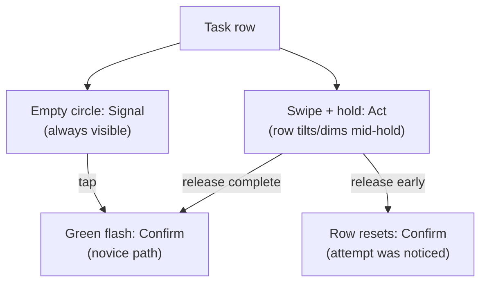

import Scenario from "../../../components/Scenario.astro";
import LevelIntro from "../../../components/LevelIntro.astro";
import Checkpoint from "../../../components/Checkpoint.astro";

## The interaction under audit

This example uses a mobile task-management app, but the pattern is
familiar anywhere a team invents its own gesture instead of reusing one:
a private messaging app's custom "hold to unsend," a photo app's custom
swipe-up for "save," a note-taking app's custom two-finger tap for
"archive." Whenever an app decides to skip a recognized pattern, the
question is the same one this unit keeps returning to: does the new
gesture have a real signifier, and does it confirm what it did?

<Scenario label="The interaction">
  <Fragment slot="facts">
    

      
📱 Task list, mobile app, "mark done" interaction

      
👆 Shipped as: swipe left, hold 400ms, release

      
🎯 No icon, no handle, no hint text on the row

    

    
Usability test result

    

      
📉 12% of first-time users discovered the gesture unprompted

      
💬 Most-repeated quote: "how do I mark this done?"

    

  </Fragment>

A task-management app team wants a task list that feels light and
uncluttered — no checkboxes, no icons, no buttons on each row, just the
task text. The interaction they ship: swipe a row left, hold for 400ms,
release, and the task marks itself done with a soft green flash. It
works, and the team who built it loves how it feels once you know it's
there. A round of usability testing with ten first-time users tells a
different story: only 12% discover the gesture on their own, and the most
common thing said out loud during the session is some version of "how do
I mark this done?"

**Before reading the audit below: nothing crashed, and the gesture itself is smooth once someone finds it. Using the four-moment model from L2, which moment is actually missing here — and is it one moment or more than one?**

</Scenario>

<LevelIntro
  items={[
    "Auditing a hidden gesture against the four-moment model",
    "The fix, and why a visible fallback matters more than the gesture itself",
    "Where a deliberately novel interaction is still the right call",
  ]}
/>

## Auditing the gesture, moment by moment

Discoverability failures rarely trace back to a single missing piece. Walking through the four moments from L2 one at a time: at which point does this interaction actually break down first, and does fixing that one point fix everything else downstream of it?

| Moment  | What happens today                                            | What's missing                                                                                |
| ------- | ------------------------------------------------------------- | --------------------------------------------------------------------------------------------- |
| Signal  | The row shows no icon, handle, underline, or hint of any kind | Nothing on the resting row suggests it can be swiped, held, or touched at all                 |
| Act     | Nothing visibly moves until the full 400ms hold completes     | No partial feedback during the hold — the row is either untouched or done, nothing in between |
| Respond | The 400ms hold plays out silently                             | No sense that _something_ is building toward an outcome                                       |
| Confirm | A soft green flash plays once the hold completes              | Present, but arrives too late to help anyone who already gave up before finishing the hold    |

The result: 88% of first-time users never get past Signal, so Act, Respond, and Confirm never even get exercised. This is the same shape as L2's toggle-switch example, but worse — a toggle at least has a visible shape to tap; this gesture has nothing on the row at all to interact with in the first place.

<Checkpoint question="The team's first instinct is to fix Confirm — make the green flash brighter and longer, on the theory that a more satisfying payoff will encourage people to find the gesture. Is that the right moment to fix first?">

No, and the usability numbers say why directly: 88% of people never complete the gesture at all, so they never reach Confirm in the first place — a more satisfying flash only rewards the 12% who already succeeded. The actual bottleneck is Signal: nobody discovers there's anything to try because the row gives no indication a gesture exists. Fixing a later moment in the loop before the earlier one is solid is fixing a step most users never reach; the ordering in the four-moment model isn't arbitrary — an earlier moment gates whether a later one ever gets exercised at all.

</Checkpoint>

## The fix: a visible fallback, not a better-hidden gesture

Making the gesture itself flashier doesn't solve a discoverability problem — it solves a delight problem for people who already found it. What actually needs to change is what's visible _before_ anyone touches the row at all.

**1. Restore Signal with a permanent, visible element.** Add a small circular outline on the right edge of each row — unfilled, meaning "not done." This alone does two jobs: it signals there's something interactive there at rest, and its shape (an empty circle, a near-universal completion signifier from checklists and to-do apps generally) tells the user what tapping it will probably do before they've tried anything.

**2. Keep the swipe as an accelerator, not the only path.** The circle is tappable on its own — a single tap marks the task done immediately, with the same green flash. The swipe gesture stays in the product for anyone who's already learned it and finds it faster, but it's no longer the _only_ way in. This is the same "novice path plus expert accelerator" idea from the usability-heuristics unit's flexibility-and-efficiency heuristic — a visible, guessable action for someone new, and a faster shortcut underneath it for someone fluent.

**3. Give Act a partial signal during the hold.** For people who do use the swipe, the row now tilts and dims proportionally as the hold progresses, instead of staying static until 400ms completes. Releasing early now visibly resets, rather than silently doing nothing — the interface admits it noticed the attempt even when the attempt doesn't finish.

**4. Move Confirm earlier relative to effort, not just louder.** The green flash stays, but now it's confirming an action a first-time user was actually likely to complete (a single tap on a visible circle), instead of only rewarding the rare person who stumbled through an undiscoverable 400ms hold.

None of these four fixes touched the underlying "mark done" operation — the same request fires either way. What changed is entirely what the row communicates before, during, and after the interaction, which is exactly L2's Signal/Act/Respond/Confirm loop applied to a real regression the team could measure.

## Where a hidden or novel interaction is still the right call

If discoverability always wins, no product would ever ship anything new — every interaction would default to the most familiar existing pattern forever. So when is inventing something unfamiliar actually the correct trade-off, rather than a mistake to walk back?

Two situations where it holds up:

- **The audience will use the product often enough to learn it once and benefit repeatedly.** A power-user keyboard shortcut, or an expert gesture layered _on top of_ a discoverable default (exactly what the task-app fix above does), earns its novelty because the learning cost is paid once and the speed gain compounds over hundreds of future uses. The mistake in the original version wasn't inventing the swipe — it was making the swipe the _only_ way in, for an audience that includes first-time users who'll never use the app often enough to stumble into it.
- **The unfamiliarity is doing real communicative work, not just decoration.** A first-run animation that walks a user through a genuinely new capability (a coach mark pointing at a new gesture, shown once and dismissible) can responsibly introduce novelty, because it pairs the new pattern with an explicit, temporary Signal that a permanent UI element doesn't need to carry forever afterward.

What doesn't hold up: novelty chosen because it "feels different" or "feels more polished" with no discoverability path at all, which is what the original task-row gesture was — 12% of first-time users is not an edge case, it's most of the audience being locked out of a core action.

<Checkpoint question="A different team, inspired by this audit, adds a one-time coach mark ('Swipe left to mark tasks done!') that appears the first time someone opens the task list, then never appears again — but keeps the gesture as the only way to mark a task done, with no permanent visible circle. Does this fully solve the discoverability problem the original audit found?">

Not fully. A coach mark shown once helps someone who happens to read it at that exact moment and remembers it later, but it doesn't create a durable, repeatable Signal the way a permanent visible element does — someone who dismisses it quickly, gets interrupted, or simply forgets what they read a week later is back to a row with no ongoing signifier at all. The original audit's fix kept the swipe as an accelerator specifically because a permanent circle is a signal that's always there to fall back on, not a signal that has to be caught and retained in one moment. A one-time coach mark is a reasonable _addition_ to a permanent Signal, but it's a weaker replacement for one.

</Checkpoint>

## Extending the redesign beyond this case

The task-row fix above was built for one audience: a general consumer app, used casually, on a touchscreen, where most sessions are short. That's one case, not the whole territory of "hidden interaction, low discovery."

**Before moving on: if this same problem — a core action reachable only through an undiscoverable gesture — showed up in a professional tool used for hours a day by the same small group of experts (an internal admin console, a video-editing timeline), would the same fix apply? What would you keep from the fix above, and what would you deliberately drop, given that this audience will use the product often enough to actually learn a gesture through repetition?** (A hint on scope, not the full answer: the permanent visible fallback probably still belongs there for new hires, but the _ratio_ of screen space it deserves relative to power-user accelerators shifts hard toward the accelerator once the audience is measured in daily hours rather than occasional taps.)

## A short table for reference

| Concept              | One-line test                                                                                                                           |
| -------------------- | --------------------------------------------------------------------------------------------------------------------------------------- |
| Affordance           | What can this element actually do, regardless of how it looks?                                                                          |
| Signifier            | Does anything visible say the affordance exists, before it's touched?                                                                   |
| Signal (moment 1)    | Can the user tell something is interactive at rest?                                                                                     |
| Act (moment 2)       | Does the interface confirm an input registered, even mid-gesture?                                                                       |
| Respond (moment 3)   | Does the system show it's working, if the work takes any real time?                                                                     |
| Confirm (moment 4)   | Does the outcome get shown clearly, and does it arrive after real effort was likely completed?                                          |
| Interaction pattern  | Is this solving a problem a recognized pattern already solves — and if not, why not?                                                    |
| Novel/hidden gesture | Does the audience use this often enough, or is the novelty paired with an explicit one-time teach, to earn skipping a visible fallback? |
