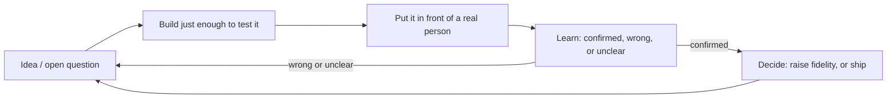
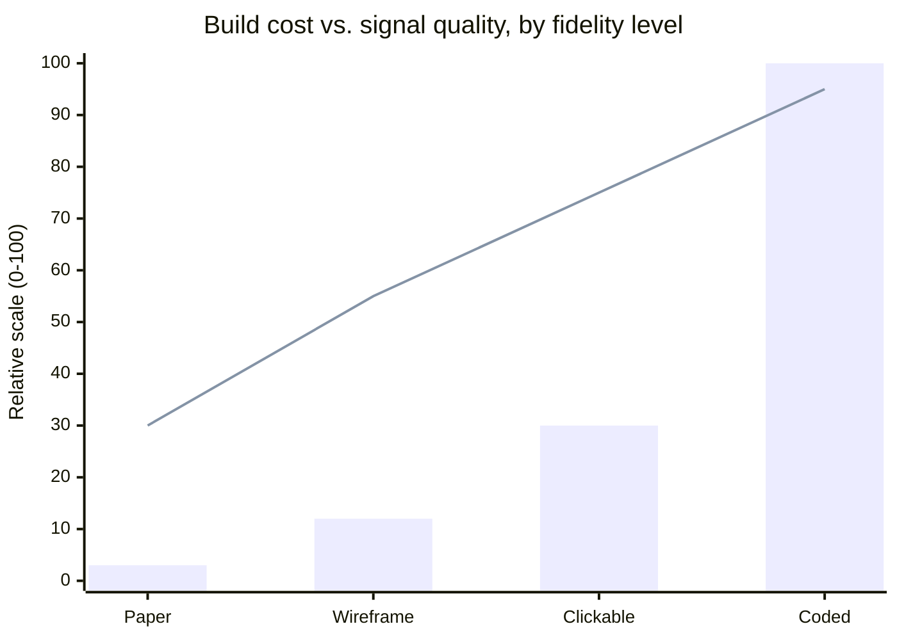

import LevelIntro from "../../../components/LevelIntro.astro";
import Checkpoint from "../../../components/Checkpoint.astro";

L1 established that fidelity is a spectrum and that a prototype's job is
to answer one question as cheaply as possible. L2 works out how to pick
the _right_ point on that spectrum — because picking wrong is its own
failure mode, in both directions.

<LevelIntro
  items={[
    "The feedback loop as a repeatable cycle",
    "Why loop length, not just build cost, is what you're really buying",
    "Matching fidelity to the *type* of question — not just its size",
  ]}
/>

## The loop, not just the prototype

A single prototype answers one round of questions. What happens to the
_next_ round — the one that only exists because the first round taught
you something?

Prototyping isn't a one-shot event; it's a loop. You build something
just real enough to test, show it to someone, learn from their reaction,
and use that to decide what to build (or fix) next — then, usually,
you do it again with a slightly more refined version:

The loop only stops feeding itself once an answer is confirmed enough to
justify the _next_, more expensive fidelity step — or confirmed enough
to build for real. A team that jumps straight to a coded prototype isn't
skipping steps in this diagram so much as **paying for the last loop
first**, before running any of the cheap ones that would have told them
whether it was worth reaching.

<Checkpoint question="A team runs one paper-sketch test, gets a mildly positive reaction, and ships the real feature immediately afterward — no clickable prototype, no coded test. Did they skip a step, or use the loop correctly?">

It depends entirely on how much confidence that one paper test actually
bought them relative to what's at stake. The loop isn't "always run all
four fidelity levels" — it's "keep looping until the confidence you have
matches the cost of being wrong." For a low-stakes cosmetic tweak, one
cheap round of feedback can be genuinely enough, and looping further
would just be wasted caution. For something like a checkout flow change,
where being wrong costs real revenue and a paper sketch can't tell you
whether the _interaction_ holds up, stopping after one mildly positive
paper test is very likely stopping too early — the loop was cut short
relative to what's at stake, not used correctly. The right number of
loops is a judgment call driven by risk, not a fixed count.

</Checkpoint>

## Loop length is what you're actually buying

Build cost and loop length move together, but they're not the same
thing to reason about. A three-week build isn't just three weeks of
work — what does it cost you in _how many times you get to be wrong and
still recover cheaply_, within a fixed project timeline?

If a project has, say, six weeks before a launch decision, a three-week
loop leaves room for exactly one round — build, test, and whatever you
learn is final, because there's no time left to act on it. A
half-day loop leaves room for a dozen rounds in that same six weeks.
Fidelity and loop length trade against each other on a curve, not a
straight line — cost rises much faster than the trustworthiness of the
answer you get back:

Notice the shape: going from a clickable prototype to a coded one costs
roughly three times as much as going from paper to clickable, but buys a
much smaller jump in how trustworthy the answer is. That gap is exactly
why "just build it for real to be sure" is usually the wrong default —
most of the achievable confidence was already available several rungs
down, for a fraction of the price.

## Fidelity isn't one dial — match it to the _type_ of question

Two teams can both be testing "does this feature work," yet need
completely different fidelity, because they're not actually asking the
same _kind_ of question. What's different between "will people
understand this flow" and "will this gesture feel good to use"?

- **Structural questions** — is the order right, is anything missing,
  does the flow make sense end to end? A paper sketch or a clickable
  prototype answers these well, because structure doesn't depend on
  real motion, real data, or real latency.
- **Interaction-feel questions** — does a drag, a swipe, a long-press,
  an animation feel responsive and natural? These need enough real
  behavior to actually _feel_ like the real thing — a static or
  click-through prototype fakes the destination screens but not the
  motion in between, which is exactly what's being tested.
- **Performance and scale questions** — does it stay usable with real
  data volumes, on a real network, under real load? No amount of visual
  or click-through fidelity answers this; only something running against
  real conditions can.

| Type of question                          | Needs at least                             | Why lower fidelity fails it                            |
| ----------------------------------------- | ------------------------------------------ | ------------------------------------------------------ |
| Structural (flow, order, wording)         | Paper sketch / clickable                   | The answer doesn't depend on real motion or data       |
| Interaction feel (drag, swipe, animation) | A prototype with real, running interaction | A click-through fakes the destination, not the motion  |
| Performance / scale                       | A real or near-real build                  | Real latency and real data can't be faked convincingly |

The mistake isn't "using low fidelity" or "using high fidelity" in the
abstract — it's using a fidelity level that can't actually answer the
question being asked, in either direction. Testing a structural question
with a coded prototype wastes weeks confirming something a sketch would
have shown in an hour. Testing an interaction-feel question with only a
click-through risks the opposite failure: a confident-looking "yes,
users liked it" that the real, coded version doesn't back up — because
the thing that actually mattered was never tested. L3 works through a
real version of both failures.
