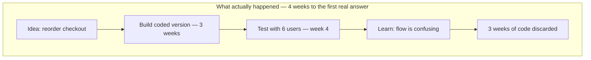
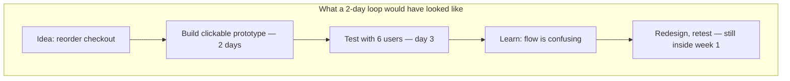

import Scenario from "../../../components/Scenario.astro";
import LevelIntro from "../../../components/LevelIntro.astro";
import Checkpoint from "../../../components/Checkpoint.astro";

<Scenario label="What actually happened">
  <Fragment slot="facts">
    
Checkout redesign

    

      
💻 Built coded, live-wired flow first

      
⏳ 3 weeks of engineering before any user saw it

      
❌ Test revealed users didn't understand the new order at all

      
💸 All 3 weeks discarded — back to the drawing board

    

  </Fragment>

The checkout team from L1 didn't run the cheap test first. They believed
the reordered flow so strongly that they went straight to a coded,
live-wired version — three weeks of real engineering — reasoning that a
sketch or click-through "wouldn't tell them anything real." They tested
it with six users in week four. Every one of them got lost at the
same step, misreading the reordered flow as a mistake in the site rather
than a deliberate redesign. The three weeks of code were shelved. The
question the team actually needed answered — _does this order make
sense to someone seeing it for the first time_ — was a structural
question, exactly the kind a two-day clickable prototype answers.

**Before reading on: what would a two-day version of this same test have looked like, and what would it have cost the team if the answer had come back wrong at that point instead of week four?**

</Scenario>

The team didn't fail because they built something bad — the reordered
flow, once redesigned properly, later did reduce abandonment. They
failed because they picked a fidelity level that made being wrong
maximally expensive, for a question that didn't need it.

<LevelIntro
  items={[
    "A slow loop: the checkout team paid for the expensive answer first",
    "A false-confidence loop: a low-fidelity test that couldn't test the real risk",
    "How to tell, before building anything, what fidelity a question actually needs",
  ]}
/>

## Failure one: the loop that was too slow

Every extra week between "we have an idea" and "we know if it's right"
is a week where the team keeps investing in a direction that might
already be wrong. What does that cost look like laid out on a timeline?

Compare that to the loop that should have run first:

Same result — "the flow is confusing" — reached in three days instead
of four weeks, at close to zero engineering cost. The cheap loop doesn't
just save money; it leaves time to run it _again_ after fixing the
problem, still inside the original timeline. The coded loop, once wrong,
has no time left to recover inside a normal sprint cadence — the team
has to either ship something they now know is broken, or blow the
schedule to redo it.

|                                    | Coded-first (what happened)                       | Clickable-first (what should have happened) |
| ---------------------------------- | ------------------------------------------------- | ------------------------------------------- |
| Time to first real answer          | 4 weeks                                           | 3 days                                      |
| Cost of being wrong                | 3 weeks of engineering                            | A few hours of prototyping                  |
| Loops possible in the same 4 weeks | 1                                                 | Several                                     |
| What was actually being tested     | A structural question (does the order make sense) | The same structural question                |

<Checkpoint question="A teammate argues: 'the coded version was still useful — at least now we know exactly what to fix in the real code.' Is that a fair defense of building it first?">

It's true but beside the point, because it defends the wrong comparison.
The question was never "did the coded build produce useful information"
— almost any build produces _some_ useful information. The question is
whether that information was worth what it cost to get, compared to the
cheaper way of getting the same information. A two-day clickable
prototype would have surfaced the identical confusion — the flow's
order didn't make sense — without spending three weeks of engineering to
learn it. "It was useful" is true of nearly every prototype at any
fidelity; the actual failure was reaching for a fidelity level whose
extra cost bought no extra insight over the cheap option, for a
question that was purely structural.

</Checkpoint>

## Failure two: the test that lied

The checkout team's mistake was reaching too high for the question they
had. The opposite mistake — reaching too low — is quieter, because it
doesn't look like a failure until later. What happens when the fidelity
of the test can't actually reach the thing you're worried about?

A different team, on the same product, wanted to let users reorder items
in a saved list by dragging them. Having just learned the checkout
lesson, they were determined not to over-build: they made a clickable
Figma prototype where tapping an item's drag handle instantly swapped it
to a new position, no real drag motion, no physics, just an instant
jump. They tested it with eight users, all of whom said the reordering
"worked great." They shipped the real, coded version two weeks later.
Within days, real users were abandoning the drag mid-gesture — the real
version had a slight lag before an item picked up, and the drop animation
overshot its target on a slow connection. None of that existed in the
click-through test, because a click-through can't fake motion, only
destinations.

**Before reading on: what kind of question was "will this drag interaction feel good" — structural, interaction-feel, or performance — and what does that tell you about what went wrong here?**

It's an interaction-feel question, and the team tested it with a
fidelity level built for structural questions. The prototype could show
_that_ an item ends up in a new position; it could never show _how it
feels to get there_, because it had no real drag motion to feel in the
first place. Eight positive reactions were real and meaningless at the
same time — genuinely honest feedback, about a version of the feature
that couldn't have failed the way the real one did, because the real
failure mode wasn't present in what they tested.

<Checkpoint question="What's the minimum change to this team's test that would have caught the problem before shipping, without going all the way to a fully coded, live-wired feature?">

The minimum fix is raising fidelity on exactly the one dimension the
question actually depended on — real interaction — while leaving
everything else (visual polish, being wired to real backend data,
production performance) at whatever cheap level was already good
enough. A throwaway prototype that implements the actual drag gesture
with its real motion and timing, even with placeholder items and no
real backend behind it, would have reproduced the lag and the overshoot
that a click-through couldn't. That's a smaller build than the full
coded feature — it never has to touch real data or the live app — but a
much bigger one than a click-through, because interaction-feel questions
specifically require real, running interaction to test at all. Fidelity
doesn't need to go up everywhere at once; it needs to go up on the one
axis the question is actually about.

</Checkpoint>

## The general lesson, not just these two cases

Both teams made the same underlying mistake in opposite directions:
neither one started by naming the _type_ of question they were asking
before picking how real the prototype needed to be. The checkout team
over-invested in a structural question; the drag team under-invested in
an interaction-feel question. Naming the question type first — before
touching a design tool — is what would have caught both.

These two cases both happened to be about a single flow or a single
gesture. What changes about matching fidelity to the question when the
thing being tested is something that can't be prototyped at all in
isolation — say, whether a redesigned pricing page increases signups,
which depends on traffic, timing, and who happens to see it, not just
whether the page itself is clear? Structural, interaction-feel, and
performance questions all assume you can put a prototype in front of
someone and watch what they do with _it_ — a question that's really
about outcomes in the wild doesn't fully reduce to any fixed fidelity
level, and usually needs a live experiment (a real page shown to a real
slice of traffic) rather than a prototype at all, however high its
fidelity. Recognizing that boundary — where prototyping stops being the
right tool — is itself part of matching the test to the question.
