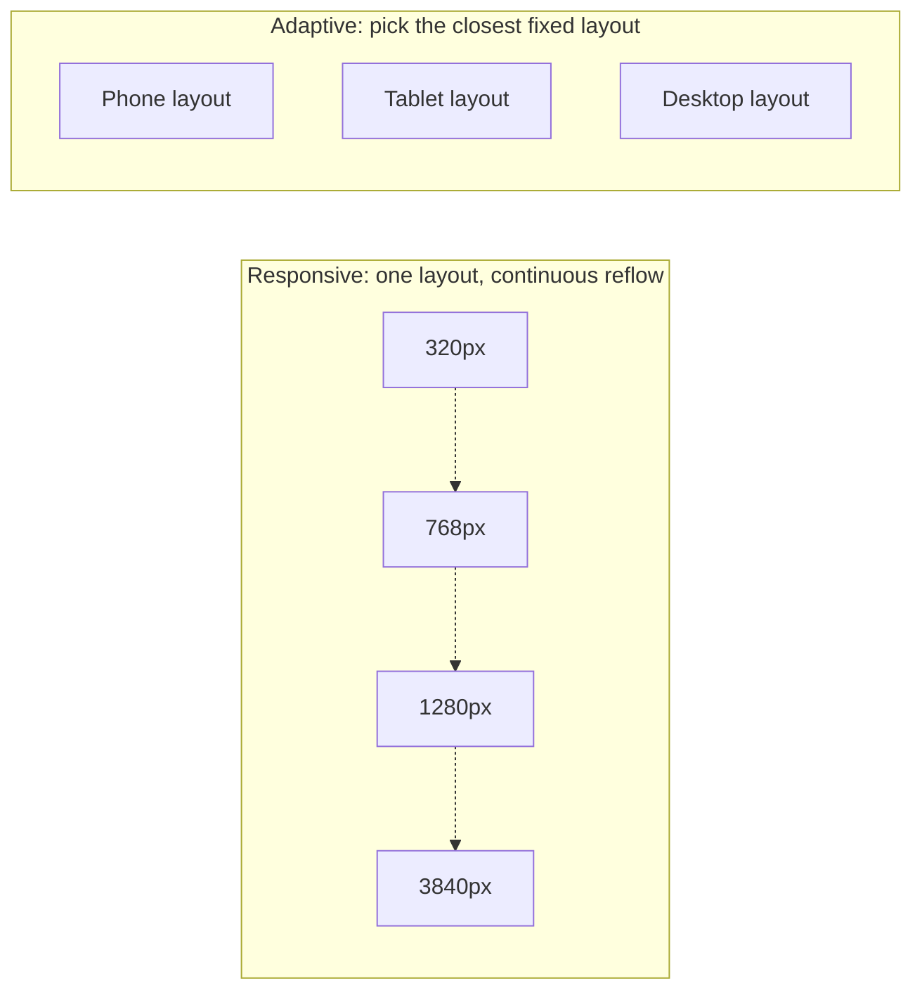
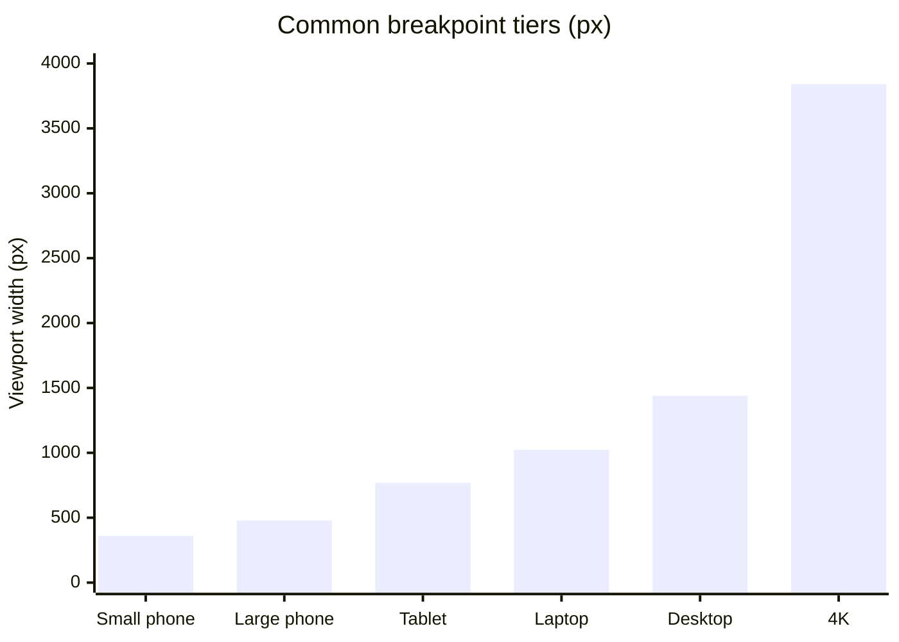

import Scenario from "../../../components/Scenario.astro";
import LevelIntro from "../../../components/LevelIntro.astro";

<Scenario>
  <Fragment slot="facts">
    

      
📱 Phone — 375px wide, one column, thumb-reachable

      
📟 Tablet — 768px wide, room for two columns

      
🖥️ Laptop — 1280px wide, sidebar + content

      
🖵 4K monitor — 3840px wide, same layout stretched thin if nothing changes

    

    
Same page, same HTML, four viewports

    
One design decision — "does the layout notice its own width?" — separates a page that works everywhere from one that only works on the screen it was built for.

  </Fragment>

A product page built and tested only on a 1280px laptop screen ships. Two bug reports land the same week: on a phone, the three-column layout squeezes into columns 90px wide, with text wrapping one word per line. On a 4K monitor, that same layout keeps its fixed 1280px width and floats in a sea of empty space, with a single line of body text stretching almost the full screen.

  

    

      ✗ Phone (375px)
    

    

      

        Col
      

      

        Col
      

      

        Col
      

    

    
Columns crushed to ~90px

  

  

    

      ✓ Laptop (1280px)
    

    

      

        Col
      

      

        Col
      

      

        Col
      

    

    

      Built and tested here only
    

  

  

    

      ✗ 4K monitor (3840px)
    

    

      

        Col
      

      

        Col
      

      

        Col
      

      

    

    

      Fixed 1280px layout, rest is empty space
    

  

**Nothing about the content changed between these three screenshots — only the width of the glass it's displayed on. So what has to change in the design so the same page holds up at every width, not just the one it happened to be designed on?**

</Scenario>

Two different strategies answer that question — and knowing which one you're using (or need) is the actual skill.

<LevelIntro
  items={[
    "Responsive vs. adaptive: two strategies, not synonyms",
    "Breakpoints as layout decision points",
    "Fluid layout as the strategy that skips breakpoints entirely",
  ]}
/>

## Two strategies, often confused as one word

- **Responsive design**: one fluid layout that continuously reflows as the viewport width changes, using relative units (`%`, `fr`, `clamp()`) and a handful of `@media` breakpoints to restructure at key widths. The same HTML and CSS serve every device; the browser does the adapting.
- **Adaptive design**: a small, fixed set of discrete layouts — often literally different templates — each targeted at a known device class (phone, tablet, desktop). The server or the app picks the closest match; there's no continuous reflow between them.
- **Fluid layout** is the specific technique inside responsive design where sizes (width, font size, spacing) are expressed as a formula relative to the viewport, rather than jumping only at fixed breakpoints — `clamp()` is the modern CSS tool for this (L2 covers the syntax).
- **Breakpoints** are the specific viewport widths where a responsive layout's structure changes — not where every value changes continuously (that's fluid layout's job), but where the _arrangement_ changes: three columns become two, a sidebar collapses into a menu.

| Question                           | Responsive                                   | Adaptive                                                    |
| ---------------------------------- | -------------------------------------------- | ----------------------------------------------------------- |
| How many layouts exist?            | One flexible layout                          | Several fixed layouts (often 3–6)                           |
| What decides the layout?           | The browser, continuously, from actual width | A device/breakpoint match, chosen once                      |
| New device width (e.g. a foldable) | Reflows automatically                        | Needs a new fixed layout or falls back awkwardly            |
| Typical cost                       | Design once, more CSS complexity             | Design/maintain N layouts separately                        |
| Common use                         | Most modern websites                         | Legacy sites, some native-feeling web apps, email templates |

The phone/laptop/4K bug reports at the top are what happens with **neither** strategy applied — a single fixed layout with no breakpoints and no fluid sizing at all. Responsive design fixes it by letting the layout reflow continuously and restructure at breakpoints; adaptive design fixes it by swapping to a different pre-built layout per device class.

## A quick sense of scale: common breakpoint tiers

These numbers aren't a law — they're common reference points (rounded from real device widths) that most responsive sites use as starting breakpoints, then adjust based on where their own content actually breaks. L2 covers how to choose a breakpoint from content, not from a device list.

Most production sites today are responsive-first, reaching for adaptive only for a handful of very different experiences (a dedicated print layout, a kiosk mode, an email client with poor CSS support) — L2 and L3 build the mechanics and the judgment call for when each is the right tool.
