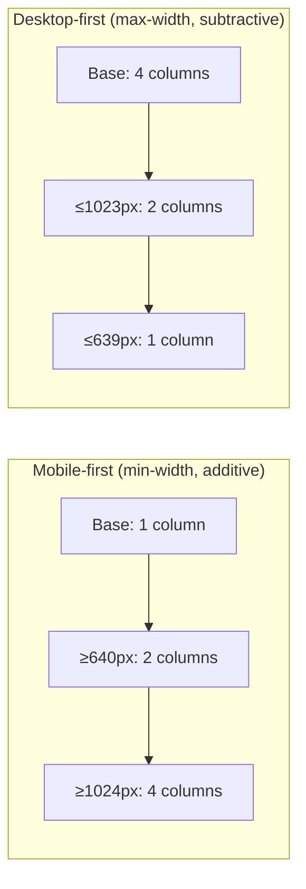

import Scenario from "../../../components/Scenario.astro";
import LevelIntro from "../../../components/LevelIntro.astro";
import Checkpoint from "../../../components/Checkpoint.astro";

<Scenario label="The mechanics">
  <Fragment slot="facts">
    <div class="not-prose flex flex-col gap-1.5 text-sm text-slate-700 dark:text-slate-300">
      <div>1. <strong>Breakpoint</strong> — a `@media` width where structure changes</div>
      <div>2. <strong>Mobile-first</strong> — base styles for narrow, `min-width` adds up</div>
      <div>3. <strong>Fluid value</strong> — `clamp(min, preferred, max)` instead of a jump</div>
      <div>4. <strong>Content-driven</strong> — the breakpoint goes where content breaks, not at a device width</div>
    </div>
    <p class="not-prose mt-3 text-xs text-slate-500 dark:text-slate-400">A breakpoint and a fluid value solve different problems — structure vs. scale — and most real layouts need both.</p>
  </Fragment>

L1 named "breakpoint" and "fluid layout" as two different tools. But a page with breakpoints in the wrong place still breaks — a three-column grid that only collapses at 1024px still crushes its columns at 900px, one breakpoint away from safe.

**So what actually decides where a breakpoint should sit, and how does fluid sizing avoid needing one at all?**

</Scenario>

<LevelIntro
  items={[
    "Where a breakpoint should actually go (content, not devices)",
    "Mobile-first cascade order and why it matters",
    "Fluid sizing with clamp() as an alternative to jumps",
  ]}
/>

## Breakpoints: content decides, not a device list

**Guiding question: if breakpoints aren't supposed to match specific devices, what should decide where one goes?**

A **breakpoint** is a viewport width written into CSS as a `@media` condition — below it, one set of rules applies; at or above it, another set takes over:

```css
/* Base styles: apply everywhere, written mobile-first */
.product-grid {
  display: grid;
  grid-template-columns: 1fr;
  gap: 1rem;
}

/* Breakpoint: once there's room for two columns without crushing either */
@media (min-width: 640px) {
  .product-grid {
    grid-template-columns: repeat(2, 1fr);
  }
}

/* Breakpoint: once there's room for four */
@media (min-width: 1024px) {
  .product-grid {
    grid-template-columns: repeat(4, 1fr);
  }
}
```

The temptation is to pick breakpoints from a device chart — "phones are 375px, tablets are 768px, so I'll break at those." That's backwards: a design should break wherever _its own content_ starts to look cramped or sparse, which rarely lines up with any specific device's width. A card that's comfortable at 280px wide only needs a new column once the viewport is wide enough to fit another 280px card plus a gap — that number comes from the design, not from a device spec sheet.

| Approach      | How the breakpoint is chosen                                                  | Risk                                                                         |
| ------------- | ----------------------------------------------------------------------------- | ---------------------------------------------------------------------------- |
| Device-based  | Match common device widths (375, 768, 1024...)                                | Breaks at the wrong point for _this_ content; new devices don't fit the list |
| Content-based | Resize the browser until the layout visibly strains, put the breakpoint there | Requires actually testing across widths, not just picking numbers upfront    |

<Checkpoint question="A designer sets a breakpoint at exactly 768px because that is a common tablet width, but the three-column layout actually starts crushing its columns at 820px on a real tablet in landscape. What is the more reliable way to have found the right breakpoint?">

Resize the layout itself and watch for the point where the content visibly strains — columns getting too narrow to read comfortably, text wrapping awkwardly, buttons losing tap space — and put the breakpoint there, rather than trusting a device-width chart. The 768px number matched a category of device, not this specific design's content; a device's _reported_ width also isn't guaranteed to match what CSS actually measures once browser chrome, zoom level, or split-screen multitasking are involved. Content-based breakpoints stay correct as new device sizes appear, because they were never tied to a device list in the first place — they're tied to where this exact layout breaks, which doesn't change just because a new phone ships.

</Checkpoint>

## Mobile-first: writing the cascade in one direction

**Guiding question: does it matter whether you write base styles for a wide screen and override down, or a narrow screen and override up?**

CSS's cascade applies rules in source order (all else equal), so `@media (min-width: ...)` and `@media (max-width: ...)` produce genuinely different mental models, not just different syntax:

- **Mobile-first** (`min-width`): base rules target the narrowest case with no media query at all; each breakpoint _adds_ capability as space becomes available. A phone loads exactly the CSS it needs — no wide-screen rules to override.
- **Desktop-first** (`max-width`): base rules target the widest case; each breakpoint _removes or overrides_ what came before as space shrinks. A phone has to load and then undo desktop-oriented rules.



Mobile-first is the dominant convention today for two concrete reasons: it matches the reality that mobile traffic is the majority case for most products, so the "no override needed" path should be the common one, not the exception — and it keeps override rules additive (turning features _on_) rather than subtractive (turning them _off_), which is easier to reason about as a page grows more breakpoints over time.

## Fluid layout: skipping the jump with clamp()

**Guiding question: a heading that's 24px on a phone and 48px on a desktop needs _some_ value at every width in between — does it have to jump at a breakpoint, or can it scale continuously?**

CSS's `clamp(min, preferred, max)` picks the middle value unless it would go outside the min/max bounds — and the "preferred" value can itself be a formula using `vw` (viewport width units), which is what makes it track viewport size continuously instead of jumping:

```css
h1 {
  /* Never below 1.5rem, never above 3rem, otherwise scale with viewport */
  font-size: clamp(1.5rem, 1rem + 3vw, 3rem);
}
```

Reading that formula left to right: below some narrow width the `1rem + 3vw` term evaluates under `1.5rem`, so the size clamps to the `1.5rem` floor; above some wide width it evaluates over `3rem`, clamping to that ceiling; in between, it grows smoothly with viewport width — no breakpoint, no jump, one line of CSS. The interactive demo at the end of this page lets you drag a viewport-width slider and watch this exact formula's output move continuously between its floor and ceiling.

|                              | Breakpoint-only sizing                        | Fluid sizing (clamp)                                   |
| ---------------------------- | --------------------------------------------- | ------------------------------------------------------ |
| Value between breakpoints    | Constant, then jumps                          | Changes continuously                                   |
| Number of values to maintain | One per breakpoint                            | One formula                                            |
| Best for                     | Structural changes (column count, nav layout) | Continuous scale changes (font size, spacing, padding) |

Fluid layout and breakpoints aren't competitors — a real page typically uses fluid `clamp()` values for things that should scale smoothly (type size, spacing) and breakpoints for things that genuinely have discrete states (a 3-column grid can't become "2.4 columns," so it needs a breakpoint; a heading can be any size in between, so it doesn't).
