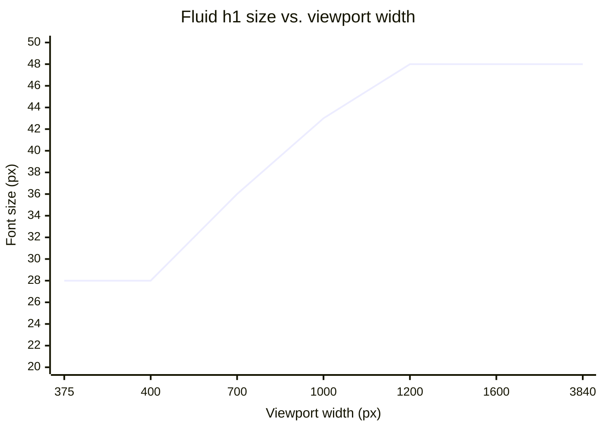

import Scenario from "../../../components/Scenario.astro";
import LevelIntro from "../../../components/LevelIntro.astro";
import Checkpoint from "../../../components/Checkpoint.astro";

<Scenario label="The scenario">
  <Fragment slot="facts">
    <div class="not-prose flex flex-col gap-1.5 text-sm text-slate-700 dark:text-slate-300">
      <div>📦 Product listing: image, title, price, "Add to cart"</div>
      <div>📱 375px — 1 column, full-width card</div>
      <div>📟 768px — 2 columns, card shrinks</div>
      <div>🖥️ 1440px — 4 columns, sidebar filters appear</div>
      <div>🖵 3840px — same 4-column grid, capped max-width, centered</div>
    </div>
    <p class="not-prose mt-3 text-xs text-slate-500 dark:text-slate-400">The card itself also has to respond to *its own* box width, not just the viewport — that's the container-query problem below.</p>
  </Fragment>

An e-commerce team is rebuilding their product listing page. It needs to work from a 375px phone up through a 3840px 4K monitor, with a sidebar of filters that only makes sense once there's room for it, product cards that shouldn't get so narrow their price wraps awkwardly, and a header title that should feel proportionate at every size without a designer hand-picking a dozen font sizes.

**Given everything L1 and L2 established — breakpoints for structure, `clamp()` for continuous scale — how do those pieces actually combine into one working page, and where does the design still need a genuinely different (adaptive) layout instead of a responsive one?**

</Scenario>

<LevelIntro
  items={[
    "Assembling breakpoints + clamp() into one real layout",
    "Container queries: responding to a box's width, not the viewport's",
    "When adaptive design is still the right call, and the accessibility floor",
  ]}
/>

## Building the grid: breakpoints for structure

The listing page's column count is a genuinely discrete decision — 1, 2, or 4 columns, never "2.6" — so it's breakpoint territory, written mobile-first per L2:

```css
.listing {
  display: grid;
  grid-template-columns: 1fr;
  gap: 1rem;
  padding: 1rem;
}

/* Two columns once a card can be ~300px without feeling cramped */
@media (min-width: 640px) {
  .listing {
    grid-template-columns: repeat(2, 1fr);
  }
}

/* Four columns + a sidebar once there's genuinely room for filters */
@media (min-width: 1024px) {
  .listing {
    grid-template-columns: 260px repeat(4, 1fr);
    gap: 1.5rem;
  }
}

/* Cap total width on very large screens instead of stretching thin */
.listing-wrap {
  max-width: 1600px;
  margin-inline: auto;
}
```

That last rule answers the 4K half of the original bug report from L1: without a `max-width` and centering, a responsive grid keeps adding columns or stretching existing ones indefinitely as the viewport grows, which is its own failure mode — four columns at a reasonable width, then the same four columns stretched to fill 3840px, with each product photo scaled comically wide. A cap plus centering is what makes "responsive" mean "adapts within a sensible range," not "always fills 100% of however wide the monitor is."

## Fluid type: the header title, worked end to end

The page title needs to feel proportionate from 375px to 3840px without a breakpoint jump — a `clamp()` case per L2. Here's the actual arithmetic, not just the formula shape:

| Target                                                    | Value          |
| --------------------------------------------------------- | -------------- |
| Minimum size (narrow viewports)                           | 1.75rem (28px) |
| Maximum size (wide viewports)                             | 3rem (48px)    |
| Viewport width where it should start growing              | 400px          |
| Viewport width where it should stop growing (hit the max) | 1200px         |

The "preferred" middle term needs a slope and an intercept: `slope = (48 - 28) / (1200 - 400) = 20 / 800 = 0.025px per px of viewport`, expressed as `2.5vw` (since `1vw` is 1% of viewport width, and `0.025 * 100 = 2.5`). The intercept is the size the formula would predict at `0vw`: `28 - 0.025 * 400 = 18px`, i.e. `1.125rem`. That gives:

```css
.listing h1 {
  font-size: clamp(1.75rem, 1.125rem + 2.5vw, 3rem);
}
```

Below 400px-equivalent the formula's output falls under `1.75rem` and clamps there; above 1200px-equivalent it exceeds `3rem` and clamps there; in between, it's the exact line connecting `(400px, 28px)` to `(1200px, 48px)`. This is the general recipe for turning "I want it to go from A at width W1 to B at width W2" into a `clamp()` line, not a formula specific to this one title.



<Checkpoint question="The same clamp() recipe is applied to body paragraph text, going from 15px at 375px wide up to 15px at 3840px wide (i.e. the min and max are set to the same value). What happens, and was clamp() the right tool for this case?">

When the minimum and maximum are equal, the preferred formula's slope becomes irrelevant — the value is clamped to that single number at every viewport width, since it can never legally sit above or below a floor and ceiling that are the same. That's not a bug, but it does mean clamp() was the wrong tool to reach for: a fixed `font-size: 15px` produces the identical result with far less to read and no risk of a future edit to the formula accidentally introducing unwanted scaling. Fluid sizing earns its complexity only when a value is genuinely meant to differ across the range — reaching for clamp() out of habit on a value that should stay constant adds a formula where a plain fixed value would do.

</Checkpoint>

## Container queries: when the viewport isn't the right question

**Guiding question: the product card needs to switch from a horizontal layout (image left, text right) to a vertical one when it gets narrow — but it can get narrow either because the _viewport_ shrank, or because the _sidebar_ opened up and ate its share of a wide viewport. Does a `@media` breakpoint see that second case?**

It doesn't — `@media` only ever measures the viewport, never the width of the specific box the CSS is styling. A card that's 700px wide on a mobile viewport with no sidebar and a card that's 220px wide on a 1440px viewport _with_ the filter sidebar open are, from `@media`'s point of view, indistinguishable — both are "on a wide-enough viewport" even though one of those cards is genuinely too narrow for a horizontal layout. **Container queries** (`@container`) fix this by measuring the width of a named containing element instead:

```css
.card-slot {
  container-type: inline-size;
  container-name: card;
}

/* Base: vertical layout for a narrow card */
.card {
  display: flex;
  flex-direction: column;
}

/* Switches to horizontal once THIS card's own box has room — regardless
   of why it has room (wide viewport, sidebar closed, grid column width) */
@container card (min-width: 360px) {
  .card {
    flex-direction: row;
  }
}
```

|                                   | `@media` (viewport query)                | `@container` (container query)                 |
| --------------------------------- | ---------------------------------------- | ---------------------------------------------- |
| Measures                          | The browser viewport                     | A specific containing element's box            |
| Reacts to sidebar opening/closing | No — viewport didn't change              | Yes — the card's own box did change            |
| Best for                          | Page-level structure (nav, overall grid) | Reusable components placed in varying contexts |

Container queries don't replace breakpoints — the page's overall grid (1/2/4 columns) is still a viewport-level, `@media` decision, since it's about the page's structure, not a single component's own box. The card's internal layout is a container-level, `@container` decision, since the same card component gets reused in a sidebar-adjacent grid, a full-width "related products" row, and a narrow modal — three different container widths on the exact same viewport.

## When adaptive still wins, and the accessibility floor

Responsive design (with container queries filling the old adaptive-shaped gap) covers most modern layout needs, but adaptive design is still the right call when the _experience_, not just the layout, should genuinely differ per context — not merely resized:

- **Email clients**: many still have poor or no `@media`/`@container`/`clamp()` support, so email templates commonly ship as a small set of fixed, table-based layouts — a textbook adaptive case, chosen because the platform constrains the tools, not because responsive is undesirable.
- **A kiosk or point-of-sale screen**: the design intentionally differs from the same product's phone app beyond just layout — different information density, different interaction model (touch targets sized for a public terminal, not a thumb) — closer to "a different product for a different context" than "the same content reflowed."
- **A dedicated print stylesheet**: `@media print` is technically a breakpoint mechanism, but the print layout typically strips navigation and interactive elements entirely rather than reflowing them — an adaptive swap in spirit, even though it's implemented with the responsive toolset.

None of that removes the accessibility floor responsive and adaptive design share: WCAG 1.4.10 (Reflow) requires content to remain usable without horizontal scrolling when zoomed to 400%, on a viewport equivalent to 320px CSS pixels wide — which is a real, testable constraint, not a style preference. A layout with a `clamp()` floor set too high, or a fixed-width adaptive template with no phone-class fallback, can fail this check even while looking fine at 100% zoom. Testing "does it work at every width" has to include zoomed-in width, not only physically narrow devices.

## Testing a responsive/adaptive page for real

A layout that looks right at three hand-picked widths (say, exactly 375, 768, 1440) can still fail in the gaps a spot-check skips — this is the actual failure mode behind most "it broke on someone's laptop" reports:

| Check                                                                                                                                    | Why it catches real bugs                                                                     |
| ---------------------------------------------------------------------------------------------------------------------------------------- | -------------------------------------------------------------------------------------------- |
| Drag the browser width continuously, not just to fixed presets                                                                           | Catches the exact pixel range where a breakpoint is set wrong, not just "does 768px look ok" |
| Zoom to 200% and 400% at a narrow viewport                                                                                               | Tests WCAG 1.4.10 reflow, not just raw device width                                          |
| Open a component (like the product card) inside its narrowest _and_ widest real container, not just the page's narrowest/widest viewport | Catches container-query bugs that a viewport-only test misses entirely                       |
| Check the widest realistic viewport (ultra-wide/4K), not just up to 1440px                                                               | Catches unbounded-stretch bugs (missing `max-width`) that never show up on a normal laptop   |
| Test with real content lengths (a very long product title, an empty state)                                                               | Catches wrapping/overflow bugs that placeholder "Lorem ipsum" text hides                     |

**Extending the scenario: if this same product listing page needed a genuinely different information density for a warehouse-floor inventory tablet used by staff — larger tap targets, fewer decorative images, a persistent barcode-scan button — would that still be solvable by adding more breakpoints to the same responsive page, or does the _content and interaction model_ differing (not just the layout) push this toward a deliberately separate, adaptive template?** The mechanics in this unit (breakpoints, clamp, container queries) answer "how do I make one design hold together across sizes" — but the harder judgment call, revisited here on purpose, is recognizing when the honest answer is that it's no longer the same design at all.
