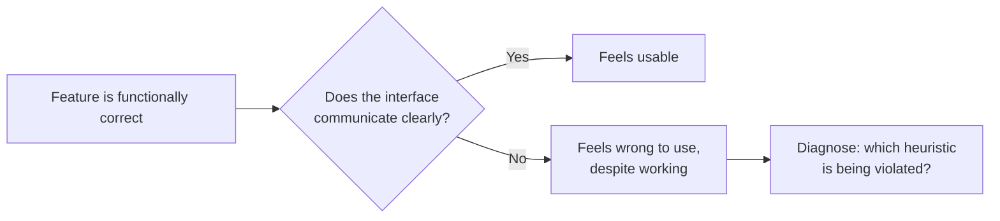

import Scenario from "../../../components/Scenario.astro";

<Scenario>
  <Fragment slot="facts">
    

      
🗑️ Delete button — no confirmation, no undo

      
⏳ Submit button — no spinner, no disabled state

      
❗ Error message — just <code>ERR_402</code>

    

    

      
✅ Every request succeeds server-side

      
🐢 Support tickets: "is this thing broken?"

    

  </Fragment>

An engineer ships a settings page. Every request round-trips correctly, every field validates, every button calls the right endpoint. QA signs off — nothing is broken. A week later, support is buried in tickets: "did my changes save?", "I clicked delete twice, did that do anything?", "what does ERR_402 mean?"

| What the code does                               | What the user experiences                                      |
| ------------------------------------------------- | ---------------------------------------------------------------- |
| Save request succeeds in ~200ms, no error          | No visible change on screen — did clicking "Save" do anything?  |
| Delete request removes the row, no confirmation    | One accidental double-click, and a row is gone with no undo      |
| Server returns `402` on a billing failure          | User sees literally the string `ERR_402`, nothing else           |

**Before reading on: nothing here is a bug in the traditional sense — every request does exactly what it was coded to do. So what's actually broken?**

</Scenario>

Nothing crashed, nothing 500'd, nothing failed a test. What failed is the _conversation_ between the interface and the person using it — the system never told them what was happening, what would happen, or what had already happened.

- A feature can be **functionally correct** and still be **unusable** — correctness and usability are different axes, and testing only checks the first one.
- **Usability heuristics** are broad, evidence-based rules of thumb for evaluating whether an interface communicates clearly with the person using it — not a style guide, not a checklist of specific UI patterns.
- **Jakob Nielsen's 10 heuristics** (1994, still the standard reference) are the most widely used version. They group into recognizable failure categories:
  - **Does the system talk to the user?** — visibility of system status, match between system and the real world.
  - **Does the user stay in control?** — user control and freedom, flexibility and efficiency of use.
  - **Does the interface stay predictable?** — consistency and standards, recognition rather than recall.
  - **Does the system protect the user from mistakes?** — error prevention, help users recognize/diagnose/recover from errors.
  - **Is the interface no more complex than it needs to be?** — aesthetic and minimalist design, help and documentation.
- The scenario above breaks at least three heuristics at once: **visibility of system status** (the save gave no feedback), **user control and freedom** (the delete had no undo), and **help users recognize, diagnose, and recover from errors** (`ERR_402` names nothing a user can act on).
- These heuristics aren't laws — they're **diagnostic lenses**. A real interface can violate one deliberately (a delete confirmation adds friction on purpose) as long as that trade-off is a conscious choice, not an oversight.
- The skill this unit builds is **noticing** a "works but feels wrong" interface and naming _which_ heuristic it violates — because naming the failure is what turns a vague complaint ("this feels clunky") into a specific, fixable design change.

| Failure in the scenario  | Heuristic it violates                                    |
| -------------------------- | ------------------------------------------------------------ |
| No feedback after "Save" | Visibility of system status                                  |
| Delete with no undo      | User control and freedom                                     |
| `ERR_402` shown raw       | Help users recognize, diagnose, and recover from errors     |
