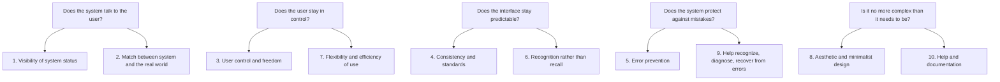

import Scenario from "../../../components/Scenario.astro";
import LevelIntro from "../../../components/LevelIntro.astro";
import Checkpoint from "../../../components/Checkpoint.astro";

L1 established that a feature can be functionally correct and still fail
its user, and that Nielsen's 10 heuristics name the specific ways that
failure happens. L2 works out how those 10 actually group into a model you
can hold in your head.

<LevelIntro
  items={[
    "The 5 categories the 10 heuristics group into",
    "What each category actually protects",
    "Where the categories trade against each other",
  ]}
/>

## Ten rules, or five questions?

Ten heuristics is a lot to hold in your head while reviewing a screen. Before reading the full list: if you had to compress Nielsen's ten heuristics into a handful of questions you could actually run through during a code review or a design critique, what would the categories be?

Nielsen's ten don't sit at the same altitude — some are about the system communicating with the user, some are about protecting the user from their own mistakes, some are about not repeating a pattern the user already had to learn once. Grouped by **what each one protects**, they collapse into five questions:

| Category                                   | Heuristics                                                              | The question it answers                                            |
| ------------------------------------------ | ----------------------------------------------------------------------- | ------------------------------------------------------------------ |
| Does the system talk to the user?          | 1. Visibility of system status · 2. Match between system and real world | Does the user always know what state things are in?                |
| Does the user stay in control?             | 3. User control and freedom · 7. Flexibility and efficiency of use      | Can the user recover from a wrong turn, and go faster once fluent? |
| Does the interface stay predictable?       | 4. Consistency and standards · 6. Recognition rather than recall        | Does a pattern learned once keep working everywhere else?          |
| Does the system protect against mistakes?  | 5. Error prevention · 9. Help recognize, diagnose, recover from errors  | Does the interface stop mistakes, and explain the ones it can't?   |
| Is it no more complex than it needs to be? | 8. Aesthetic and minimalist design · 10. Help and documentation         | Is every element on screen earning its place?                      |

Another bridge before the full names:

| Technical phrase                | Simple question                                                    |
| ------------------------------- | ------------------------------------------------------------------ |
| Mental model                    | What does the user already think is happening?                     |
| Accelerator                     | What shortcut helps an experienced user move faster?               |
| Platform/industry convention    | What pattern have users already learned somewhere else?            |
| Recognition rather than recall  | Can the screen show the choice instead of making them remember it? |
| Aesthetic and minimalist design | Is this element useful right now, or is it stealing attention?     |

## Does the system talk to the user?

An interface that never reports back is asking the user to trust a black box. What's the actual cost of silence — is it just annoyance, or something that compounds?

- **Visibility of system status** — the system should always keep the user informed, through appropriate feedback, within reasonable time. A spinner during a slow request, a checkmark after a save, a progress bar during an upload — all of this is the system narrating its own state so the user isn't left guessing.
- **Match between system and the real world** — the system should speak the user's language, with words, phrases, and concepts familiar to them, rather than system-oriented terms. A shopping cart is called a "cart," not a "session-scoped order buffer"; a date picker shows a calendar, not a raw ISO string field.

Both heuristics are about the same underlying thing: the interface owes the user a model of what's happening that matches the user's own mental model, not the engineer's internal one. Silence and jargon fail the same way — they leave the user substituting their own guess for information the system actually has.

<Checkpoint question="A settings page saves instantly in the background, with no spinner and no confirmation message. The save always succeeds. Is this a visibility-of-system-status violation, given that nothing ever actually goes wrong?">

Yes. Visibility of system status isn't conditional on failure — it's about the user always knowing what state things are in, regardless of whether that state is good or bad. A save that always succeeds still needs to tell the user it happened, because the user has no other way to know the click registered at all; "it always works" is a fact about the backend, not something the person clicking the button can see. The fix doesn't have to be heavy — a brief checkmark or a subtly changed button label is enough — but leaving it out asks the user to trust silence.

</Checkpoint>

## Does the user stay in control?

A user who takes a wrong turn needs a way back. If there's no way back, what does that do to how cautiously they use every other feature afterward?

- **User control and freedom** — users often choose functions by mistake and need a clearly marked "emergency exit" to leave the unwanted state without going through an extended process. Undo, cancel, and a confirmable "are you sure?" before anything destructive all serve this.
- **Flexibility and efficiency of use** — accelerators unseen by the novice user may often speed up the interaction for the expert user, such that the interface can cater to both inexperienced and experienced users. Keyboard shortcuts, batch actions, and saved defaults are all optional speed for people who no longer need the guided path.

These two look opposite at first — one is about safety nets for uncertainty, the other about removing friction for fluency — but they share a premise: the interface shouldn't assume there's only one kind of user, or only one speed of use.

## Does the interface stay predictable?

Every new pattern a user has to learn is a small tax. Where does that tax actually get paid — once, or every single time the interface is used afterward?

- **Consistency and standards** — users should not have to wonder whether different words, situations, or actions mean the same thing; follow platform and industry conventions. A "Delete" button that's red in one screen and gray in another forces the user to re-learn the meaning of red each time.
- **Recognition rather than recall** — minimize the user's memory load by making objects, actions, and options visible, rather than requiring the user to remember information from one part of the interface to another. A visible list of recent items beats "type the exact name you used last time."

Consistency is about not re-learning a pattern already learned once; recognition is about not having to _remember_ something without the interface's help. Both are attacks on the same cost: making the user do work the interface could have done for them.

## Does the system protect against mistakes?

Even a well-worded error message is a recovery from a failure that already happened. What's the heuristic that tries to stop the mistake before it happens at all?

- **Error prevention** — even better than good error messages is a careful design which prevents a problem from occurring in the first place; either eliminate error-prone conditions, or check for them and present a confirmation option. Disabling a submit button until required fields are filled is prevention; a confirmation dialog before an irreversible delete is prevention for something that can't be fully eliminated.
- **Help users recognize, diagnose, and recover from errors** — error messages should be expressed in plain language (no codes), precisely indicate the problem, and constructively suggest a solution. `ERR_402` fails every part of this: no plain language, no specific problem named, no suggested next step.

Prevention and recovery aren't redundant — prevention is the cheaper heuristic to satisfy but can't cover everything (a payment can still fail for reasons outside the interface's control), so recovery is the fallback for whatever prevention couldn't stop.

<Checkpoint question="A delete button shows a confirmation dialog that just says 'Are you sure?' with Yes/No. It technically satisfies 'user control and freedom' by giving the user a chance to back out. Why might it still fail in practice?">

Because a generic confirmation only works if the user actually reads it, and a dialog that appears before every action — with no information beyond the fact that it's asking — trains people to click through it on reflex, the same way they'd dismiss any other repeated interruption. Satisfying the letter of the heuristic (there is technically a confirmation step) isn't the same as satisfying its intent (giving the user a real chance to catch a mistake). A confirmation that names the specific, non-obvious consequence of this particular action gives the user something new to notice; a generic one doesn't, and gets clicked through exactly as fast as no confirmation at all.

</Checkpoint>

## Is it no more complex than it needs to be?

Every extra element on screen competes for the same attention as the ones that actually matter. Before reading on: what's the failure mode when a screen has too much on it, versus too little?

- **Aesthetic and minimalist design** — interfaces should not contain information that is irrelevant or rarely needed; every extra unit of information competes with the relevant units and diminishes their relative visibility.
- **Help and documentation** — even though it's better if the system can be used without documentation, it may be necessary to provide help and documentation, which should be easy to search, focused on the user's task, and not too large.

These sit last for a reason: they're the heuristics most often invoked as an excuse ("we don't need X, it's cluttered" / "we'll just document the weird part") instead of a genuine trade-off — L3 covers exactly this misapplication.

<Scenario label="Quick check">
  <Fragment slot="facts">
    

      
1️⃣2️⃣ Talk to the user

      
3️⃣7️⃣ Stay in control

      
4️⃣6️⃣ Stay predictable

      
5️⃣9️⃣ Protect against mistakes

      
8️⃣🔟 No more complex than needed

    

  </Fragment>

A form silently accepts a save, then two minutes later the tab shows a generic "Something went wrong" banner with no indication of what to fix. Which two heuristics does this violate, and which category do they belong to?

It's **visibility of system status** (the save gave no immediate feedback, so the failure surfaced late) and **help users recognize, diagnose, and recover from errors** (the banner names no field, no cause, no fix) — both under "does the system talk to the user?"/"protect against mistakes." Naming both, not just "this is confusing," is the actual skill this unit is teaching.

</Scenario>
