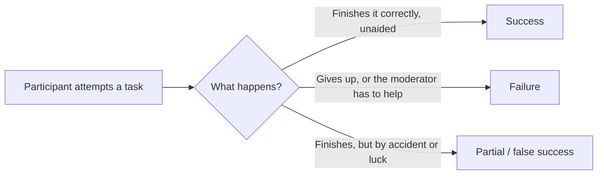

import Scenario from "../../../components/Scenario.astro";
import LevelIntro from "../../../components/LevelIntro.astro";

<Scenario>
  <Fragment slot="facts">
    

      

        2 of 6
        completed the checkout task unaided
      

      

        

      

    

    

      
🗳️ Team vote before testing: "obviously intuitive"

      
🖱️ 4 of 6 users tapped the wrong icon first

      
🗣️ "I guess this is... a trash can? Or save?"

    

  </Fragment>

A five-person design team spent a sprint agreeing that the new icon-only
checkout button was obvious — everyone in the room understood it
instantly. They shipped it. Two weeks later, support tickets about
"can't find checkout" tripled.

| What the team believed           | What actually happened when a stranger tried it             |
| -------------------------------- | ----------------------------------------------------------- |
| "It's obviously a checkout icon" | 4 of 6 first-time users tapped it thinking it was "save"    |
| "Nobody will get confused here"  | Every confused user still finished — eventually, by luck    |
| "We all agreed it looked clean"  | Looking clean and being understandable are different things |

**Before reading on: the team's confidence and the users' confusion are both real — so which one should the team have trusted, and why did agreeing in a room fail to predict what happened outside it?**

</Scenario>

The team was testing the wrong thing. They tested whether _they_ understood
the design — and of course they did, they built it. What they never tested
was whether someone who didn't build it, and doesn't already know what it
means, could figure it out cold.

<LevelIntro
  items={[
    "Why a team's own confidence isn't evidence a design works",
    "Usability testing: watching real people attempt real tasks",
    "Task success rate and the think-aloud protocol",
  ]}
/>

- **A design team's own opinion of its work is not evidence.** Everyone on the team already knows what every icon, label, and flow is supposed to mean — that knowledge makes it impossible for them to experience the design the way a first-time user does. This is sometimes called the "curse of knowledge."
- **Usability testing** replaces opinion with observation: a small number of realistic people attempt real tasks on the design, without being told how, while someone watches (or records) what happens.
- Two tools do most of the work:
  - **Task success rate** — of the people who attempted a specific task ("check out with one item in your cart"), what fraction completed it correctly, without being rescued by the moderator? This turns "seems fine" into a number you can compare across rounds.
  - **The think-aloud protocol** — participants are asked to narrate what they're thinking as they work ("I'm looking for a way to pay... I don't see one, so I'll try this icon"), which surfaces _why_ they got stuck, not just _that_ they got stuck.
- A usability test is not a survey and not a focus group. It doesn't ask "do you like this?" — it watches what people actually do when given a task and no help, because what people say they'd do and what they actually do reliably diverge.
- Even a handful of participants is informative: testing doesn't require hundreds of users to catch a design's biggest problems, which is exactly why teams have no excuse to skip it.

In plain words:

| Term                 | Simple meaning                                                                   |
| -------------------- | -------------------------------------------------------------------------------- |
| Usability testing    | Watching real people attempt real tasks on a design, unaided                     |
| Task success rate    | The percentage of participants who completed a given task correctly on their own |
| Think-aloud protocol | Asking participants to narrate their thoughts while working, out loud            |
| Moderator            | The person running the session — gives the task, then stays quiet and watches    |
| Curse of knowledge   | Once you know what something means, you can't easily imagine not knowing it      |

A task's outcome is one of three things, and only one of them counts as a real pass:

That third outcome — finishing by accident — is easy to miscount as a
win if you're only watching whether the task got done, instead of also
listening to how the participant got there. The bake-sale-style trap
here is the same one teams fall into with their own confidence: a result
that looks fine on the surface can be hiding the exact confusion the
test was supposed to catch.
