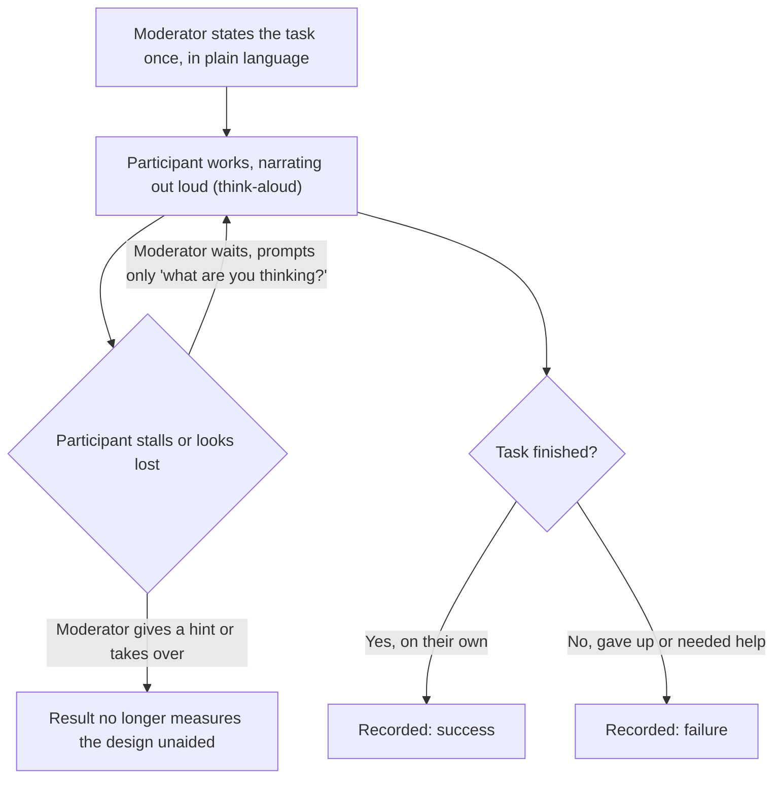
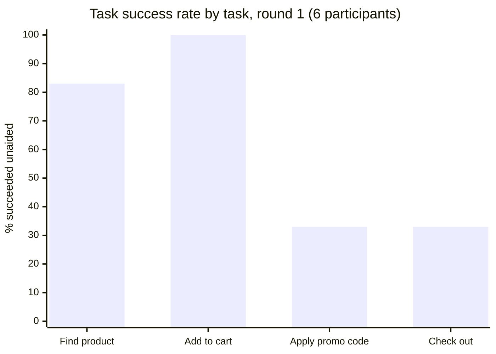

import Checkpoint from "../../../components/Checkpoint.astro";
import LevelIntro from "../../../components/LevelIntro.astro";

L1 showed that a team's own confidence in a design predicts almost
nothing about whether a stranger can use it. L2 turns that observation
into a repeatable procedure: how to pick tasks, run sessions with the
think-aloud protocol, and turn what you watch into a decision — not just
a feeling.

<LevelIntro
  items={[
    "Writing a task that tests the design, not the participant's memory",
    "Running the session: think-aloud, and staying quiet as the moderator",
    "Turning raw observations into a severity-ranked list of problems",
  ]}
/>

## Writing a task worth testing

If you ask a participant "what do you think of this checkout page?", you
get an opinion about visuals. If you ask "please buy this shirt in size
medium," you get a behavior you can actually watch fail. What's the
difference between those two prompts that makes one useful and the other
not?

A good task gives a **goal**, never a **path**. "Find a way to check out"
tests whether the design communicates its own affordances. "Tap the cart
icon, then tap checkout" tests nothing — you've just told the participant
which icon is which, which is the exact information the test exists to
find out whether the design provides on its own.

| Bad task (leaks the path)                        | Good task (states only the goal)   |
| ------------------------------------------------ | ---------------------------------- |
| "Click the hamburger menu, then tap 'Settings'"  | "Turn off email notifications"     |
| "Use the search bar to look up 'blue shoes'"     | "Find a pair of blue shoes to buy" |
| "Scroll down and tap the trash icon on order #4" | "Cancel your third order"          |

A task also needs a **clear, unambiguous finish line** — a specific,
observable state, not a vague feeling of doneness. "Explore the settings
page" has no finish line, so a moderator watching the recording later
can't score it success or failure; "turn off email notifications" ends
the moment the toggle is off, which is exactly the property that makes
it possible to compute a success rate later at all.

<Checkpoint question='A teammate proposes the task "see if you can figure out how our new dashboard works." Is that a task you could score as success or failure?'>

No — it fails for the same reason "explore the settings page" does: it
has no observable finish line. "Figure out how it works" could mean
anything from glancing at the layout to fully understanding every
feature, and different observers watching the same session could
reasonably disagree about whether the participant succeeded. A scorable
version has to name a concrete goal state, like "find last month's total
spending" — something a moderator can watch for and mark done the moment
it happens, without having to guess at the participant's internal sense
of understanding.

</Checkpoint>

## Running the session

Once the tasks are written, the session itself has one job: capture what
the participant actually does and thinks, without the moderator's own
knowledge leaking into the result. What happens to the data the moment a
moderator jumps in to help?

The think-aloud protocol is what turns a silent pass/fail into a source
of _why_. A participant who fails silently just leaves you a failure with
no explanation; a participant narrating "I'm looking for a way to
pay... I don't see one, so I'll try this icon" hands you the exact
misreading that caused it — in this case, that the payment affordance
wasn't recognizable as one. The moderator's only real jobs during the
session are: state the task once, prompt narration if it stops ("what
are you thinking right now?"), and resist the urge to help, however
strong that urge gets when someone is visibly struggling.

<Checkpoint question="Why does a moderator giving even a small hint — 'try tapping that icon in the corner' — ruin the result for that task, instead of just slightly helping?">

Because the thing being measured is whether the design itself
communicates that affordance without outside help — the moment the
moderator supplies the missing information, the task stops testing the
design and starts testing whether the participant can follow a verbal
instruction, which nobody doubted in the first place. It's not a matter
of degree: a small hint and a large hint both cross the same line,
because the failure the test was trying to catch (the icon not reading
as clickable, or not reading as "payment") gets papered over by the
moderator instead of being left visible in the data. The session isn't
ruined because the participant "did worse" — it's ruined because the
result no longer answers the actual question being asked.

</Checkpoint>

## From observations to a decision

A session produces raw notes: which tasks succeeded, which failed, and
what participants said along the way. Raw notes alone don't tell a team
what to fix first — what's missing between "we watched six people
struggle" and "here's what we're changing before launch"?

Two conversions do that work. First, **task success rate** — for each
task, the fraction of participants who completed it unaided:

Second, **severity** — not every failure deserves the same urgency. A
typo a user shrugs off and a dead end that blocks checkout entirely are
both "failures," but they don't belong on the same line of a fix list.

| Severity | What it looks like                                      | Example from this unit's data             |
| -------- | ------------------------------------------------------- | ----------------------------------------- |
| Cosmetic | Noticed, mildly annoying, doesn't block the task        | Button color looks slightly off-brand     |
| Minor    | Slows the participant down, but they recover unaided    | Hesitated on "Add to cart," then found it |
| Major    | Blocks the task for most participants without help      | 2 of 6 abandoned "Apply promo code"       |
| Critical | Blocks the task for nearly everyone, or risks real harm | 4 of 6 couldn't complete checkout at all  |

Severity is what turns a list of failures into a fix order: a critical
problem with low task success (checkout, at 33%) outranks a cosmetic one
even if the cosmetic one is easier to fix — "easy to fix" and "worth
fixing first" are two different rankings, and severity is what keeps a
team from optimizing for the first one by accident.
