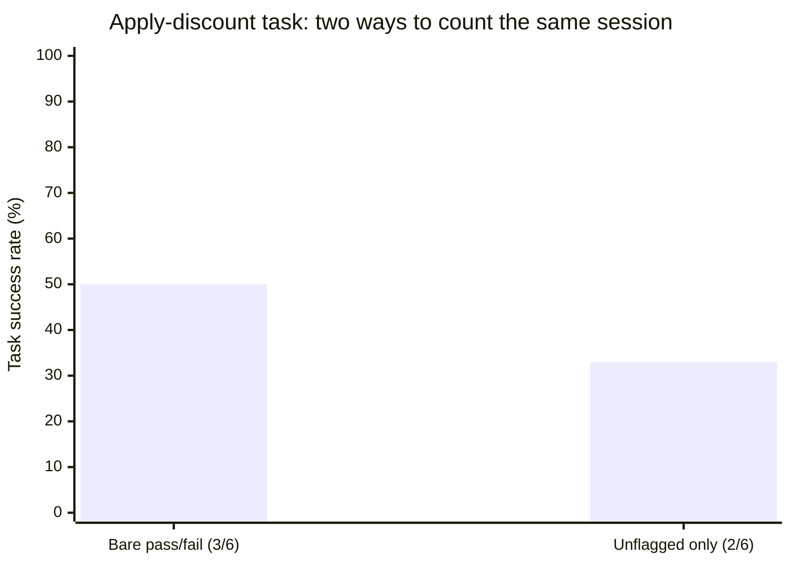
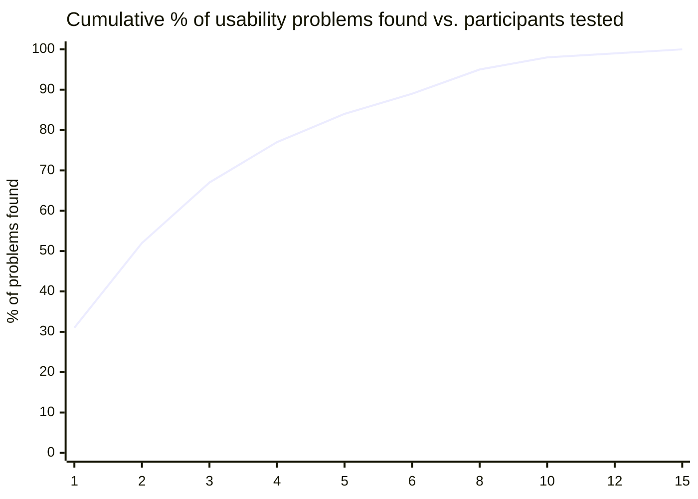

import Scenario from "../../../components/Scenario.astro";
import LevelIntro from "../../../components/LevelIntro.astro";
import Checkpoint from "../../../components/Checkpoint.astro";

<Scenario label="The session">
  <Fragment slot="facts">
    
Promo code redesign

    

      
🎯 Task: "Apply a discount to your order"

      
👥 6 participants, moderated, think-aloud

      
❌ 4 of 6 never found the promo field

      
🗣️ "I'd expect this near the total, not buried in 'Order details'"

    

  </Fragment>

The team redesigning checkout moved the promo code field into a
collapsed "Order details" accordion to reduce visual clutter — a change
that looked cleaner in every mockup review. They ran a usability test
before launch instead of trusting the review. Participant 3, mid-task,
said out loud: "Okay, I have my item, now... where do I put a discount
code? I don't see one. Let me check... 'Order details'? That seems like
just a summary, not where I'd type something." She opened it anyway,
after 40 seconds of hesitation, and found the field. Participants 1, 4,
and 6 never opened that accordion at all, and gave up.

**Before reading on: participant 3 eventually succeeded. Does that count as a design win, a design failure, or something in between — and what would you need to know about her 40 seconds to decide?**

</Scenario>

Participant 3's outcome shows exactly why "did they finish?" is not
enough on its own — the think-aloud narration is what turns a bare
success into a success with a warning attached.

<LevelIntro
  items={[
    "Reading a full session: what counts as success, and what the narration adds",
    "Computing task success rate and turning it into a fix decision",
    "Why 5 participants reliably find most of a design's problems — and why that's not the whole story",
  ]}
/>

## Scoring the session

Before computing anything, each of the six participants needs an
individual score for the "apply a discount" task. What separates
participant 3's outcome from a clean success, given that she did finish
the task on her own?

| Participant | Outcome                                 | Think-aloud excerpt                                                 | Scored as        |
| ----------- | --------------------------------------- | ------------------------------------------------------------------- | ---------------- |
| 1           | Gave up after 90 seconds                | "I don't know, I don't see anywhere for a code. I'll just skip it." | Failure          |
| 2           | Found it in 8 seconds                   | "Oh, 'Order details' — makes sense, let me check there."            | Success          |
| 3           | Found it after 40 seconds of hesitation | "That seems like just a summary, not where I'd type something."     | Success, flagged |
| 4           | Gave up, asked moderator for help       | "I really can't find it, is it even possible here?"                 | Failure          |
| 5           | Found it in 6 seconds                   | "Right there under order details, easy."                            | Success          |
| 6           | Gave up after 70 seconds                | "There's just... nothing labeled discount anywhere I can see."      | Failure          |

Participant 3 is scored a success — she completed the task entirely
unaided — but she's **flagged**, not filed identically to participants 2
and 5. Her narration ("that seems like just a summary") describes the
exact same confusion that made participants 1, 4, and 6 fail outright;
she just happened to push through it instead of quitting. Without the
think-aloud data, a bare pass/fail count would read her as proof the
design works, when her own words say the opposite.

<Checkpoint question="If this team had only tracked pass/fail with no think-aloud narration, what number would they have reported for this task, and how would that number have misled a launch decision?">

Without narration, only completion is visible: 3 of 6 succeeded (2, 3, 5) and 3 of 6 failed (1, 4, 6) — a clean 50% success rate with no further
context. That number alone invites reading the glass as half full: "half
of people get it, we can polish the label and ship." The narration
changes the real picture, because participant 3's "success" carries the
same root confusion as the three outright failures — meaning 4 of 6
participants, not 3, actually struggled to locate the field at all. The
true story is closer to "one clear near-failure hiding inside the
success count," which argues for fixing the placement before launch, not
polishing a label on a design that's already working for most people.
That's the entire reason think-aloud exists: pass/fail alone can't tell
these two situations apart, and they call for different decisions.

</Checkpoint>

## Computing task success rate, and what it does and doesn't tell you

With every participant scored, the task success rate is a single
number: successes divided by attempts. For this task, that's 3 of 6, or
50% — but strictly counting only clean, unhesitant completions (2 and 5)
as unflagged successes, the number a team should actually act on is 2 of
6, or 33%.

Neither number is "wrong" — they're answering slightly different
questions. Bare pass/fail answers "did the task technically get
completed." The unflagged count answers the question the team actually
cares about before launch: "does the design work smoothly for a
first-time user, without friction that a slightly less patient customer
would have abandoned at." A team that only ever reports the generous
number will consistently overestimate how ready a design is — which is
exactly the same trap L1's five-person team fell into, just moved one
step later in the process, from "we all agree it's fine" to "well, the
data says 50%."

## How many participants does a test actually need?

Six participants is a small sample by almost any statistical standard —
so why did this team trust the result instead of waiting to test fifty
people first? The answer is a well-established property of usability
testing specifically: most design problems aren't rare, they're common
enough that a small number of participants finds most of them, and each
additional participant mostly finds problems you've already seen.

If a given problem has, on average, roughly a 31% chance of surfacing
with any one representative participant (a widely cited estimate from
usability research), then the chance of catching it at least once grows
fast with just a handful of people, and then flattens:

By 5 participants, the curve has already found roughly 85% of a
design's problems; by participant 10, the team is paying for a full
extra round of sessions to find perhaps 10-13 more percentage points.
That's the practical case for testing early and often with small groups
instead of running one large study: five participants this week, fixing
what they found, and testing five more next week catches more real
problems, sooner, than saving the whole budget for one fifty-person
study right before launch.

<Checkpoint question="This curve assumes every participant is drawn from the same representative user population, attempting the same tasks. What happens to the curve's usefulness if the team's 6 participants were all fellow designers instead of real first-time customers — and does that change with 20 designer-participants instead of 6?">

The curve's math still runs the same way, but the number it produces
stops meaning what the team needs it to mean. The 31%-per-participant
estimate describes how often a _representative user_ notices a given
problem — fellow designers already carry the same curse of knowledge
from L1 that caused the original mistake, so they're far more likely to
correctly infer an unclear affordance than a real first-time customer
would be, and far less likely to hit the same confusion at all. Testing
more designers doesn't fix this — 20 designer-participants will
converge confidently on a number that still doesn't describe real
customers, because the sample itself, not the sample size, is what's
broken. This is why "who are the participants" is a decision that has
to be right before "how many" even becomes a meaningful question — more
of the wrong population finds problems faster, not better.

</Checkpoint>

## The launch decision

With the flagged success rate (33%), the severity of "checkout is
functionally unreachable for most first-time users," and think-aloud
evidence pointing at one specific cause (the field's location inside a
collapsed, summary-sounding accordion), the team has what a room vote
in L1 never produced: a specific, defensible reason to delay launch and
move the promo field to a visible position near the order total — and a
task they can re-run, with a fresh set of participants, to check whether
that one change actually raises the success rate before shipping.

**What would you look for in a re-test with the field moved: is a
success-rate jump from 33% to, say, 83% alone enough to ship, or would
you still want to check the think-aloud narration for a different kind
of flagged success, the way participant 3's was?** The number tells you
whether the fix worked in aggregate; the narration is still the only
place a new, different kind of hesitation would show up.
