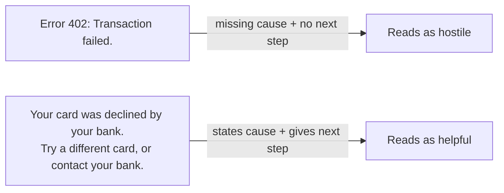
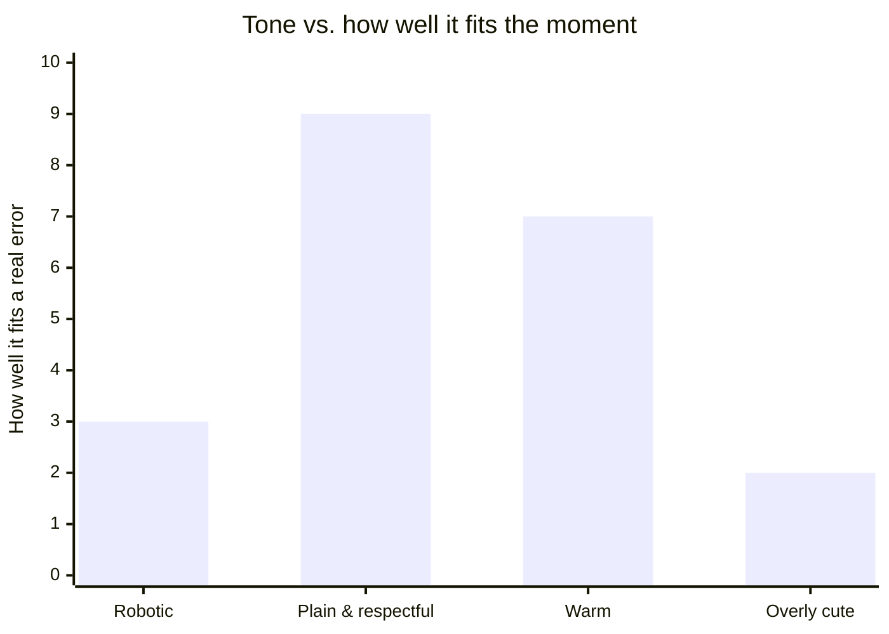

import Scenario from "../../../components/Scenario.astro";
import LevelIntro from "../../../components/LevelIntro.astro";

<Scenario>
  <Fragment slot="facts">
    

      

        
App A

        
"Error 402: Transaction failed."

      

      

        
App B

        

          "Your card was declined by your bank. Try a different card, or contact your bank to
          find out why."
        

      

    

    

      
💳 Same event: card declined

      
🔢 Same underlying error code

      
😠 App A → user assumes the app is broken

      
🙂 App B → user knows exactly what to do next

    

  </Fragment>

You're buying something online. Your card gets declined — nothing unusual, it happens to
everyone occasionally. Two checkout pages, two completely different reactions to the exact same
failure:

| What happened                 | App A shows you                                 | App B shows you                                                                                    |
| ----------------------------- | ----------------------------------------------- | -------------------------------------------------------------------------------------------------- |
| Your bank declined the charge | "Error 402: Transaction failed."                | "Your card was declined by your bank. Try a different card, or contact your bank to find out why." |
| Your reaction                 | "Is this site broken? Did I get charged twice?" | "Okay — I'll grab my other card."                                                                  |

**Both messages are 100% technically accurate. Neither one lies. So why does one feel like the
app is hostile toward you, and the other feels like it's on your side?**

</Scenario>

Nothing about the underlying failure changed. What changed was the handful of words standing
between the system's internal state and a human being staring at a screen — and that handful of
words is the entire subject of this unit.

<LevelIntro
  items={[
    "What microcopy and UX writing actually mean",
    "The three ingredients that make an error message feel hostile",
    "The tone spectrum, from cold to overly cute",
  ]}
/>

## What "microcopy" means

Microcopy is the small, functional text embedded in a product's interface: error messages,
button labels, empty states, form field hints, confirmation dialogs, tooltips, loading messages.
It's not marketing copy and it's not documentation — it's the text a person reads at the exact
moment they're trying to _do_ something and something just went sideways (or is about to). A
single sentence like "Your card was declined" is doing real work: it's the difference between a
user retrying calmly and a user abandoning the checkout entirely.

UX writing is the practice of writing that microcopy on purpose, instead of letting whatever
string a backend developer typed into an error-handling branch ship straight to production.

## Why the same fact feels different depending on the words

Three ingredients decide whether an error message reads as helpful or hostile, independent of
whether it's technically correct:

- **Blame vs. cause.** Does the message imply the user did something wrong ("You entered an
  invalid value"), or does it neutrally state what happened ("That format isn't quite right")?
- **Actionability.** Does the message tell the reader what to do next, or does it just announce
  that something failed and leave them guessing?
- **Register.** Does the tone match the stakes? A typo in a search box and a failed payment are
  not the same emotional moment, and shouldn't sound like they are.

## The tone spectrum

Tone isn't a single "friendly vs. unfriendly" dial — it runs from cold and robotic on one end to
distractingly cute on the other, with the right spot depending on what's at stake:

A blunt "Error 402" scores low because it gives the reader nothing to act on. An overly cute
"Oopsie! Your card had a little hiccup! 🙈" scores low too — for a payment failure, cheerfulness
reads as tone-deaf, not friendly. "Plain & respectful" wins for most errors: it states the cause
without blame and tells the reader what to do, in a normal human register.

## The shape of a good error message

Across nearly every well-regarded example, the same three-part shape shows up:

1. **What happened** — stated as a fact, not an accusation.
2. **Why (when it helps)** — only include a cause if knowing it changes what the reader does next.
3. **What to do about it** — a concrete next step, not just an acknowledgment that something's wrong.

Leave out step 3 and you get App A: technically true, practically useless. The rest of this unit
is about writing step 3 on purpose, every time, and matching the tone in all three steps to how
much is actually at stake for the person reading it.
