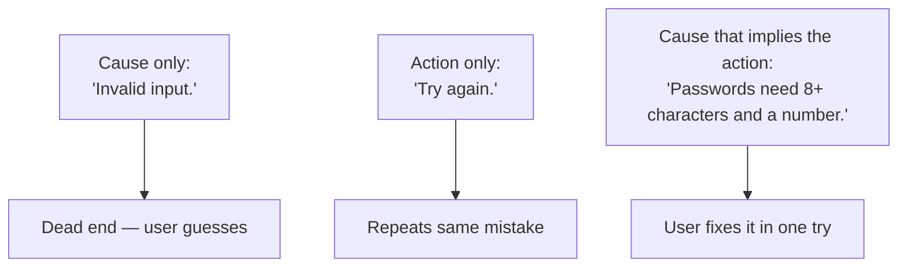
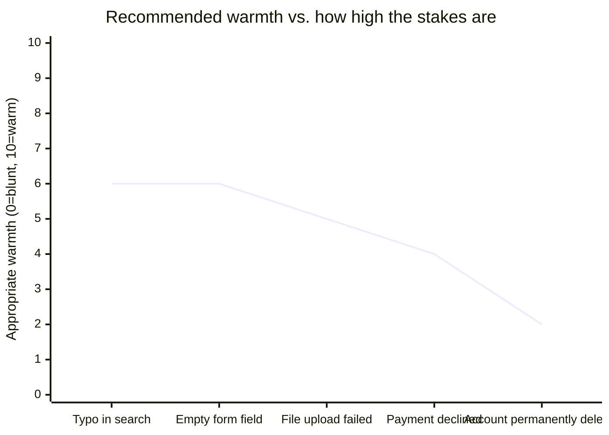

import Scenario from "../../../components/Scenario.astro";
import LevelIntro from "../../../components/LevelIntro.astro";
import Checkpoint from "../../../components/Checkpoint.astro";

<Scenario>
  <Fragment slot="facts">
    

      

        
Password field

        
"Invalid input."

      

      

        
Same field, rewritten

        

          "Passwords need at least 8 characters, including one number."
        

      

    

    

      
🔁 Both fire on the exact same validation failure

      
❓ "Invalid input" tells you nothing you didn't already know

      
🎯 The rewrite tells you the rule you broke and how to fix it

    

  </Fragment>

You already know App A vs. App B from the last level was about blame, actionability, and
register. But those are just labels — what's the actual mechanism a writer applies, sentence by
sentence, to turn "Invalid input" into something a user can act on without re-reading it twice?

**If you had to hand a new writer on your team one rule that would fix 80% of bad error
messages, what would it be?**

</Scenario>

The password example above is that rule in miniature: "Invalid input" restates that a failure
happened; the rewrite explains the actual rule and hands back a fixable next step. Everything
below is how to do that on purpose, for any error, not just this one.

<LevelIntro
  items={[
    "The cause / impact / action triad",
    "Voice: writing as a helpful person, not a system log",
    "Matching tone to how much is actually at stake",
  ]}
/>

## The cause / impact / action triad

Every error message is answering up to three questions, and a message is only as strong as the
questions it actually answers:

| Question it answers                    | Skip it when...                                                         | Include it when...                                                               |
| -------------------------------------- | ----------------------------------------------------------------------- | -------------------------------------------------------------------------------- |
| **What happened?** (cause)             | Almost never — always state the fact, briefly                           | Always, unless it's genuinely self-evident from context                          |
| **What does it mean for me?** (impact) | The impact is obvious ("field is empty" → nothing was saved is obvious) | The impact is non-obvious or high-stakes (data loss, a charge, a locked account) |
| **What do I do next?** (action)        | Truly never — a message with no action is a dead end                    | Always, even if the action is just "try again"                                   |

Cause without action is App A from L1: technically informative, practically a dead end. Action
without cause can also fail — "Try again" on its own, with no hint of why it failed, leaves the
reader repeating the exact same mistake. The strongest messages give a cause specific enough that
the action is almost self-explanatory: "Passwords need at least 8 characters, including one
number" doesn't need a separate "action" sentence — the cause already tells you what to fix.

<Checkpoint question="A teammate proposes this rewrite for a failed file upload: 'Try again.' No cause, just the retry instruction. What's the problem with shipping that as-is?">

It gives the reader an action but no information to act on differently — if the upload failed
because the file was too large, "try again" just produces the same failure a second time. A
retry instruction only helps when the cause is transient (a dropped connection, a momentary
timeout); when the cause is something the user can actually change — file size, file type,
network permission — the message needs to name that cause, or "try again" is just delaying the
same dead end by one click.

</Checkpoint>

## Voice: write as a person, not a system log

A second axis, independent of the triad above, is _who_ the message sounds like it's coming
from. Backend error strings tend to describe the system's internal state ("Request failed with
status 402", "Null reference in payment handler") because that's genuinely what a log line is
for. But a user-facing message isn't a log line — it's one person telling another person what
just happened, so it should read like it, not like a stack trace that leaked into the UI:

- **System-voice (avoid):** "Transaction failed. Error 402."
- **Human-voice (prefer):** "Your card was declined by your bank."

The system-voice version isn't wrong, it's just answering the wrong question — it describes what
the _server_ experienced, not what the _user_ needs to know. Human-voice microcopy translates the
internal event into the reader's terms: not "what broke in our system" but "what does this mean
for you, and what can you do."

## Matching tone to stakes

The tone-spectrum chart from L1 (robotic → plain → warm → cute) isn't a single right answer —
where you land on it should track how much is actually on the line for the reader in that
specific moment:

Notice the line goes _down_ as stakes go up, not up. A cheerful, bouncy tone on a low-stakes typo
("Looks like a typo — try again?") reads as friendly. That same cheerful tone on "Your account
and all its data have been permanently deleted" reads as tone-deaf, almost mocking — high-stakes
moments call for plain, calm, precise language, not warmth. Warmth is a resource to spend on the
small, frequent, low-consequence failures where it makes the product feel considerate; spend it
on a catastrophic failure and it reads as the product not taking the situation as seriously as
the user does.

<Checkpoint question="A designer wants to add an exclamation point and a friendly emoji to the confirmation dialog for 'This will permanently delete your account and all data.' Using the stakes-vs-warmth relationship above, what would you tell them?">

Don't — this is exactly the high-stakes end of the spectrum where warmth should go down, not up.
The reader is about to make an irreversible decision, and the writing's job in that moment is to
make the consequence unmistakably clear and give them a real chance to back out, not to sound
approachable. An exclamation point or emoji here reads as the product being cheerful about
something the user should be taking seriously, which undercuts the one thing this message
actually needs to do: make sure they don't delete something by accident.

</Checkpoint>

## Putting the two axes together

The triad (cause / impact / action) decides _what_ the message says; voice and stakes-matched
tone decide _how_ it says it. A message can nail the triad and still fail on tone (a
technically-complete but coldly worded deletion warning), or nail the tone and still fail the
triad (a warm, friendly message that never actually says what to do). Both axes have to land for
a message to read as genuinely helpful — which is exactly what the worked rewrites in L3 walk
through end to end.
