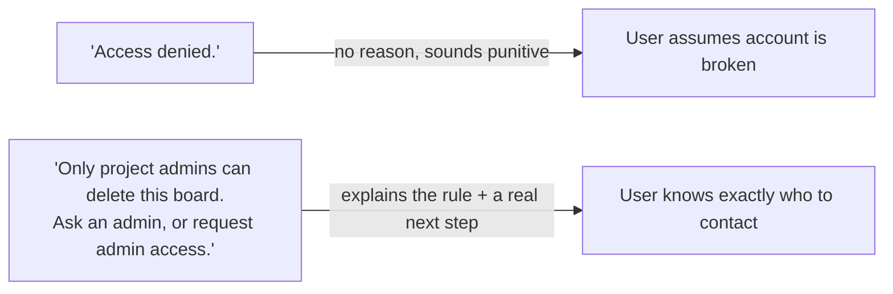

import Scenario from "../../../components/Scenario.astro";
import LevelIntro from "../../../components/LevelIntro.astro";
import Checkpoint from "../../../components/Checkpoint.astro";

<Scenario>
  <Fragment slot="facts">
    

      

        
Original

        
"Error: Request failed."

      

      

        
After rewrite

        

          "We couldn't reach the server. Check your connection and try again."
        

      

    

    

      
🐛 "Error: Request failed" is a literal console.log left in production

      
🧭 The rewrite names a plausible cause AND a concrete next step

      
⏱️ Takes about 90 seconds to write once you know the triad

    

  </Fragment>

L1 and L2 gave you the shape of a good message and the two axes (triad, stakes-matched tone)
that decide it — but each of those was a single sentence in isolation. What does the actual
writing process look like, end to end, on a real string that ships in production today?

</Scenario>

The rewrite above didn't happen by accident — it followed a repeatable process. This level walks
that process end to end, then applies it across the failure modes every product hits sooner or
later: network errors, destructive actions, rate limits, permission errors, and empty states.

<LevelIntro
  items={[
    "A full walkthrough: rewriting a real network-error string",
    "Rewrites for destructive actions, rate limits, and permission errors",
    "Where the triad and stakes-matched tone genuinely trade off against each other",
  ]}
/>

## Walkthrough: rewriting "Error: Request failed."

Start from the worst-case default: a raw string that leaked out of a `catch` block with no UX
writing pass at all. Here's the process, step by step, the way a writer would actually work
through it.

**Step 1 — name the real cause, not the technical one.** The underlying exception might be a
timeout, a DNS failure, or a 5xx from the server — the user doesn't need (or want) to
differentiate those. What they need is the category of cause that changes what they'd do: is this
their connection, or is it us? "We couldn't reach the server" answers that in six words, without
pretending to diagnose the exact failure.

**Step 2 — decide whether impact needs stating.** Here the impact is obvious — nothing loaded, the
screen is visibly empty or stuck — so a separate impact sentence would just be padding. Skip it.

**Step 3 — give a concrete action.** "Check your connection and try again" is concrete enough to
act on immediately, and honest about the fact that a retry is a reasonable next step for this
specific failure class (unlike the file-upload example in L2, where retrying a too-large file
changes nothing).

**Step 4 — check the tone against the stakes.** A failed page load is low-to-moderate stakes —
annoying, not catastrophic. Plain, calm language fits; no warmth is needed, but nothing about the
wording should sound like an accusation either. "We couldn't reach the server" keeps the blame on
neither party — it doesn't say "you're offline" (which might be wrong) or "our server is down"
(which might also be wrong).

| Step       | Original                 | After                                                                |
| ---------- | ------------------------ | -------------------------------------------------------------------- |
| Raw string | "Error: Request failed." | —                                                                    |
| + cause    | —                        | "We couldn't reach the server."                                      |
| + action   | —                        | "We couldn't reach the server. Check your connection and try again." |
| Tone check | Reads as a crash log     | Reads as a calm, neutral status update                               |

<Checkpoint question="Extend this same walkthrough to a different failure: the request didn't fail from a bad connection, it failed because the user's session expired mid-form. Using the same four steps, what would the cause and action sentences say?">

The cause sentence has to name something different from "we couldn't reach the server" — the
connection was fine; what actually happened is the session timed out, so the honest cause is
something like "You've been signed out due to inactivity." The action then has to account for the
fact that whatever the user was typing is now at risk of being lost, which changes what "impact"
step 2 would skip for the network case — here it shouldn't be skipped, because losing unsaved
work is exactly the kind of non-obvious, higher-stakes impact the triad says to call out
explicitly, e.g. "Sign back in to continue — we've saved your progress" (if that's true) or a
clear warning if it isn't. The tone stays plain and calm either way, but the content of cause and
impact genuinely differ from the connection-failure case even though both start from the same
generic "Error: Request failed."

</Checkpoint>

## Destructive actions: where warmth should drop to zero

Destructive-action confirmations are the clearest case of the stakes-vs-warmth relationship from
L2, because the cost of getting the tone wrong is irreversible data loss, not just annoyance.

| App                             | Confirmation copy                                                  | What's wrong / right                                                                    |
| ------------------------------- | ------------------------------------------------------------------ | --------------------------------------------------------------------------------------- |
| Generic default (bad)           | "Are you sure?"                                                    | Doesn't say what will be deleted, doesn't say it's irreversible                         |
| Overly casual (bad)             | "Whoops, about to nuke this project! Cool with that? 😅"           | Cute tone actively undersells an irreversible action                                    |
| Clear and stakes-matched (good) | "Delete 'Q3 Planning' and its 14 documents? This can't be undone." | Names exactly what's affected, states irreversibility plainly, no blame, no false cheer |

The good version isn't longer because more words are better — it's longer because it's answering
the two questions that actually matter for a destructive action: _what_ is being destroyed, and
_can I get it back_. A generic "Are you sure?" technically prompts a confirmation but gives the
reader nothing to reason about; they're confirming blind.

## Rate limits and permission errors: cause is the whole message

Some failure categories are almost entirely about naming the cause correctly, because once the
cause is clear, the action is either obvious or genuinely out of the user's hands.

- **Rate limit, vague:** "Too many requests." — sounds like the user did something wrong.
- **Rate limit, better:** "You've hit the limit of 100 searches per hour. It resets in 12
  minutes." — states the actual rule and gives a concrete time, replacing anxiety ("did I get
  banned?") with a plain fact.
- **Permission error, vague:** "Access denied."
- **Permission error, better:** "Only project admins can delete this board. Ask an admin, or
  request admin access." — the action here isn't something the reader can do alone, so the
  message's job shifts from "tell them what to click" to "tell them who to talk to" — still an
  action, just a human one instead of a UI one.

## Where the triad and stakes-matched tone can pull against each other

**What happens when being fully specific about the cause would itself increase anxiety more than
it helps?** This is the one genuine tension in the model: full transparency about a cause isn't
automatically the right call.

Consider a payment failure where the real cause, from the payment processor, is "suspected
fraud — card issuer flagged this transaction." Naming that cause literally ("Your bank flagged
this as possible fraud") is accurate, but for a legitimate customer it can read as alarming and
accusatory, exactly the "reads as hostile" failure mode this whole unit is about — even though
it's specific and truthful. A better resolution keeps the action just as concrete while
softening the cause to what the user can actually act on: "Your bank declined this card. Contact
them directly, or try a different card" — true, actionable, and doesn't imply the reader is
suspected of fraud, which isn't useful information for them anyway (they can't do anything about
their fraud-flag status from the checkout page). The lesson generalizes: the right cause to state
is the most specific one the reader can actually act on or find reassuring — not the most
technically complete one available in the logs.

**Try extending this yourself:** how would the rate-limit rewrite above change if the audience
were a developer hitting an API programmatically instead of someone using a search box? (Consider
what "action" even means for a caller that's a script, not a person reading a screen — does the
message still need a plain-English tone, or does something else start to matter more, like the
exact reset timestamp in a machine-parseable format?)
