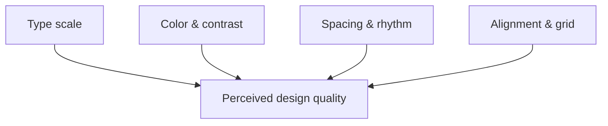

import Scenario from "../../../components/Scenario.astro";

<Scenario>
  <Fragment slot="facts">
    

      
🔤 Type scale — one size for everything vs. a deliberate size/weight jump per role

      
🎨 Contrast — 2.8:1 gray-on-white vs. 12.6:1 — same hue family, different legibility

      
📏 Spacing — near-zero gaps everywhere vs. an 8px rhythm that groups related fields

      
📐 Alignment — labels and inputs on different edges vs. one shared left edge

    

    
Same content, same HTML elements

    
Nothing was added or removed below — every difference comes from CSS alone.

  </Fragment>

Both boxes below are the same "Profile settings" form: a title, two labeled fields, one button. Same words, same HTML elements, same screen space. Only the CSS differs.

  

    
✗ Bare form

    
Profile settings

    
Name

    

    
Email

    

    

      Save
    

  

  

    

      ✓ Designed
    

    

      Profile settings
    

    <label class="mb-1 block text-xs font-medium text-slate-600 dark:text-slate-400">
      Name
    </label>
    

    <label class="mb-1 block text-xs font-medium text-slate-600 dark:text-slate-400">
      Email
    </label>
    

    

      Save changes
    

  

**Before reading on: no copy changed, no field was added or removed, and both use the same font family. So what, specifically, is doing all the work?**

</Scenario>

It's not decoration — it's four measurable levers, applied or ignored.

- "Designed" isn't a vague compliment and "bare form" isn't a lack of effort — both are the visible result of four concrete levers, each of which can be measured, not just eyeballed:
  - **Type scale / hierarchy** — do sizes and weights signal what to read first, or is every line of text visually equal?
  - **Color & contrast** — is there enough luminance difference between text and background to read easily, and enough _difference between elements_ to tell them apart? (Contrast has a real formula — see below.)
  - **Spacing & rhythm** — does whitespace group related things together and separate unrelated things, on a consistent scale, or is every gap arbitrary?
  - **Alignment & grid** — do elements share edges the eye can lock onto, or does each one sit wherever it happens to fit?
- These four levers are **not independent taste calls** — contrast has a published, calculable ratio (WCAG's relative-luminance formula), and type scale is usually a fixed multiplier applied consistently, not sizes picked one at a time.
- The "bare form" box above isn't bad because its border-radius is 0 — it's bare because **every lever above sits at its default, unconsidered value**: one font size, low-contrast gray-on-white with no chosen ratio, spacing that's whatever the browser gives you by default, and a label/field/button that don't share a left edge.
- Fixing all four at once feels like "good taste." Fixing them one at a time, deliberately, is a skill — and it's the one this unit builds.

The four levers aren't independent — they compound. A hierarchy fix without a spacing fix still looks cramped; a spacing fix without a contrast fix still looks flat:

| Lever      | Bare-form default           | Designed choice                                  | Measurable as                   |
| ---------- | --------------------------- | ------------------------------------------------ | ------------------------------- |
| Type scale | One size, one weight        | A fixed ratio (e.g. ×1.25) across heading levels | Font-size ratio between levels  |
| Contrast   | Whatever gray "looked fine" | A chosen ratio against a real threshold          | WCAG contrast ratio (see L2)    |
| Spacing    | Browser/element defaults    | A consistent scale (e.g. 4px/8px steps)          | px gap between grouped elements |
| Alignment  | Each element's own default  | A shared edge (grid column or baseline)          | Shared x/y coordinate           |

Two more things worth knowing before L2 goes into the mechanics:

- **None of these four levers requires more content, more colors, or more images.** The comparison above used the exact same markup — this is a CSS-only, content-neutral set of moves, which is why it's learnable independent of "having an eye" for design.
- **Contrast is the one lever with a legal/accessibility floor, not just a taste preference** — WCAG defines a minimum contrast ratio for text to be considered readable, and it's just arithmetic on RGB values. L2 walks through the formula; L3 applies it to a real color pair and shows a pair that looks "fine" to the eye but fails the number.
