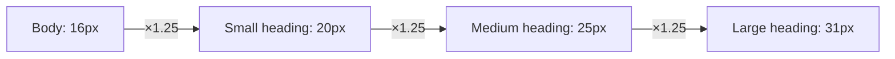
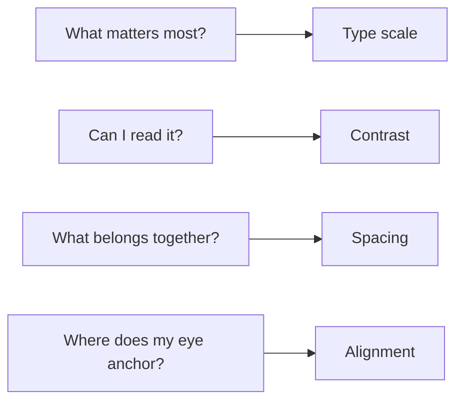

import Scenario from "../../../components/Scenario.astro";

<Scenario label="The model">
  <Fragment slot="facts">
    

      
1. <strong>Type scale</strong> — a fixed ratio, not picked sizes

      
2. <strong>Contrast</strong> — a real luminance formula, WCAG 2.x

      
3. <strong>Spacing</strong> — a step scale that encodes grouping

      
4. <strong>Alignment</strong> — a shared edge, not a shared "roughly here"

    

    
All four apply to the same element at once — none works in isolation.

  </Fragment>

L1 named four levers. But "use more contrast" and "add more spacing" are exactly the kind of vague advice that made the bare form bare in the first place — nobody sat down and _decided_ 2px gaps and gray-on-white, they just didn't decide anything.

**So what does "deciding" actually look like for each lever — is it a number, a ratio, or a rule?**

</Scenario>

## Type scale: a ratio, not a list of sizes

Picking `14px`, `16px`, `22px`, `28px` one at a time produces a plausible-looking list — until two headings sit next to each other and the jump between them feels arbitrary. A **type scale** fixes a ratio once and multiplies:

If powers feel abstract, read the scale as repeated multiplication:
start with body text at `16px`; one step up at ratio `1.25` is `16 *
1.25 = 20px`; another step up is `20 * 1.25 = 25px`. The formula
`base * ratio^steps` is just that same repeated step written compactly.

**Guiding question: if every size on the page comes from the same multiplier, what should that buy you that picking sizes by eye doesn't?** Consistency you don't have to re-justify — a 5th heading level slots in at the next multiple without a fresh judgment call, and two unrelated pages built from the same scale feel like the same product.

  

    

      ✗ Ratio ≈ 1.05 (everything nearly the same size)
    

    

      Account settings
    

    

      Manage your plan
    

    

      Billing details
    

  

  

    

      ✓ Ratio = 1.25 (clear jump per role)
    

    

      Account settings
    

    

      Manage your plan
    

    

      Billing details
    

  

A small ratio change compounds fast across levels — the demo at the end of this page lets you drag the ratio and watch a heading three steps up from body text grow from barely-distinct to unmistakably a headline.

## Color & contrast: the one lever with an actual number

**Guiding question: two grays can both "look readable" on a white background — how do you tell, without guessing, which one actually is?**

Contrast measures difference in **lightness**, not how loud or colorful a
hue feels. A bright saturated blue can look intense and still be too
close in luminance to the background for small text. The formula below is
just a precise way to answer: "is the text clear enough against this
actual background?"

WCAG defines **relative luminance** for an sRGB color and a **contrast ratio** between two luminances. You don't need to memorize the formula, but it's worth seeing once, because it explains why some greens look bright but read poorly:

| Step | What it computes                                                                                                       |
| ---- | ---------------------------------------------------------------------------------------------------------------------- |
| 1    | Convert each of R, G, B (0–255) to a 0–1 linear value, gamma-correcting each channel                                   |
| 2    | Weight them unevenly: **L = 0.2126·R + 0.7152·G + 0.0722·B** (green dominates human perception, blue barely registers) |
| 3    | Contrast ratio = **(L₁ + 0.05) / (L₂ + 0.05)**, where L₁ is the lighter of the two colors                              |

That last detail — the 0.7152 weight on green — is why a saturated blue button can look "loud" but still fail a contrast check against white: perceived brightness and measured luminance aren't the same axis, and only luminance feeds the ratio.

The output is a single number, and WCAG sets thresholds against it:

| Use case                          | AA minimum | AAA minimum |
| --------------------------------- | ---------- | ----------- |
| Normal text                       | 4.5 : 1    | 7 : 1       |
| Large text (≥18pt, or ≥14pt bold) | 3 : 1      | 4.5 : 1     |
| UI components / graphical objects | 3 : 1      | —           |

  

    

      Sample text
    

    

      2.85:1 — fails AA
    

  

  

    

      Sample text
    

    

      4.54:1 — passes AA, fails AAA
    

  

  

    

      Sample text
    

    

      12.6:1 — passes AAA
    

  

All three swatches are "gray text on white" — the eye alone doesn't reliably separate a 2.85 from a 4.54 without a side-by-side, which is exactly why this is the one lever you check with arithmetic instead of a glance. L3 walks the full calculation for the middle swatch.

## Spacing & rhythm: whitespace groups things

**Guiding question: if you only changed the gaps between elements — not their size, not their color — could you still make a form look organized?** Yes, entirely — this is the _proximity_ principle: elements closer together read as related, elements farther apart read as separate groups, independent of any other styling.

This is one of the Gestalt principles: people do not read every item as a
separate isolated fact first; they quickly group nearby things together.
That is why random gaps feel messy and consistent gaps feel structured.

  

    

      ✗ Uniform gaps — is "City" part of "Shipping" or "Billing"?
    

    

      
Shipping address

      
Street

      
City

      
Billing address

      
Street

      
City

    

  

  

    

      ✓ Grouped by gap size — the grouping is unambiguous
    

    

      

        Shipping address
      

      
Street

      
City

      

        Billing address
      

      
Street

      
City

    

  

A **spacing scale** (commonly steps of 4px or 8px — `4, 8, 12, 16, 24, 32...`) does for whitespace what a type scale does for text: it makes every gap a deliberate multiple instead of a one-off number, so "related field" gaps and "different section" gaps stay visually distinct everywhere on the page, not just in the one spot you happened to tune.

## Alignment & grid: one shared edge

**Guiding question: why does a column of left-aligned labels feel calmer than the exact same labels centered individually?** Because a shared edge gives the eye one vertical line to track down the page — center-aligned text creates a different left edge on every line, so the eye has to re-find the start of each one.

  

    

      ✗ Centered — no shared left edge
    

    

      
Full name

      
Email address

      
Phone number (optional)

    

  

  

    

      ✓ Left-aligned — one shared edge
    

    

      
Full name

      
Email address

      
Phone number (optional)

    

  

A grid (even an informal one — "everything starts at 24px from the left") is what makes this hold across an entire page, not just one group of three lines.

## The levers compound — they don't substitute for each other

**Guiding question: if you only had time to fix one lever on the bare form from L1, which one would fix the most?** None of them alone — this is the point worth sitting with. Contrast without spacing still reads as cramped. Spacing without type scale still reads as flat (every group is well-separated, but nothing signals _which_ item in each group matters most). The four levers answer different questions — _what matters most_ (type), _can I read it_ (contrast), _what belongs together_ (spacing), _where does my eye anchor_ (alignment) — and a layout only reads as fully "designed" once all four are answered, not just one.

L3 applies all four to one real panel across several passes, works the WCAG formula on an actual color pair end to end, and looks at where these levers create genuine tension with other constraints (brand color, information density) rather than a clean win every time.
