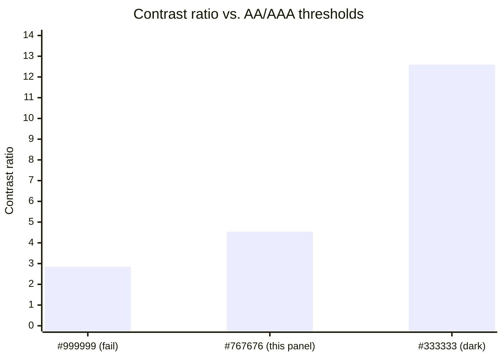

import Scenario from "../../../components/Scenario.astro";

<Scenario label="The panel">
  <Fragment slot="facts">
    

      
<strong>Pass 1</strong> — spacing (group + separate)

      
<strong>Pass 2</strong> — type scale (signal what matters most)

      
<strong>Pass 3</strong> — color & contrast (verify with math, not eyes)

    

    
Same three fields, same two toggles, every pass. Nothing added, nothing removed.

  </Fragment>

A real "Notification preferences" panel — three checkboxes, two toggles, one save button — arrives from a first implementation pass with no design attention at all. It works. It's also the bare-form problem from L1, at slightly larger scale.

  

    

      ✗ Starting point — everything at default
    

    
Notification preferences

    
Email me about

    
☐ Product updates

    
☐ Security alerts

    
☐ Weekly digest

    
Push notifications

    
☐ Enabled on this device

    
☐ Quiet hours 10pm–8am

    

      Save
    

  

**Before the first pass: this panel has two distinct groups (email settings, push settings) and one action. Nothing in the markup below tells you that. What's the cheapest fix that would make the grouping visible without touching type or color at all?**

</Scenario>

## Pass 1 — spacing: make the grouping visible for free

The fix costs nothing structurally: apply an 8px step scale (`8, 16, 24, 32`px) so items in the same group sit 8px apart, and groups sit 24px apart from each other. No font size changed. No color changed.

  

    

      ✗ Before — one undifferentiated list
    

    

      
Email me about

      
☐ Product updates

      
☐ Security alerts

      
☐ Weekly digest

      
Push notifications

      
☐ Enabled on this device

      
☐ Quiet hours 10pm–8am

    

  

  

    

      ✓ After — 8px within group, 24px between groups
    

    

      
Email me about

      

        
☐ Product updates

        
☐ Security alerts

        
☐ Weekly digest

      

      
Push notifications

      

        
☐ Enabled on this device

        
☐ Quiet hours 10pm–8am

      

    

  

This is worth pausing on: **spacing alone already made the two groups legible**, before a single font size or color changed. That's a useful diagnostic in a real review — if a layout feels disorganized, check whether the spacing scale is even present before reaching for a redesign.

## Pass 2 — type scale: signal what to read first

Spacing shows _where the groups are_; it doesn't show _what matters most within them_. Right now "Email me about," "Push notifications," and every checkbox label render at the same weight — the panel title doesn't visually outrank its own subsections.

**Before this pass: with the ×1.25 scale from L2 (16px body → 20px section label → 25px panel title), what's the minimum number of distinct sizes this panel actually needs?** Three: panel title, section label, item label — a 4th size would be hierarchy for its own sake, not signal.

  

    

      ✗ Before — one size throughout
    

    

      
Notification preferences

      
Email me about

      

        
☐ Product updates

        
☐ Security alerts

      

    

  

  

    

      ✓ After — 3 sizes, ×1.25 apart
    

    

      
Notification preferences

      

        Email me about
      

      

        
☐ Product updates

        
☐ Security alerts

      

    

  

## Pass 3 — color & contrast: verify, don't eyeball

Passes 1 and 2 got the panel readable and organized using grays that were never actually checked. **The section-label gray above — is it a real WCAG-passing choice, or does it just look fine on this screen, in this lighting, to these eyes?** That question can't be answered by looking; it has to be computed.

Take `#767676` on a white (`#FFFFFF`) background — the section-label gray used above, and a famously borderline real-world value (it's the exact gray several major style guides once shipped as their "muted text" color). Working the WCAG formula from L2 end to end:

**Step 1 — linearize each channel of `#767676` (R=G=B=118):**

| Channel     | 0–255 → 0–1 | Gamma correction                                   |
| ----------- | ----------- | -------------------------------------------------- |
| c = 118/255 | 0.4627      | c > 0.03928, so `lin = ((c + 0.055) / 1.055)^2.4`  |
|             |             | `lin = (0.5177 / 1.055)^2.4 = 0.4907^2.4 ≈ 0.1811` |

Since R = G = B, the weighted sum from L2 (`0.2126·R + 0.7152·G + 0.0722·B`) collapses to the same value regardless of the weights (they sum to 1): **L(gray) ≈ 0.1811**.

**Step 2 — white's luminance is exactly 1.0** (all three channels maxed, no correction needed at the ceiling).

**Step 3 — contrast ratio:**

`ratio = (L_white + 0.05) / (L_gray + 0.05) = (1.0 + 0.05) / (0.1811 + 0.05) = 1.05 / 0.2311 ≈ 4.54`

**4.54:1 clears the AA minimum for normal text (4.5:1) by 0.04 — a rounding error's worth of margin — and fails AAA (7:1) outright.** That's the uncomfortable part of doing the math: a color that "looked fine" turns out to be passing by the thinnest possible margin, one that a slightly different rendering engine's gamma handling could tip the wrong way. The fix here isn't cosmetic — swap to `#5c5c5c` (luminance ≈0.108, ratio ≈6.2:1) or `#333333` (ratio ≈12.6:1, comfortably AAA) if the label is meant to be read reliably, not just technically pass.

  

    

      ✓ Final panel — spacing + type scale + verified contrast
    

    

      
Notification preferences

      

        Email me about
      

      

        
☐ Product updates

        
☐ Security alerts

        
☐ Weekly digest

      

      

        Push notifications
      

      

        
☐ Enabled on this device

        
☐ Quiet hours 10pm–8am

      

      

        Save changes
      

    

  

Three passes, same markup throughout, and the panel went from indistinguishable-from-unstyled to something a reviewer would call "designed" — without adding an icon, an illustration, or a single new color.

## Trade-offs: the levers don't always agree with each other

**Guiding question: what happens when the brand's signature color is a light, saturated one — say a mint green at `#7FE8C4` — and someone wants it as the "Save" button's text-on-white?** Compute it: mint at that lightness has a luminance around 0.55, giving a contrast ratio against white of roughly 1.4:1 — nowhere near even the loosest UI-component threshold (3:1). This is the real, recurring tension in this lever set:

| Tension                                    | What's pulling each way                                                                                                                         |
| ------------------------------------------ | ----------------------------------------------------------------------------------------------------------------------------------------------- |
| Brand color vs. contrast floor             | Marketing wants the exact brand hue on-screen; that hue may not pass AA at any reasonable size against a light background                       |
| Density vs. spacing scale                  | A data-heavy admin table wants more rows visible; a full 8px rhythm between every row may cost more vertical space than the use case can afford |
| Consistent type scale vs. one-off emphasis | A single "urgent" label wants to break the ratio and jump two sizes at once; doing that everywhere would erode the scale's whole point          |

None of these has a universal right answer. The workable pattern in practice: **keep the brand color as a fill or accent (a badge background, an icon, a border) where contrast rules are looser or don't apply, and use a darker or lighter tint of the same hue — not the literal brand value — anywhere it needs to carry text.** A mint-green _badge_ with dark text on top of it can stay on-brand and pass contrast; mint-green _text_ on white generally can't.

## Edge cases

- **Dense data tables.** The 8px spacing rhythm from Pass 1 is right for a form; a table with 40 rows on screen often can't afford it. The lever still applies — just at a smaller step (e.g. a 4px scale) so rows stay legibly separated without eating the vertical budget a form doesn't have to worry about.
- **Color as the _only_ signal.** A red border meaning "error" and a green border meaning "success" both fail for color-blind readers if color is the sole differentiator — WCAG 1.4.1 requires a second, non-color cue (an icon, a text label) alongside any color-coded state, independent of whether the colors themselves pass contrast.
- **Contrast checked against the wrong background.** A translucent card over a photo background can pass a contrast check against the _card's own_ fill color and still fail in production if the photo underneath is light in some regions — contrast has to be verified against the actual rendered background, not the nominal one.

**Extend it yourself: this redesign assumed a light theme and a standard information density. What would Pass 3's color math need to redo for a dark theme (dark background, light text) — does the same `#767676` gray keep or lose its AA pass once the background flips from white to near-black? And separately: if this were an admin table showing 200 rows instead of two toggle groups, which of the three passes would you scale back first, and which would you keep untouched?**

The three-pass structure — spacing, then type, then verified color — isn't the only valid order, but it's a useful default: each pass is checkable independently of the others, and grouping/hierarchy problems are usually cheaper to fix than contrast problems, so finding them first avoids re-verifying contrast on a layout that's about to be restructured anyway.
