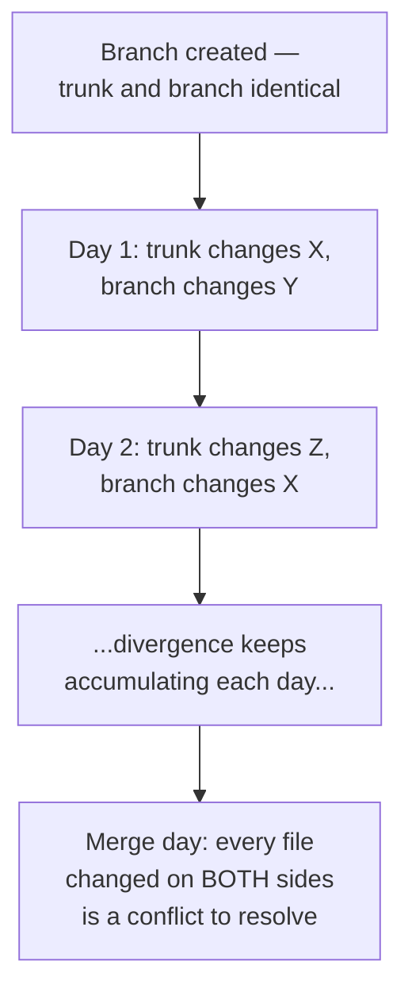

## What actually grows while a branch is open

**If a feature branch and trunk both keep changing while the branch is
unmerged, what's actually accumulating?** Not just lines of code —
specifically, the set of files each side has independently touched
since they last matched. Every day a branch stays open, both trunk and
the branch have another chance to touch the same file without either
side knowing about the other's change:

Notice that a conflict already exists by day 2 in this diagram (branch
touched `X` on day 2, trunk touched `X` on day 1) — it just isn't
_discovered_ until whenever the merge actually happens. A long-lived
branch doesn't create more conflicts by existing longer; it delays
discovering conflicts that already happened, and lets more of them
accumulate before discovery.

## Trunk-based vs. gitflow: what's actually being traded

| Property                                        | Trunk-based                                                     | Gitflow                                                                |
| ----------------------------------------------- | --------------------------------------------------------------- | ---------------------------------------------------------------------- |
| Typical branch lifetime                         | Hours to 1 day                                                  | Days to weeks                                                          |
| When conflicts are discovered                   | Immediately, in small pieces                                    | All at once, at merge time                                             |
| Total conflict _volume_ over a sprint           | Similar or lower — overlap resolved before it can accumulate    | Higher — overlap has longer to build before any reconciliation         |
| What's required to merge unfinished work safely | Feature flags, since code lands on trunk before it's fully done | Not required — the branch itself hides unfinished work until merge day |
| Cost of a single merge                          | Low — small diff, recent context, easy to reason about          | High — large diff, days-old context, harder to reason about            |

Neither column is "correct" in the abstract — trunk-based demands
feature-flag discipline that gitflow doesn't need, and gitflow's
isolation is genuinely useful for work that shouldn't be visible on
trunk at all yet (a major rewrite, a security-sensitive change). The
trade is speed and frequency of small conflicts against the comfort of
deferring all of it to one larger reconciliation.

## Why merge cost isn't proportional to code volume

**If Team Gitflow and Team Trunk wrote roughly the same amount of
code, why was one team's integration so much harder?** Because the
cost driver isn't code volume, it's _unreconciled overlap_ — and
overlap doesn't accumulate at a constant rate relative to code
written; it accumulates relative to **time spent unreconciled**. Two
developers can write completely disjoint code for two weeks with zero
conflict, or write overlapping code for one day and hit a conflict
immediately — the strategy that resolves overlap sooner catches it
smaller, regardless of how much total code either side wrote.
