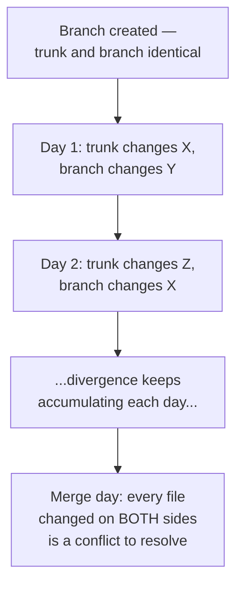

import LevelIntro from "../../../components/LevelIntro.astro";
import Checkpoint from "../../../components/Checkpoint.astro";

L1 named trunk-based development and gitflow as two different answers to how long work should stay unreconciled before it's checked. L2 works out mechanically why that choice moves conflict cost, and what each strategy actually trades away to get its result.

<LevelIntro
  items={[
    "What accumulates while a branch stays open",
    "Trunk-based vs. gitflow, trait by trait",
    "Why cost tracks time unreconciled, not code volume",
  ]}
/>

## What actually grows while a branch is open

**If a feature branch and trunk both keep changing while the branch is
unmerged, what's actually accumulating?** Not just lines of code —
specifically, the set of files each side has independently touched
since they last matched. Every day a branch stays open, both trunk and
the branch have another chance to touch the same file without either
side knowing about the other's change:

Strictly speaking, Git only reports a merge conflict when it cannot
combine the exact changed lines or regions automatically. Two people
can edit different functions in the same file and Git may merge them
cleanly. This lesson uses "same hot files" as a beginner-friendly
proxy for rising overlap risk: same-file work is not guaranteed to
conflict, but it is a place where reconciliation becomes more likely
and more worth checking early.

Notice that a conflict already exists by day 2 in this diagram (branch
touched `X` on day 2, trunk touched `X` on day 1) — it just isn't
_discovered_ until whenever the merge actually happens. A long-lived
branch doesn't create more conflicts by existing longer; it delays
discovering conflicts that already happened, and lets more of them
accumulate before discovery.

<Checkpoint question="In the diagram above, the conflict on file X was already 'live' by day 2, but nobody found out until merge day. Does merging more frequently mean fewer conflicts happen, or just that they're found sooner?">

Merging more frequently doesn't stop the underlying overlap from
happening in the first place — two people can still independently
touch the same file on the same day regardless of merge cadence. What
changes is _when_ that overlap gets discovered and reconciled. A
conflict found the next day is small: one day's worth of independent
change on each side, fresh in both people's minds. A conflict found
after ten days is the same underlying event, just left to compound
with nine more days of independent touches before anyone looks at it.
The frequency of merging controls the batch size of reconciliation,
not whether reconciliation is ever needed at all.

</Checkpoint>

## Trunk-based vs. gitflow: what's actually being traded

| Property                                        | Trunk-based                                                     | Gitflow                                                                |
| ----------------------------------------------- | --------------------------------------------------------------- | ---------------------------------------------------------------------- |
| Typical branch lifetime                         | Hours to 1 day                                                  | Days to weeks                                                          |
| When conflicts are discovered                   | Immediately, in small pieces                                    | All at once, at merge time                                             |
| Total conflict _volume_ over a sprint           | Similar or lower — overlap resolved before it can accumulate    | Higher — overlap has longer to build before any reconciliation         |
| What's required to merge unfinished work safely | Feature flags, since code lands on trunk before it's fully done | Not required — the branch itself hides unfinished work until merge day |
| Cost of a single merge                          | Low — small diff, recent context, easy to reason about          | High — large diff, days-old context, harder to reason about            |

Neither column is "correct" in the abstract — trunk-based demands
feature-flag discipline that gitflow doesn't need, and gitflow's
isolation is genuinely useful for work that shouldn't be visible on
trunk at all yet (a major rewrite, a security-sensitive change). The
trade is speed and frequency of small conflicts against the comfort of
deferring all of it to one larger reconciliation.

| Team situation                                            | Strategy that usually fits better | Reason                                                                        |
| --------------------------------------------------------- | --------------------------------- | ----------------------------------------------------------------------------- |
| Strong CI, small PRs, frequent deployments, feature flags | Trunk-based                       | The team can integrate often without exposing unfinished behavior             |
| Release trains, regulated approvals, long QA windows      | Gitflow or release branches       | The team needs a stable branch for certification or scheduled release control |
| Major rewrite that should not touch trunk yet             | Longer-lived branch               | Isolation may be worth the later reconciliation cost                          |
| Security-sensitive work with limited visibility           | Longer-lived protected branch     | Access control and timing may matter more than daily integration              |
| Many engineers touching the same modules every day        | Trunk-based, if discipline exists | Frequent reconciliation keeps overlap small and recent                        |

## Why merge cost isn't proportional to code volume

**If Team Gitflow and Team Trunk wrote roughly the same amount of
code, why was one team's integration so much harder?** Because the
cost driver isn't code volume, it's _unreconciled overlap_ — and
overlap doesn't accumulate at a constant rate relative to code
written; it accumulates relative to **time spent unreconciled**. Two
developers can write completely disjoint code for two weeks with zero
conflict, or write overlapping code for one day and hit a conflict
immediately — the strategy that resolves overlap sooner catches it
smaller, regardless of how much total code either side wrote.

<Checkpoint question="A teammate argues 'our feature branch is huge, that's why merging it was so painful.' Based on what this section just showed, is branch size the right diagnosis?">

Not quite — branch size (lines of code) correlates with pain but isn't
the actual driver. What made the merge painful is how much
_independent, overlapping_ change accumulated on both sides while the
branch was open, and that's a function of time, not line count. A
branch could be enormous but touch files nobody else ever touches, and
merge painlessly. A branch could be tiny but sit open for three weeks
on a handful of hot files everyone else is also editing, and produce a
brutal merge. The real lever to pull isn't "write less code per
branch" — it's "reduce how long code sits unreconciled with everyone
else's."

</Checkpoint>
