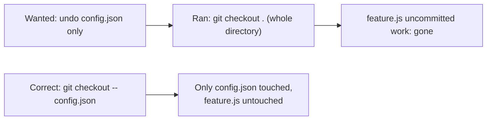

import Scenario from "../../../components/Scenario.astro";

<Scenario>
  <Fragment slot="facts">
    

      

        1 file
        intended to touch
      

      

        

      

      

        2 files
        actually wiped
      

      

        

      

    

    

      
🎯 Wanted: undo <code>config.json</code> only

      
💥 Ran a whole-directory command instead

      
😱 Three hours of uncommitted <code>feature.js</code> work: gone

    

    
The three verbs

    

      
🔀 <code>checkout</code> — move HEAD, or restore files

      
⏪ <code>revert</code> — new commit, history untouched

      
⚠️ <code>reset --hard</code> — overwrites, no undo

    

  </Fragment>

You broke `config.json` with a bad edit. `feature.js`, sitting right next to
it in the same working directory, has three hours of good, uncommitted work
you haven't touched yet. You want to undo _just_ `config.json`.

You type `git checkout .` — a dot for "the current directory" — expecting it
to restore the one broken file. Instead, both files snap back to their
last-committed state. `feature.js`'s three hours are gone, with no
confirmation prompt and no undo.

| What you meant          | What you typed   | What actually happened                             |
| ----------------------- | ---------------- | -------------------------------------------------- |
| Undo `config.json` only | `git checkout .` | Every uncommitted change in the directory reverted |

**The command did exactly what it says — restore everything in the current directory to its last-committed state. The mistake wasn't the tool malfunctioning; it was not knowing that `checkout .` is scoped to the whole directory, not the one file you had in mind. What exact file path, used instead of the dot, would have saved `feature.js`?**

</Scenario>

The fix (`git checkout -- config.json`, naming the file) was one path away —
the danger wasn't the command family, it was not knowing which of three
genuinely different operations you were actually invoking. The `--` helps
Git read what follows as a path, but it does not make `.` safe: `git checkout
-- .` still means "restore everything under this directory." The lifesaving
move is replacing `.` with the exact file you meant.

Before undoing anything, pause for the emergency checklist:

1. Run `git status` and read which files are at risk.
2. If you do not understand the status output, do not use `--hard`, `.`, or
   any whole-directory restore.
3. If the mistake is already pushed or shared, prefer `git revert`.
4. If you only mean one file, name that file exactly.

- Git has three different "undo" commands that get used interchangeably in casual speech but do genuinely different things: **`checkout`** (move between commits/branches, or restore specific files), **`revert`** (create a _new_ commit that undoes an old one), and **`reset`** (move a branch pointer backward, optionally touching the working directory too).
- The critical distinction: some undo operations **rewrite history** (reset, an old-style checkout that moves your branch), others **add to it** (revert) — this matters enormously the moment more than one person shares the branch, because rewritten history that's already been shared creates real conflicts for everyone else.
- `reset` has three modes that differ in how much they touch: `--soft` (move the branch pointer only, keep everything staged), `--mixed` (also unstage, but keep working-directory files as they are — the default), `--hard` (also overwrite working-directory files to match — **this one can destroy uncommitted work with no recovery path**).
- `revert` is the safe default for anything already pushed/shared: it doesn't erase the mistake from history, it adds a new commit that cancels it out — history stays append-only, which is exactly why it's safe on a shared branch where `reset` would not be.
- `checkout` (and its modern split, `switch`/`restore`) is the most overloaded of the three verbs historically — it can switch branches, detach HEAD to an old commit, or restore individual files from another commit, and conflating those three different actions under one command name is a real, common source of confusion, including the exact mistake above.
- The single most dangerous command in this unit is `git reset --hard` on a branch with uncommitted changes — it silently, irrecoverably discards them, no confirmation prompt, no undo. Everything else here has some recovery path; that combination often doesn't.
- The practical rule this unit builds: before undoing anything, know whether the target commit is still only local (safe to rewrite) or already shared (rewrite only with real coordination, or don't rewrite at all — revert instead) — and know exactly what scope your command covers before you run it.

| Command                          | What it moves                | Rewrites history? | Recoverable if wrong?                      |
| -------------------------------- | ---------------------------- | ----------------- | ------------------------------------------ |
| `checkout <branch>`              | HEAD, working directory      | No                | Yes — just check out the other branch back |
| `checkout -- <file>` / `restore` | One or more named files      | No                | Only if the file was previously committed  |
| `revert <commit>`                | Nothing — adds a new commit  | No (append-only)  | Yes — revert the revert                    |
| `reset --soft` / `--mixed`       | Branch pointer (+ staging)   | Yes (locally)     | Yes, via `reflog`                          |
| `reset --hard`                   | Branch pointer + working dir | Yes (locally)     | Only for already-committed content         |
