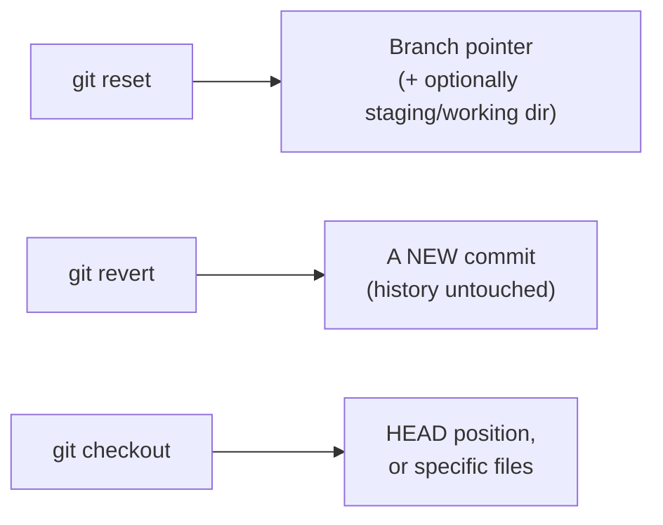
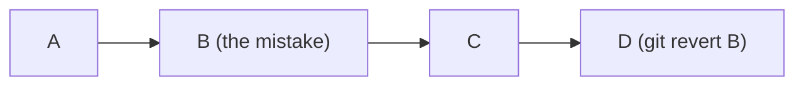

## Three commands, three different targets



`reset` moves where the branch label points — history before that point doesn't disappear, it just becomes unreachable from the branch anymore (still there in the object store until garbage collected, which is why `reflog` recovery, covered later, often works). `revert` never moves anything backward — it looks at what an old commit changed and creates a brand-new commit that changes it back. `checkout` moves _your working position_, not history at all.

## Reset's three modes, precisely

```python
function reset(mode, target_commit):
    move_branch_pointer(target_commit)  # ALL modes do this

    if mode == "soft":
        return  # staging area and working directory untouched

    reset_staging_area_to(target_commit)  # --mixed and --hard both do this
    if mode == "mixed":
        return  # working directory files untouched — edits are still there, just unstaged

    overwrite_working_directory_to(target_commit)  # --hard ONLY
    # Any uncommitted change in the working directory is now gone,
    # with no recovery path — this line is the entire danger of --hard.
```

Each mode is a strict superset of the previous one's effect — `--soft` is the least destructive (nothing outside the branch pointer changes), `--hard` is the most (working directory files are forcibly overwritten). The default, `--mixed`, sits in between: it unstages, but never touches actual file contents on disk.

## Why revert is the safe default once history is shared



After `revert`, the mistake (B) is still visibly there in history — D is a new commit whose diff is the exact inverse of B's. Anyone who already pulled A→B→C keeps working with no conflict, because nothing they already have was rewritten — D is just a new commit that arrives normally. Compare this to `reset`ting the branch back to A: anyone who already pulled B and C now has commits their remote no longer has any record of, and the next push/pull between them and the rewritten branch produces exactly the kind of "diverged history" mess that gives force-pushing its bad reputation.

## The safety rule, stated as a decision

| Is the target commit already pushed/shared?                   | Safe choice                          | Why                                                           |
| ------------------------------------------------------------- | ------------------------------------ | ------------------------------------------------------------- |
| No — only exists on your local branch                         | `reset` (any mode) is fine           | Nobody else has a copy of the history you're changing         |
| Yes — others may have already pulled it                       | `revert`                             | Adds new history instead of rewriting shared history          |
| Yes, but the team has explicitly coordinated a rewrite (rare) | `reset` + force-push, with agreement | The exception, not the default — requires everyone re-syncing |

This single question — "has anyone else possibly already seen this commit" — is the entire basis for choosing between rewriting history and adding to it, and it's the question worth asking before running any undo command, not after.
