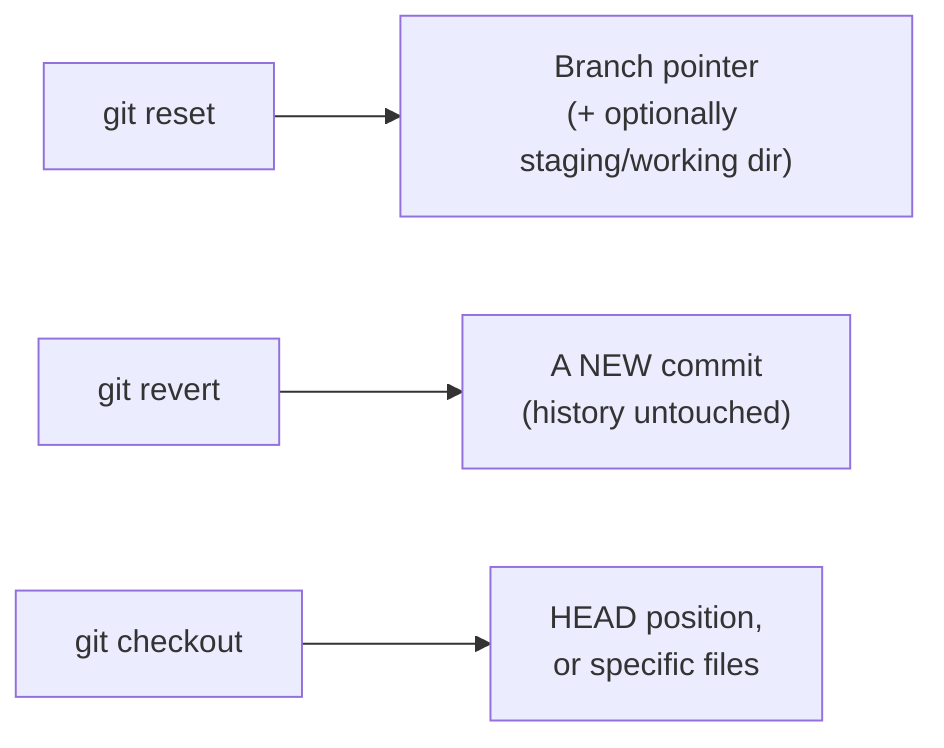
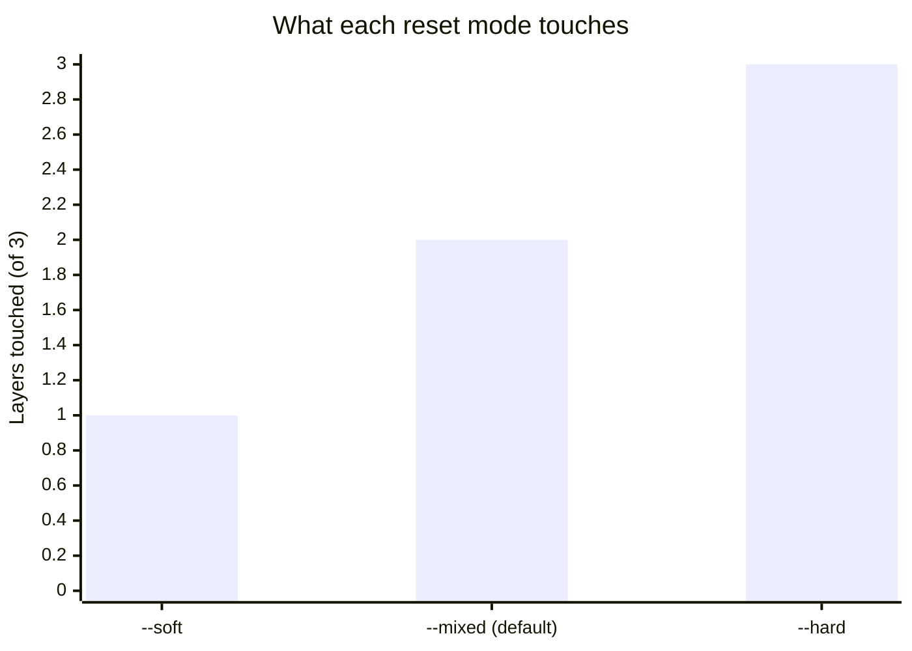

import LevelIntro from "../../../components/LevelIntro.astro";
import Checkpoint from "../../../components/Checkpoint.astro";

L1 named the three verbs and the one mistake that conflates them —
`checkout .` silently restoring a whole directory instead of the one file
you meant. L2 works out precisely what each of the three commands moves,
so "which one am I actually invoking" stops being a guess.

<LevelIntro
  items={[
    "What reset, revert, and checkout each move",
    "checkout's three unrelated-looking behaviors",
    "The sharing question that decides reset vs. revert",
  ]}
/>

## Three commands, three different targets — which one would have saved `feature.js`?

Before the diagram: the L1 mistake ran `git checkout .` hoping to undo one file. Of the three commands below, which one actually operates on individual files by name, rather than on history or a branch pointer as a whole?



`reset` moves where the branch label points — history before that point doesn't disappear, it just becomes unreachable from the branch anymore (still there in the object store until garbage collected, which is why `reflog` recovery, covered later, often works). `revert` never moves anything backward — it looks at what an old commit changed and creates a brand-new commit that changes it back. `checkout` moves _your working position_, not history at all — and when given a file path, it narrows down to exactly that file, which is the one-word fix L1 needed (`checkout -- config.json` instead of bare `checkout .`).

Minimum vocabulary for this page:

| Word           | Plain meaning                                                                       |
| -------------- | ----------------------------------------------------------------------------------- |
| `HEAD`         | The commit your working copy is currently looking at                                |
| Branch pointer | The movable label, like `main`, that says which commit is the branch tip            |
| Staging area   | The prepared set of changes that will go into the next commit                       |
| Shared/pushed  | A commit may already exist on another machine, so rewriting it affects other people |
| Reflog         | Git's local diary of where `HEAD` and branch pointers recently moved                |

## `checkout` does three unrelated-looking things — what tells them apart?

The answer is entirely in what argument follows the command, which is exactly why `checkout .` and `checkout -- config.json` behave so differently despite looking similar:

| What follows `checkout`    | What it actually does                                      | Modern equivalent              |
| -------------------------- | ---------------------------------------------------------- | ------------------------------ |
| A branch name              | Moves HEAD to that branch, updates working dir             | `git switch <branch>`          |
| A commit hash              | Moves HEAD to that commit, detached (no branch)            | `git switch --detach <commit>` |
| `-- <file>` or a bare path | Restores that file's content from HEAD (or a given commit) | `git restore <file>`           |

Git 2.23 split `checkout` into `switch` (branches/commits) and `restore` (files) specifically because one verb doing three different-shaped things was a real, common source of the exact mistake in L1 — `switch`/`restore` can't be argument-confused with each other the way a bare `checkout .` can silently mean "restore everything."

<Checkpoint question="Given that checkout's behavior depends entirely on what argument follows it, why did Git 2.23 introduce switch and restore as separate commands instead of just documenting checkout's three behaviors more clearly?">

Better documentation doesn't remove the actual risk, which is that the
same typed word can mean three structurally different things depending on
an argument that's easy to get wrong under pressure — exactly what
happened in L1, where `.` was meant as "nothing in particular" but Git
read it as "every file in this directory." `switch` only ever moves HEAD
between branches or commits, and `restore` only ever touches file
contents — splitting the verb makes it impossible to cross from one
category of mistake into the other, which no amount of documentation on
a single overloaded command can guarantee.

</Checkpoint>

## Reset's three modes, precisely — which one is the default, and why does that matter?

`--mixed` is the default precisely because it's a middle ground: destructive enough to be useful (unstages what you staged by mistake) without touching file contents on disk, which is why typing bare `git reset <commit>` feels safe in practice while `--hard` never does.

```
function reset(mode, target_commit):
    move_branch_pointer(target_commit)  # ALL modes do this

    if mode == "soft":
        return  # staging area and working directory untouched

    reset_staging_area_to(target_commit)  # --mixed and --hard both do this
    if mode == "mixed":
        return  # working directory files untouched — edits are still there, just unstaged

    overwrite_working_directory_to(target_commit)  # --hard ONLY
    # Any uncommitted change in the working directory is now gone,
    # with no recovery path — this line is the entire danger of --hard.
```

Each mode is a strict superset of the previous one's effect — `--soft` is the least destructive (nothing outside the branch pointer changes), `--hard` is the most (working directory files are forcibly overwritten). The default, `--mixed`, sits in between: it unstages, but never touches actual file contents on disk.



<Checkpoint question="A teammate has already pulled a commit you now want to undo with reset --mixed. Does --mixed being the 'safer, non-destructive-to-files' default mean it's also safe to use on that shared commit?">

No. `--mixed` only promises that _your own_ working-directory files stay
untouched — it says nothing about what happens to the branch pointer
itself, and moving the branch pointer backward is exactly what rewrites
history. Once a teammate has already pulled the commit you're moving away
from, their copy and your rewritten branch now disagree, regardless of
which reset mode you used to get there. "Safer to your files" and "safe
to run on shared history" are two different guarantees, and only the
first one is true of `--mixed`.

</Checkpoint>

## Why is `revert` the safe default once history is shared, when `reset` feels simpler?

`reset` feels simpler because it's one step — move the pointer back, done. The cost of that simplicity only shows up once someone else already has a copy of the history being erased. What actually happens to their copy?


After `revert`, the mistake (B) is still visibly there in history — D is a new commit whose diff is the exact inverse of B's. Anyone who already pulled A→B→C keeps working with no conflict, because nothing they already have was rewritten — D is just a new commit that arrives normally. Compare this to `reset`ting the branch back to A: anyone who already pulled B and C now has commits their remote no longer has any record of, and the next push/pull between them and the rewritten branch produces exactly the kind of "diverged history" mess that gives force-pushing its bad reputation.

## The safety rule, stated as a decision — what's the one question that decides it?

Not "how destructive is the command" in the abstract — a `reset --hard` on a commit only you have ever seen can be safe for **history**, because nobody else has copied the commits you are moving away from. It can still be unsafe for **your files right now** if the working directory contains uncommitted work. Ask the sharing question below, but also run `git status` first.

| Is the target commit already pushed/shared?                   | Safe choice                          | Why                                                           |
| ------------------------------------------------------------- | ------------------------------------ | ------------------------------------------------------------- |
| No — only exists on your local branch                         | `reset` (any mode) is fine           | Nobody else has a copy of the history you're changing         |
| Yes — others may have already pulled it                       | `revert`                             | Adds new history instead of rewriting shared history          |
| Yes, but the team has explicitly coordinated a rewrite (rare) | `reset` + force-push, with agreement | The exception, not the default — requires everyone re-syncing |

This single question — "has anyone else possibly already seen this commit" — is the entire basis for choosing between rewriting history and adding to it, and it's the question worth asking before running any undo command, not after. Try it below: as the number of teammates who've already pulled a commit grows, watch what a `reset` + force-push actually costs in cleanup time compared to `revert`, which stays flat regardless of how many people already have a copy.
