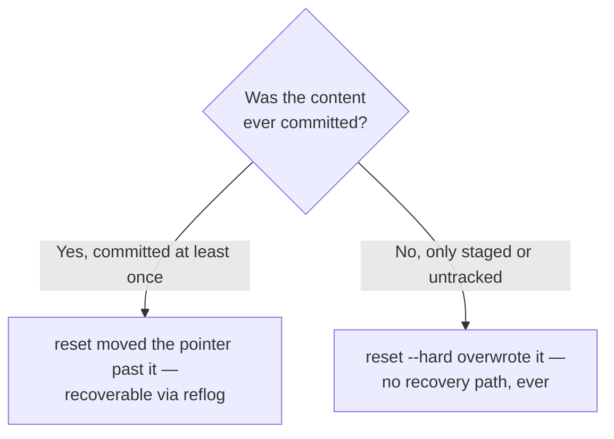

import Scenario from "../../../components/Scenario.astro";
import LevelIntro from "../../../components/LevelIntro.astro";
import Checkpoint from "../../../components/Checkpoint.astro";

<Scenario label="The scenario">
  <Fragment slot="facts">
    <div class="not-prose flex flex-col gap-1.5 text-sm text-slate-700 dark:text-slate-300">
      <div class="flex items-center gap-1.5"><span>1️⃣</span> File-scoped restore — one broken file, one good file nearby</div>
      <div class="flex items-center gap-1.5"><span>2️⃣</span> <code>reset --hard</code> — a staged, never-committed file, deleted for good</div>
      <div class="flex items-center gap-1.5"><span>3️⃣</span> <code>revert</code> on a shared branch — the mistake stays visible, teammates unaffected</div>
    </div>
    <p class="not-prose mt-3 mb-1 text-xs font-semibold tracking-wide text-slate-400 uppercase">Recoverable?</p>
    <div class="not-prose grid grid-cols-2 gap-2 text-xs">
      <div class="rounded border border-emerald-300 bg-emerald-50 p-1.5 dark:border-emerald-800 dark:bg-emerald-950">
        <p class="font-semibold text-emerald-600 dark:text-emerald-400">Committed, then reset</p>
        Reflog can usually recover it
      </div>
      <div class="rounded border border-rose-300 bg-rose-50 p-1.5 dark:border-rose-800 dark:bg-rose-950">
        <p class="font-semibold text-rose-600 dark:text-rose-400">Never committed, then reset --hard</p>
        No recovery path — reflog never saw it
      </div>
    </div>

  </Fragment>

Three real sessions, in order: a safe file-scoped restore, an unrecoverable
`reset --hard`, and a `revert` on a branch teammates have already pulled.
Watch what's recoverable and what isn't, and why — the difference isn't how
scary the command looks, it's whether the content was ever captured in a
commit at all.

</Scenario>

Before the three sessions: the branching question that decides recoverability
in every case below is never "how scary did the command look," it's whether
the content was ever captured by a commit at all.



<LevelIntro
  items={[
    "Restoring one file without a whole-directory wipe",
    "The unrecoverable case: reset --hard on uncommitted work",
    "revert on a shared branch, from a teammate's view",
  ]}
/>

## Restoring a single file without touching anything else

This is the fix L1 was missing — naming the file turns a whole-directory
operation into a one-file one:

```
$ git status
On branch main
Changes not staged for commit:
  modified:   config.json    <- accidentally broken
  modified:   feature.js     <- good work, keep this

$ git checkout HEAD -- config.json
$ git status
On branch main
Changes not staged for commit:
  modified:   feature.js
```

Only `config.json` was restored to its last-committed state; `feature.js`'s uncommitted edits were untouched, because `checkout -- <file>` (or the modern `git restore <file>`) targets exactly one file, not the whole working directory. This is the narrow, safe, file-scoped use of `checkout` — distinct from checking out a branch or a commit, and the exact distinction the L1 scenario's mistake collapsed.

## `reset --hard`: the unrecoverable case, demonstrated safely

**Before running this: if the file below had already been committed once, even to a throwaway local commit, would `reset --hard` still be unrecoverable?** Keep that question in mind for the `git log`/`reflog` check right after.

Run commands like this only in a practice repository created for the
demo. In a real project, `git reset --hard` can delete uncommitted work
without a prompt. The point here is to understand the failure mode before
you ever reach for the command under stress.

```
$ echo "important unsaved work" > notes.txt
$ git status
Untracked files:
  notes.txt

$ git add notes.txt
$ git status
Changes to be committed:
  new file:   notes.txt

$ git reset --hard HEAD
$ git status
On branch main
nothing to commit, working tree clean

$ cat notes.txt
cat: notes.txt: No such file or directory

$ git reflog
d4e5f6a HEAD@{0}: reset: moving to HEAD
d4e5f6a HEAD@{1}: commit: Fix typo in README
```

`reset --hard` unstaged _and_ deleted `notes.txt` from disk, because it was newly-created (never committed) — there is no `git` command that recovers a file that was never committed at all. Notice what the reflog above actually contains: two entries about the branch pointer's own position, nothing about `notes.txt`. The reflog only helps recover _commits_, not uncommitted working-directory content, which answers the question above — had `notes.txt` been committed even once before the reset, that commit (and the file inside it) would show up as a recoverable `HEAD@{n}` entry the same way. This is the exact scenario L1 warns about: no confirmation, no undo, and it's indistinguishable from any other `reset --hard` until it's too late.

<Checkpoint question="The reflog above only shows two entries about the branch pointer's own position — nothing about notes.txt. If notes.txt had been committed once before that reset --hard, would the reflog situation look any different, and what does that difference actually mean for what 'recoverable' means in this unit?">

Yes — it would look different. The reflog is a record of where `HEAD`
and branch pointers have moved, not a record of file contents in
general. A file that was committed at least once has its content
preserved inside that commit object, and the commit itself would still
show up as a `HEAD@{n}` entry in the reflog even after a `reset --hard`
moved the pointer past it — so checking out that old reflog entry would
bring the file back. A file that was only staged or untracked was never
wrapped in a commit object at all, so there is no commit for the reflog
to point back to. "Recoverable" in this unit specifically means "captured
in a commit somewhere," not "less risky-looking" — the scariness of the
command has nothing to do with it.

</Checkpoint>

## `revert` on a shared branch, and what teammates see

```
$ git log --oneline
d4e5f6a (HEAD -> main) Fix typo in README
c3d4e5f Add broken rate-limit check      <- the mistake, already pushed
b2c3d4e Add login endpoint
a1b2c3d Initial commit

$ git revert c3d4e5f
[main 9a8b7c6] Revert "Add broken rate-limit check"

$ git log --oneline
9a8b7c6 (HEAD -> main) Revert "Add broken rate-limit check"
d4e5f6a Fix typo in README
c3d4e5f Add broken rate-limit check
b2c3d4e Add login endpoint
a1b2c3d Initial commit
```

The broken commit (`c3d4e5f`) is still fully visible in history — anyone who already pulled it keeps a perfectly consistent view; they just pull one more commit (`9a8b7c6`) that cancels it out. Nobody's local history conflicts with anyone else's, because nothing was rewritten — this is the entire practical argument for `revert` over `reset` once a commit has left your machine.

| &nbsp;                                | `reset` to before the mistake                                   | `revert` the mistake               |
| ------------------------------------- | --------------------------------------------------------------- | ---------------------------------- |
| Commits after the mistake             | Orphaned locally — vanish from anyone who re-pulls              | Untouched, still there             |
| What teammates who already pulled see | A history that no longer matches theirs — conflict on next sync | One extra commit, arrives normally |
| Mistake still visible in log?         | No                                                              | Yes — reverted, not erased         |

<Checkpoint question="After the revert above, the commit c3d4e5f ('Add broken rate-limit check') is still sitting right there in git log --oneline, hash and all. Given that, what's the actual difference between 'the mistake is fixed' after a revert versus after a reset — is the broken code gone from history either way?">

No — only `reset` removes it from the branch's reachable history (and
even then, not permanently; it's still in the object store until garbage
collected). `revert` never removes anything: `c3d4e5f` stays visible,
checkoutable, and diffable forever, right alongside the new commit that
cancels its effect. "Fixed" after a revert means the current state of the
files no longer has the bug — it does not mean the bug's commit stops
existing. That distinction is exactly why `revert` is safe on a shared
branch and `reset` isn't: nothing anyone already pulled gets erased out
from under them, it just becomes one commit further from HEAD.

</Checkpoint>

## A real decision function

The "has this been shared" question from L2 is directly codeable — this is the same logic a script (or a mental checklist before typing a git command) would use:

```js
// undo-strategy.mjs
function chooseUndoStrategy({ isPushed, teamCoordinatedRewrite }) {
  if (!isPushed) return "reset"; // purely local — safe to rewrite freely
  if (teamCoordinatedRewrite) return "reset-with-force-push"; // the rare, agreed exception
  return "revert"; // the default once anyone else may have seen it
}

console.log(
  chooseUndoStrategy({ isPushed: false, teamCoordinatedRewrite: false }),
); // "reset"
console.log(
  chooseUndoStrategy({ isPushed: true, teamCoordinatedRewrite: false }),
); // "revert"
console.log(
  chooseUndoStrategy({ isPushed: true, teamCoordinatedRewrite: true }),
); // "reset-with-force-push"
```

## Failure modes

- **Running `reset --hard` to "clean up" without checking `git status` first.** The command doesn't ask whether the working directory has anything valuable in it — the habit that prevents this is the same one from `git-teamwork/snapshots-manual-copies`: check status before any command that could discard state, every time, not just when something feels risky.
- **Force-pushing after a `reset` on a branch others have already pulled, without warning anyone.** Even a coordinated rewrite needs everyone to actually re-sync (typically `git fetch` + `git reset --hard origin/branch` on their end) — force-pushing silently just relocates the confusion to whoever pulls next and gets a divergent-history error they don't understand.
- **Using `checkout <commit-hash>` (detached HEAD) and then committing more work there by accident.** This leaves new commits that no branch points to — they're not lost immediately (reflog can usually recover them for a while), but they're also not part of any branch's history until deliberately attached to one, which surprises people who expected `checkout` on a commit to behave like checking out a branch.
- **Reaching for `revert` on a commit that's purely local, never pushed.** `revert` works technically, but it adds a confusing "revert of a revert" pair to history for something that could have just been cleanly `reset` away before anyone ever saw it — the safety `revert` buys only matters once sharing is actually in play.

## Beyond these three sessions

The three sessions above are worked cases, not the whole territory — a couple of questions to check whether the underlying model actually transferred:

- The `notes.txt` example was a single untracked file. What changes if instead of one file, `reset --hard` is run against a working directory with a dozen modified files, half staged and half not — does the "never committed = unrecoverable" rule still apply file-by-file, or does something change once some of those files _were_ committed earlier in the session?
- The decision function above only takes `isPushed` and `teamCoordinatedRewrite`. If you added a third real-world input — say, `hoursAgoPushed`, on the theory that a rewrite five minutes after pushing is less risky than one from last week because fewer people have likely pulled yet — would you make it change the returned strategy, or would you argue that input shouldn't affect the decision at all? What's the argument either way?
