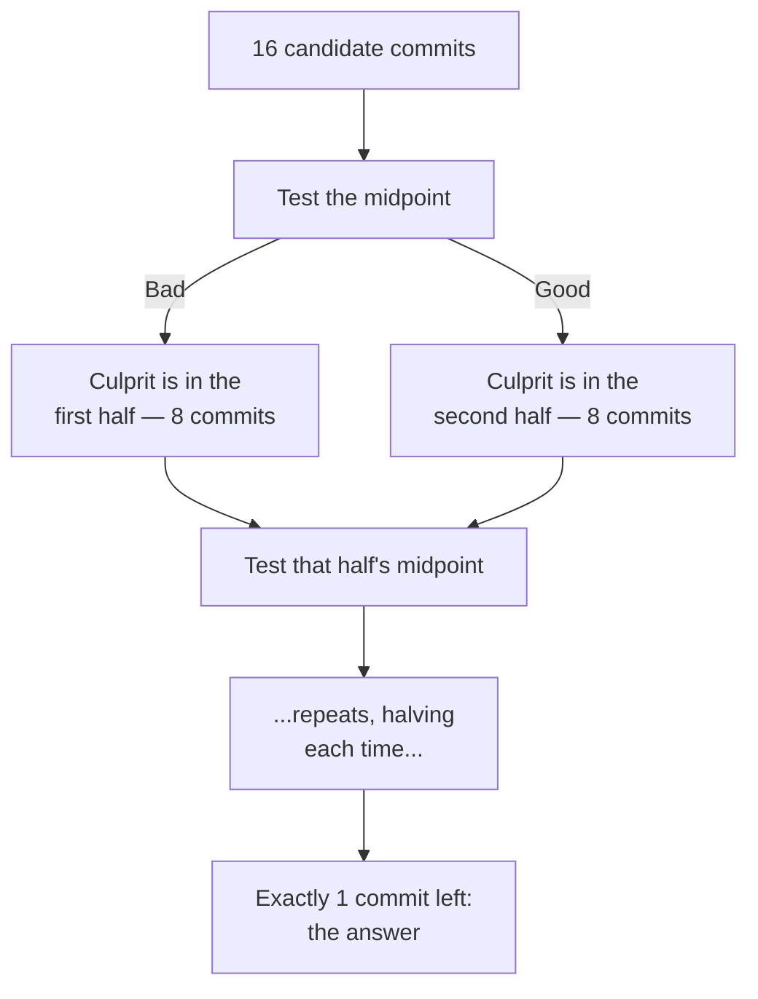

## Bisect narrows the range, one test at a time

**If there are 16 commits between the last known-good state and now,
how many does `git bisect` actually have to test to find the culprit?**
Far fewer than 16 — it eliminates half the remaining candidates at
every step, the same binary search used to find a name in a sorted
list.

Each test eliminates half the remaining commits, so the number of
tests needed grows only logarithmically with history size — doubling
the number of commits between good and bad adds just one more test,
not twice as many.

## Conventional commit types

**Once bisect points at one commit, what makes that commit fast to
understand?** A message that states plainly what kind of change it is,
before anyone has to open the diff:

| Type       | What it means                                       |
| ---------- | --------------------------------------------------- |
| `feat`     | A new feature or capability                         |
| `fix`      | A bug fix                                           |
| `refactor` | A change to code structure with no behavior change  |
| `docs`     | Documentation only                                  |
| `test`     | Adding or changing tests, no production code change |
| `chore`    | Tooling, dependencies, or other maintenance work    |

A message like `fix: correct off-by-one in pagination` tells a reader
exactly what to expect from the diff before they open it — a
`chore: update eslint config` commit sitting next to it is
unmistakably a different kind of change, at a glance.

## Why atomic commits are what makes bisect's answer actionable

**If bisect correctly points at the right commit, why isn't that
enough on its own?** Because "the right commit" is only as useful an
answer as what that commit actually contains. A commit bundling twelve
unrelated changes gives bisect exactly one thing to point at, and
finding _which one of the twelve_ actually caused the problem is a
manual search all over again — the same manual search bisect was
supposed to replace.

|                                 | Atomic commits                    | Bundled commits                                                           |
| ------------------------------- | --------------------------------- | ------------------------------------------------------------------------- |
| What bisect points to           | One logical change                | One commit containing several unrelated changes                           |
| Work left after bisect finds it | None — the commit _is_ the change | Manually reading the whole diff to isolate the actual culprit             |
| Commit message's usefulness     | Describes exactly what changed    | Vague ("various fixes"), because it's covering unrelated ground           |
| Reverting just the bad change   | `git revert` on that one commit   | Not possible cleanly — the good changes in the same commit come along too |

## The generalizable lesson

**Is this only useful for finding bugs?** No — the same shape shows up
anywhere someone has to later understand or undo a specific change:
code review (a reviewer can evaluate one logical change at a time
instead of an undifferentiated pile), reverting a bad deploy, or just
reading `git log` to understand what happened and why. Atomicity and
clear messages aren't really about the moment of committing at all —
they're about making every later reader's job possible.
