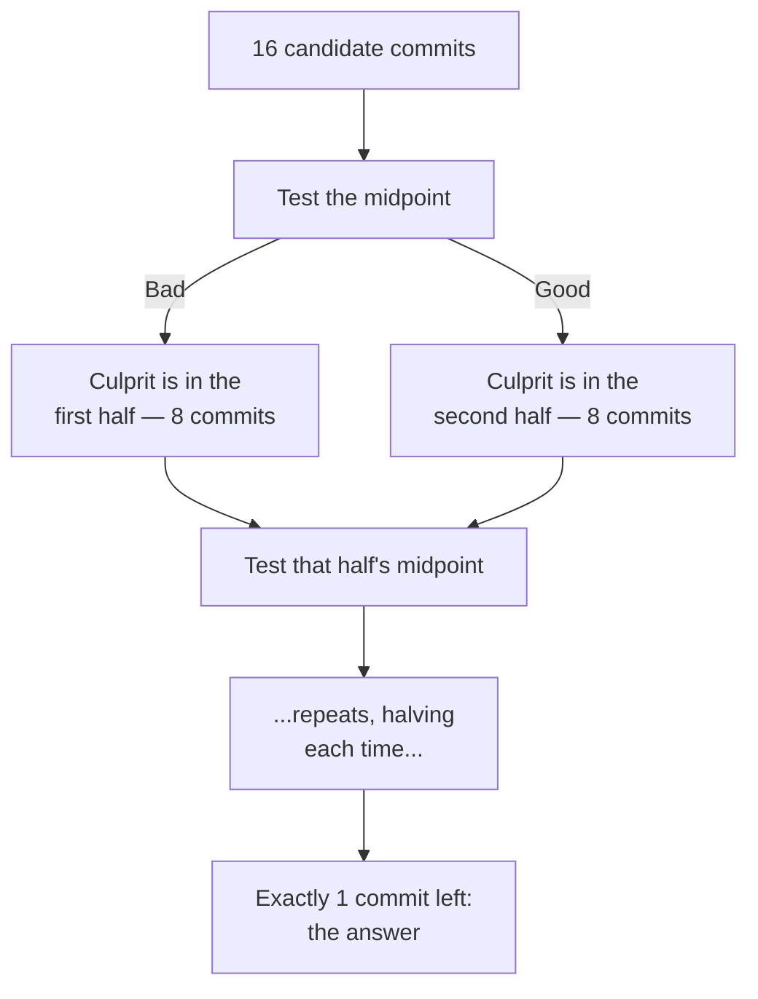

import LevelIntro from "../../../components/LevelIntro.astro";
import Checkpoint from "../../../components/Checkpoint.astro";

L1 named the problem: `git bisect` correctly finds a commit, but a bundled
commit still leaves a manual search inside it. L2 works out exactly how
bisect's search narrows down to that commit, and precisely why atomicity is
what turns "bisect found it" into "the investigation is done."

<LevelIntro
  items={[
    "How bisect's binary search narrows a range",
    "What each conventional commit type signals",
    "Why atomic commits are what makes bisect's answer actionable",
  ]}
/>

## Bisect narrows the range, one test at a time

**If there are 16 commits between the last known-good state and now,
how many does `git bisect` actually have to test to find the culprit?**
Far fewer than 16 — it eliminates half the remaining candidates at
every step, the same binary search used to find a name in a sorted
list.

Each test eliminates half the remaining commits, so the number of
tests needed grows only logarithmically with history size — doubling
the number of commits between good and bad adds just one more test,
not twice as many.

<Checkpoint question="History grows from 16 commits to 128 commits between the last known-good state and now. Roughly how many more tests does git bisect need, and why isn't it 8x as many?">

Only 3 more tests — 4 for 16 commits (`log2(16)`) versus 7 for 128 commits
(`log2(128)`). Each test halves the remaining range regardless of how large
that range currently is, so the test count grows with the _exponent_ of the
history size, not the size itself. That's the whole point of binary search:
an 8x larger haystack costs a fixed handful of extra tests, not a
proportional increase in work.

</Checkpoint>

## Conventional commit types

**Once bisect points at one commit, what makes that commit fast to
understand?** A message that states plainly what kind of change it is,
before anyone has to open the diff:

| Type       | What it means                                       |
| ---------- | --------------------------------------------------- |
| `feat`     | A new feature or capability                         |
| `fix`      | A bug fix                                           |
| `refactor` | A change to code structure with no behavior change  |
| `docs`     | Documentation only                                  |
| `test`     | Adding or changing tests, no production code change |
| `chore`    | Tooling, dependencies, or other maintenance work    |

A message like `fix: correct off-by-one in pagination` tells a reader
exactly what to expect from the diff before they open it — a
`chore: update eslint config` commit sitting next to it is
unmistakably a different kind of change, at a glance.

## The team convention, not just the syntax

Conventional commit syntax helps, but the real convention is a shared
promise about shape:

| Team habit                               | Why it matters later                                                        |
| ---------------------------------------- | --------------------------------------------------------------------------- |
| One idea per commit                      | Bisect, review, and revert can point to one coherent change                 |
| Specific description, not vague activity | `fix: reject expired invite token` is searchable; `updates` is not          |
| Type matches intent                      | A behavior fix should be `fix`, not hidden in `chore` or `refactor`         |
| Split unrelated work                     | Formatting, dependency bumps, feature logic, and bug fixes age better apart |

## Why atomic commits are what makes bisect's answer actionable

**If bisect correctly points at the right commit, why isn't that
enough on its own?** Because "the right commit" is only as useful an
answer as what that commit actually contains. A commit bundling twelve
unrelated changes gives bisect exactly one thing to point at, and
finding _which one of the twelve_ actually caused the problem is a
manual search all over again — the same manual search bisect was
supposed to replace.

|                                 | Atomic commits                    | Bundled commits                                                           |
| ------------------------------- | --------------------------------- | ------------------------------------------------------------------------- |
| What bisect points to           | One logical change                | One commit containing several unrelated changes                           |
| Work left after bisect finds it | None — the commit _is_ the change | Manually reading the whole diff to isolate the actual culprit             |
| Commit message's usefulness     | Describes exactly what changed    | Vague ("various fixes"), because it's covering unrelated ground           |
| Reverting just the bad change   | `git revert` on that one commit   | Not possible cleanly — the good changes in the same commit come along too |

<Checkpoint question="A teammate says: 'bisect pointed straight at the commit, so we're done — the investigation is over.' Under what condition is that actually true, and under what condition is it false?">

It's true only if that commit is atomic — one logical change, so the commit
_is_ the change bisect was looking for. It's false the moment the commit
bundles unrelated work: bisect's job (finding which commit) and the team's
job (finding which line inside a 14-file diff caused the bug) are two
different searches, and bisect only ever solves the first one. "Bisect found
a commit" and "the investigation is done" are the same statement only when
atomicity holds — otherwise the manual diff-reading that bisect was supposed
to replace just moves one level deeper.

</Checkpoint>

## The generalizable lesson

**Is this only useful for finding bugs?** No — the same shape shows up
anywhere someone has to later understand or undo a specific change:
code review (a reviewer can evaluate one logical change at a time
instead of an undifferentiated pile), reverting a bad deploy, or just
reading `git log` to understand what happened and why. Atomicity and
clear messages aren't really about the moment of committing at all —
they're about making every later reader's job possible.

| Later task          | What good commits make easier                                                     |
| ------------------- | --------------------------------------------------------------------------------- |
| Code review         | The reviewer can ask "is this one change correct?" instead of untangling a pile   |
| Bad deploy rollback | `git revert` can undo one bad change without dragging good changes with it        |
| Release notes       | `feat`, `fix`, and `docs` messages can be summarized without rereading every diff |

When this unit says "revert," it means making a new commit that undoes
an earlier commit. The `checkout` unit covers how to inspect or move
around history without confusing that with rewriting history.
