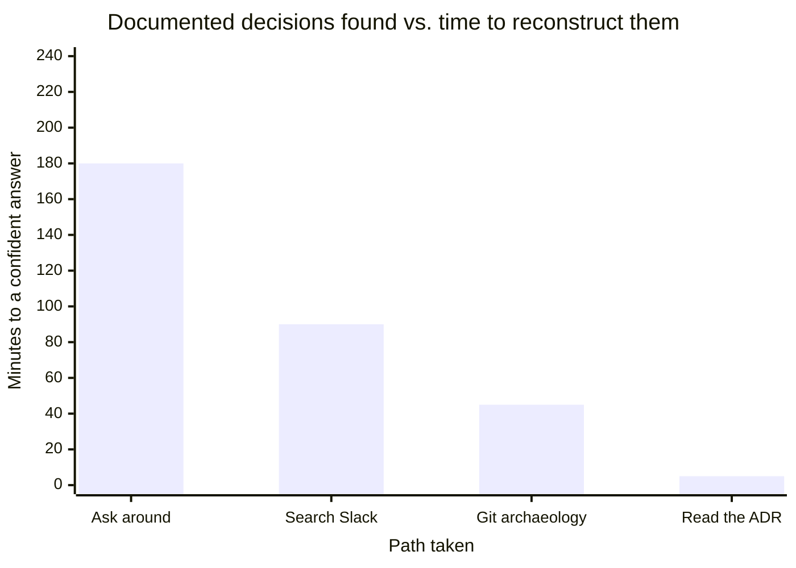

import Scenario from "../../../components/Scenario.astro";
import LevelIntro from "../../../components/LevelIntro.astro";

<Scenario>
  <Fragment slot="facts">
    

      
🗓️ Jordan — day 9 on the team

      
💳 Checkout retries a failed payment 3x, backoff capped at 8s

      
❓ Nobody on the team can say why "3" and "8s"

      
⚠️ Jordan's fix would have double-charged customers

    

    
Where the answer actually lives

    

      
🧠 In a decision made 8 months ago, in a meeting

      
📝 Never written down anywhere

      
🚪 The one engineer who remembers is on leave

    

  </Fragment>

Jordan joins the payments team and, on day 9, gets assigned a ticket:
"checkout retries feel slow, bump the retry count." Jordan reads the
code, sees `maxRetries: 3` and `backoffCapMs: 8000`, and — reasonably —
assumes these are arbitrary defaults nobody tuned carefully. Jordan
opens a PR raising `maxRetries` to 5.

A senior engineer catches it in review: raising retries without also
adding an idempotency key would let a slow-but-successful payment get
charged twice. That constraint was decided eight months ago, in a
meeting with no notes, by an engineer who left the team since. Nothing
in the code, the README, or the PR that introduced the retry logic
explains any of this.

**Jordan did nothing wrong. The code gave no indication this number was
load-bearing. So where was this decision actually supposed to live?**

</Scenario>

Nowhere — and that's the actual bug. The decision existed only as a
memory in one person's head. It survived exactly as long as that person
stayed reachable, and it was invisible to anyone who joined after the
meeting where it was made, including Jordan reading the code in good
faith nine days into the job.

<LevelIntro
  items={[
    "What tribal knowledge is, and why it's a liability",
    "What an ADR captures that a comment or a Slack thread doesn't",
    "The shape of a documentation habit that actually survives turnover",
  ]}
/>

- **Tribal knowledge** is any decision, constraint, or piece of context
  that the team depends on but that exists only in people's heads —
  not in the code, not in a doc, not searchable by anyone who wasn't in
  the room. It's not a character flaw; every team accumulates some of
  it just by moving fast. The problem is what happens when the person
  holding it leaves, forgets, or is simply asleep when someone needs
  the answer.
- An **ADR (Architecture Decision Record)** is a short, permanent
  document that captures one specific decision: what was decided, why,
  what alternatives were considered and rejected, and what the
  consequences are. It's written once, at the time the decision is
  made (or shortly after, if reconstructed — see L3), and it doesn't
  get deleted when the decision is later revisited — it gets
  superseded by a new one that links back to it.
- **Documentation culture** isn't "write more docs" — a wiki nobody
  updates is worse than no wiki, because it actively lies. It's a
  specific, narrow habit: write down the decisions that would be
  expensive to get wrong twice, at the moment they're made, in a place
  future readers will actually find.

| Where the decision lives | Findable by a new hire?                        | Survives the decision-maker leaving?                   | Explains "why," not just "what"?                                    |
| ------------------------ | ---------------------------------------------- | ------------------------------------------------------ | ------------------------------------------------------------------- |
| A meeting, no notes      | No                                             | No                                                     | No                                                                  |
| A Slack thread           | Barely — if you know to search for it          | Sort of, until the workspace's retention window passes | Sometimes, buried in the middle                                     |
| A code comment           | Yes, if you're already reading that exact line | Yes                                                    | Rarely — comments explain _what_, rarely _why not the alternatives_ |
| An ADR                   | Yes — indexed, one per decision                | Yes                                                    | Yes — that's specifically its job                                   |

**Why does an ADR beat a code comment for a decision like Jordan's,
even though a comment would have been faster to write?** Because a
comment lives at the one call site someone happens to be reading — it
does nothing for the PR that adds a _second_ retry call site
elsewhere, or for the incident reviewer six months later who's looking
at a graph, not the code. An ADR is indexed by decision, not by file
path, so it's findable by someone who doesn't yet know which file to
look in.

The chart isn't saying "documentation is nice to have" — it's saying
the four rows are the same question ("why is this the way it is?")
answered at wildly different costs, and only one of them is a cost the
team actually chose on purpose.
