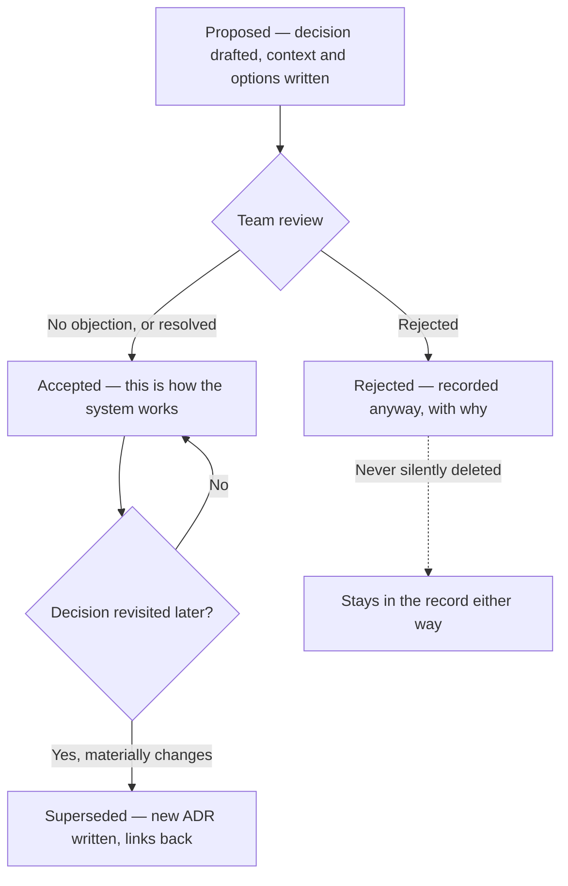

import LevelIntro from "../../../components/LevelIntro.astro";
import Checkpoint from "../../../components/Checkpoint.astro";

L1 named the problem — a decision that exists only in someone's head is
invisible to anyone who wasn't there — and the fix: an ADR, written at
decision time, findable by anyone later. L2 works out the mechanics:
what stages an ADR moves through, what sections it actually needs, and
what happens when a decision gets revisited instead of just edited.

<LevelIntro
  items={[
    "The ADR lifecycle: proposed, accepted, superseded",
    "The five sections a real ADR needs, and why each earns its place",
    "Why superseding beats editing when a decision changes",
  ]}
/>

## The lifecycle: from decision to durable record

**If the goal is "findable by anyone later," what actually needs to
happen between someone deciding something and that decision becoming
findable?** A small number of stages, each ending in a state a reader
can trust — "proposed" means still under discussion, "accepted" means
this is genuinely how the system works today, and neither of those is
left ambiguous by the document itself.

| Stage      | Meaning                                                               | Who reads it and why                                                |
| ---------- | --------------------------------------------------------------------- | ------------------------------------------------------------------- |
| Proposed   | Draft under discussion — not yet how the system actually behaves      | Reviewers deciding whether to accept it                             |
| Accepted   | This is the current, load-bearing decision                            | Anyone building on or near this part of the system                  |
| Rejected   | Considered and turned down — kept, not deleted                        | Anyone tempted to re-propose the same idea without new evidence     |
| Superseded | No longer current, but was once — a newer ADR replaces it and says so | Anyone doing archaeology on why the system used to work differently |

**Why keep a rejected ADR around instead of just deleting the proposal
once it's turned down?** Because "we considered this and said no"
is itself information — it's exactly what saves the next engineer
from re-proposing the same idea, re-running the same debate, and
re-discovering the same reason it doesn't work. Deleting it would
throw away the one thing that makes the rejection durable instead of
just a memory of a meeting, which is the same failure mode L1 opened
with.

<Checkpoint question="A team accepts an ADR, and eight months later a new engineer proposes almost the exact same idea the ADR had rejected as a different option. Did the ADR process fail here?">

No — the ADR did its job by existing; what failed is that nobody pointed the new engineer to it before they spent time re-deriving the same idea. An ADR isn't a guarantee nobody will ever re-propose something — new engineers won't know to search for a decision they don't know exists yet. What the ADR gives the team is a fast, confident answer once someone does look: "we considered this, here's exactly why it lost, here's what would have to change for the answer to be different now" — instead of relitigating the whole debate from scratch. The fix here isn't a better ADR, it's a habit of linking to the relevant ADR the moment a familiar-sounding proposal comes up.

</Checkpoint>

## The five sections that earn their place

**Does an ADR need to be a long document to do its job?** No — it needs
to answer the specific questions a future reader will actually have,
and nothing more. A minimal but complete ADR has five parts:

| Section       | Answers                                                                             | What's missing if you skip it                                              |
| ------------- | ----------------------------------------------------------------------------------- | -------------------------------------------------------------------------- |
| Context       | What situation forced this decision — the constraint, the incident, the requirement | Reader can't tell if the decision still applies once the situation changes |
| Decision      | What was actually decided, stated as a plain fact, not a proposal                   | Reader can't tell if this is settled or still under debate                 |
| Alternatives  | What else was considered, and why each lost                                         | Reader can't tell if a "better" idea was already tried and rejected        |
| Consequences  | What this decision costs, risks, or rules out going forward                         | Reader assumes the decision was free, and is surprised later by its cost   |
| Status + date | Proposed / accepted / rejected / superseded, and when                               | Reader can't tell if this is current or historical                         |

**Why does "consequences" matter as much as "decision" — isn't stating
the decision itself the whole point?** Because a decision without its
consequences reads as free, and nothing is free. Jordan's team could
write "Decision: cap retries at 3, backoff at 8s" and stop there — but
the consequence ("a payment can still fail permanently after 3 tries;
callers must handle that case, not assume retries always eventually
succeed") is the exact fact that would have told Jordan the number was
load-bearing before the PR, not after a reviewer caught it.

## Editing vs. superseding

**If a decision changes, why not just edit the original ADR in place?**
Because editing destroys the one thing that made the record trustworthy
in the first place: that it's a record of what was actually decided
and when, not the team's current best guess rewritten to look like it
was always true. A superseding ADR is a new document — new number, new
date — whose Context section says "ADR-004 decided X; this no longer
holds because Y" and whose old ADR gets a status update pointing
forward to the new one. Both stay readable. A reader landing on the
old one via an old link isn't stranded — they're one click from the
current answer.

<Checkpoint question="A team just realized ADR-004 ('use polling for status updates') was based on an assumption that's no longer true, and decides to switch to webhooks. Someone suggests just rewriting ADR-004 in place to describe webhooks instead. What breaks if they do that?">

Two things break at once. First, anyone who reads a code comment, a PR description, or an old incident report that references "see ADR-004" will land on a document that no longer matches what it originally justified — the trail connecting the old code's behavior to its original reasoning is gone, silently. Second, and worse, the team loses the record that polling was ever a deliberate decision at all — it now looks like webhooks were the answer from day one, which erases exactly the kind of context (why polling was chosen, what changed) that would help someone judge whether a future similar decision should go the same way or not. Superseding costs one more document number; editing in place costs the team's ability to trust that any ADR says what it said when it was written.

</Checkpoint>
