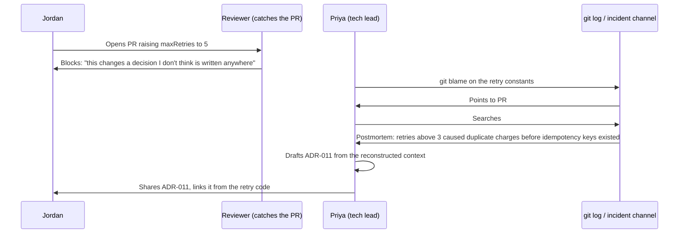

import Scenario from "../../../components/Scenario.astro";
import LevelIntro from "../../../components/LevelIntro.astro";
import Checkpoint from "../../../components/Checkpoint.astro";

<Scenario label="The near-miss, and the ADR it produced">
  <Fragment slot="facts">
    <div class="not-prose flex flex-col gap-1 text-sm text-slate-700 dark:text-slate-300">
      <div class="flex items-center gap-1.5"><span>🔍</span> Priya (tech lead) reconstructs the decision from git blame + old incident channel</div>
      <div class="flex items-center gap-1.5"><span>📄</span> ADR-011: "Cap checkout payment retries at 3, backoff at 8s"</div>
      <div class="flex items-center gap-1.5"><span>🧩</span> Written 2 days after Jordan's PR, not 8 months ago when it was decided</div>
      <div class="flex items-center gap-1.5"><span>✅</span> Status: Accepted (retroactively) — supersedes nothing, first record of this decision</div>
    </div>
  </Fragment>

L2 described the ADR lifecycle and the five sections it needs, in the
abstract. This level walks through the actual document that closed
Jordan's near-miss from L1 — not a summary of what an ADR contains,
but the real text Priya wrote, where the original reasoning came from
since nobody had written it down at the time, and what changed on the
team afterward.

**The decision in L1 was made eight months before Jordan's PR, with no
notes. Writing an ADR _after_ a near-miss is documenting something
that already happened — does that even count as the same practice as
writing one at decision time?**

</Scenario>

<LevelIntro
  items={[
    "Reconstructing a decision that was never written down",
    "The ADR that came out of it, section by section",
    "Anti-patterns that make a documentation habit quietly fail anyway",
  ]}
/>

## Reconstructing a decision nobody wrote down

**If the one engineer who made the original call has left the team,
where does Priya even start?** Not from memory — from the same traces
any future engineer could search: the git history and the incident
channel, in that order.



The decision wasn't undocumented because nobody left evidence — the
postmortem for INC-203 existed the whole time. It was undocumented
because the evidence lived in an incident channel indexed by incident
number, not connected to the code it justified, and nobody had made
that connection explicit anywhere Jordan would think to look.

<Checkpoint question="Priya found the original reasoning in an old incident postmortem — so wasn't the decision actually documented already, just in the wrong place?">

Not in any way that helped Jordan. A postmortem is indexed by incident, written for the people who lived through that incident, and it answers "what happened and how did we respond" — it isn't written to answer "why does this specific code do this," which is the question a future reader of the retry logic actually has. Jordan had no reason to search for an incident number that predates their time on the team, and the retry code itself gave no pointer toward it. Information existing _somewhere_ in the company isn't the same as it being documented for the decision it explains — an ADR's whole job is to sit at exactly the place someone will actually look: next to the decision, not buried inside the record of the event that triggered it.

</Checkpoint>

## The ADR Priya actually wrote

```md
# ADR-011: Cap checkout payment retries at 3, backoff at 8s

Status: Accepted (reconstructed) — 2026-08-19
Owner: Priya Nair
Related: postmortem INC-203 (2025-12-03)

## Context

In December 2025, checkout retried failed payment attempts up to 6
times with no backoff cap. During a payment provider slowdown, this
caused the same charge to be retried while an earlier attempt was
still in flight and had, in fact, succeeded — the provider's response
was slow, not failed, but our client treated the timeout as a failure.
Customers were double-charged 41 times before the retry logic was
patched. At the time, we did not have an idempotency key on outbound
payment requests, so the provider had no way to recognize a retry as
"the same attempt" and dedupe it on their end.

This decision was made and shipped as a hotfix (PR #482) during the
incident. It was never written up outside the incident channel.

## Decision

Cap payment retries at 3 attempts, with exponential backoff capped at
8 seconds between attempts. This bounds how long a slow-but-successful
request can overlap with a retry before we give up and surface a
failure to the customer instead of silently retrying forever.

## Alternatives considered

**Retry more, unchanged otherwise.** Rejected — this is what caused
INC-203; more retries without addressing the underlying overlap risk
only makes duplicate charges more likely, not less.

**Add an idempotency key, then retry as many times as needed.** This is
the actually-correct long-term fix — it lets the provider recognize
and dedupe a retried request server-side, removing the need for a low
retry cap at all. Not chosen _yet_ because it requires provider-side
support we confirmed exists but haven't integrated; tracked as
follow-up work, not blocking this ADR.

**No retries at all.** Rejected — most payment failures are genuinely
transient (network blip, brief provider slowdown) and recover on a
second attempt; removing retries entirely would turn transient
failures into hard failures for customers, trading one bad outcome for
a more common one.

## Consequences

A payment can still fail permanently after 3 attempts — callers must
handle that case explicitly (surface a retry-payment prompt to the
customer), not assume retries always eventually succeed. Raising this
cap without first adding an idempotency key reintroduces the exact
failure mode INC-203 describes. This ADR should be superseded once the
idempotency key work lands, since the retry cap can likely be relaxed
at that point.
```

**Why does the "alternatives" section include the idempotency-key
approach as something the team agrees is _better_, rather than only
listing options that lost outright?** Because an ADR's job is to give a
future reader — like whoever eventually raises `maxRetries` again — the
full picture, including "here's the change that would make this
decision obsolete." Without that, the next engineer who wants to raise
the retry count either has to re-derive the idempotency-key idea from
scratch or, worse, assumes 3 is a permanent constant instead of a
constraint tied to a specific missing piece of infrastructure.

<Checkpoint question="The ADR says the idempotency-key approach is the actually-correct long-term fix, but the team shipped the retry cap instead. Does writing that down undercut the decision that got made?">

No — it does the opposite of undercutting it; it makes the decision more trustworthy, not less. A decision that pretends to be the final, ideal answer is exactly the kind that gets silently violated later by someone who assumes "3" was a careful, permanent choice with no known better alternative — which is precisely what almost happened when Jordan tried to raise it without knowing the constraint behind it. Recording "this is the right call _given current constraints_, and here's the specific thing that would change the call" gives a future engineer a legitimate, documented path to revisit the number (build the idempotency key, then supersede this ADR) instead of either blindly trusting 3 forever or blindly overriding it without understanding why it was there.

</Checkpoint>

## Anti-patterns that quietly break a documentation habit

**Reconstructing ADR-011 fixed this one gap. What keeps the next
twenty decisions from ending up in exactly the same state a year from
now?** Avoiding a small set of habits that look like documentation but
don't actually produce a findable, trustworthy record:

| Anti-pattern                        | Looks like                                                                         | Why it breaks the habit                                                                                            |
| ----------------------------------- | ---------------------------------------------------------------------------------- | ------------------------------------------------------------------------------------------------------------------ |
| Decision buried in a PR description | "see PR #482 for context" instead of a standalone doc                              | PRs are indexed by code change, not by decision — nobody searches PR history to answer "why is this the way it is" |
| Write-once, never revisited         | ADR accepted, then silently wrong for a year after the system changed around it    | A stale ADR is worse than none — it actively misleads a reader who trusts it's still current                       |
| No link from the code               | ADR exists, but the retry constants have no comment pointing to ADR-011            | The reader has to already know the ADR exists to find it — same failure mode as the original incident              |
| Documenting everything equally      | An ADR for every minor, reversible choice, alongside the ones that actually matter | Signal drowns in noise; nobody reads the ADR index anymore because most entries aren't worth the click             |
| Retroactive-only culture            | Every ADR gets written after an incident, never before a decision ships            | Works as damage control, but means every gap costs a Jordan-style near-miss (or worse) to even surface             |

<Checkpoint question="Priya added a one-line comment above `maxRetries: 3` in the code: `// See ADR-011 for why this is capped, and what would need to change first.` Why does that one line matter as much as writing the ADR itself?">

Because the ADR only helps a reader who already knows to look for it, and the retry code is exactly where a future Jordan will be standing when the question comes up. Writing ADR-011 fixed the "is this decision recorded anywhere" problem; the comment fixes the separate "will anyone actually find it" problem — the two are not the same fix. A perfectly written ADR that nothing points to is functionally identical to the unwritten decision from eight months earlier: correct information that a reasonable person, acting in good faith, would still have no way to discover before making the same mistake.

</Checkpoint>

## Beyond this one example

ADR-011 resolved a single reconstructed decision with one clear owner
and one clean postmortem to trace back to. **What changes about this
same process if the original decision had never even had a postmortem
— say, a database index was added "temporarily" three years ago by
someone who's since left the company, with no incident, no PR
description beyond "perf fix," and no one currently on the team
remembers why?** Or, differently: what changes if two former
teammates, both since departed, would have given _conflicting_
accounts of why a decision was made, and nobody left can adjudicate
between them? Neither case is answered by anything shown above — the
mechanics here (trace what evidence exists, write the ADR from what's
recoverable, link it from the code) are the same, but true archaeology
with no clean trail usually means writing the ADR's Context section as
"best reconstruction, degree of confidence: low" and treating the
decision as open for revisiting, rather than presenting a guess with
the same certainty as a decision someone can still vouch for. The
worked example above is one instance of the practice, not the whole
territory it has to cover.
