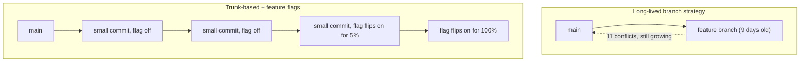
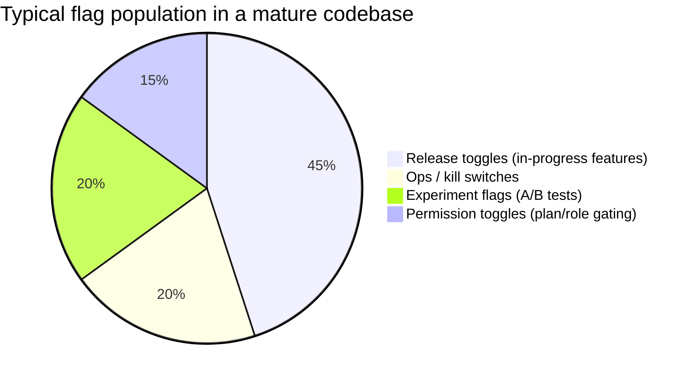

import Scenario from "../../../components/Scenario.astro";
import LevelIntro from "../../../components/LevelIntro.astro";

<Scenario label="The nine-day checkout PR">
  <Fragment slot="facts">
    

      

        11 conflicts
        by day 9
      

      

        

      

    

    

      
📅 Day 1 — PR opened, 0 conflicts, 1,800 changed lines

      
📅 Day 5 — main moved 24 commits, 3 conflicts appear

      
📅 Day 9 — main moved 47 commits, 11 conflicts, still unmerged

      
🚫 Nobody wants to merge — half the new checkout flow isn't tested yet

    

  </Fragment>

A developer opens a pull request Monday to rebuild checkout: new
pricing logic, a new address form, a new confirmation screen — 1,800
changed lines. By the following Wednesday it's still open. Main has
moved 47 commits since then; the branch now has 11 merge conflicts,
and merging it wholesale would ship an untested confirmation screen to
every paying customer at once. **The team is stuck between two bad
options: keep the branch open and let the conflicts keep growing, or
merge a giant, mostly-untested change straight into production. Is
there a third option that avoids both?**

</Scenario>

There is — and it's the same answer for both symptoms: ship the code
to main constantly, in small pieces, and keep anything unfinished or
risky **turned off** until it's actually ready, instead of keeping it
**unmerged**.

<LevelIntro
  items={[
    "Trunk-based development vs. long-lived branches",
    "What a feature flag actually is",
    "Small PRs as the other half of the same habit",
  ]}
/>

## The core idea, in one sentence

A **feature flag** is a runtime switch — usually a boolean or a
percentage — that decides whether a piece of code runs, checked with
an `if` at the point where the new behavior would kick in. That one
mechanism does something bigger than it sounds: it separates
**merging** code (a git event, safe and cheap) from **releasing** a
feature (a business event, risky and reversible only if you planned
for it). Once those two are separate, "ship fast without breaking
main" stops being a contradiction.

## Why long-lived branches make this worse, not safer

- The checkout PR above isn't an isolated mistake — it's what happens
  by default when "finish the whole feature, then merge" is the
  strategy. The longer a branch stays open, the more main drifts away
  from the commit it branched from, and the merge gets harder every
  single day it waits.
- **Trunk-based development** flips the default: everyone commits
  small, working changes directly to `main` (or through PRs merged
  within hours, not weeks), multiple times a day. Main is always
  releasable. Nothing is "held back" in a branch waiting to be finished.
- The catch: if main is always releasable, how do you commit half of a
  three-week feature without exposing it to users? That's exactly the
  gap feature flags close.

## The three habits work together

| Habit               | What it actually does                                                        | What breaks without it                                           |
| ------------------- | ---------------------------------------------------------------------------- | ---------------------------------------------------------------- |
| Small pull requests | Keeps each change reviewable in minutes and mergeable before main drifts far | Reviews get rubber-stamped or stall; merges rot into conflicts   |
| Trunk hygiene       | Keeps `main` always in a deployable, green-tests state                       | Nobody trusts `main`; deploys become risky, scheduled events     |
| Feature flags       | Lets unfinished or risky code merge to `main` without being exposed to users | "Finished" and "merged" become the same deadline, so PRs balloon |

## Flag types, at a glance

- **Release toggle** — hides unfinished work behind `if (flag)`, removed once the feature fully ships. This unit's main focus.
- **Ops toggle / kill switch** — lets on-call instantly disable a risky code path in production without a deploy.
- **Experiment flag** — routes a percentage of users to a variant to measure the effect (A/B testing).
- **Permission toggle** — gates a feature by plan tier or role, often kept long-term rather than removed.

## What this unit covers

L2 works through the actual mechanics: where the flag check lives,
what a flag's config looks like, and the lifecycle a flag moves
through from creation to deletion — including why an unremoved flag is
its own kind of technical debt. L3 implements a real flag-evaluation
service with percentage rollout and a kill switch, and walks through
using it to ship the checkout redesign from this scenario safely.
