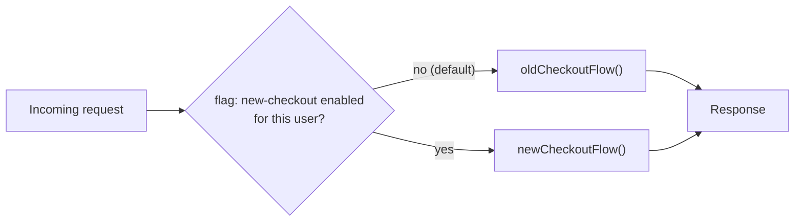
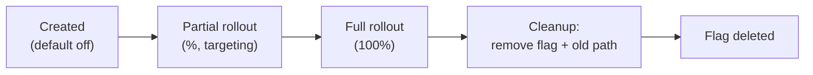

import LevelIntro from "../../../components/LevelIntro.astro";
import Checkpoint from "../../../components/Checkpoint.astro";

L1 established that a feature flag separates merging from releasing.
L2 works out the mechanics that make that possible: exactly where the
check lives in the code, what a flag's configuration actually looks
like, and the lifecycle a flag moves through — because a flag that's
never removed becomes a new source of the exact risk it was meant to
reduce.

<LevelIntro
  items={[
    "Branch by abstraction, not by git branch",
    "Flag config: targeting rules, not just on/off",
    "The lifecycle, and why stale flags are debt",
  ]}
/>

## Branching happens in the code, not in git

**If everyone commits straight to `main`, where does the "in-progress,
not-yet-ready" version of the code actually live?** Not in a git
branch — inside the running code itself, gated by an `if`. This
pattern is sometimes called **branch by abstraction**: instead of two
divergent lines of git history that eventually have to be reconciled,
there's one line of history containing both the old path and the new
path, with a runtime decision choosing between them.



In pseudocode, the shape is always the same regardless of language or
framework:

```
function handleCheckout(user, cart):
    if flags.isEnabled("new-checkout", user):
        return newCheckoutFlow(user, cart)
    else:
        return oldCheckoutFlow(user, cart)
```

Both `newCheckoutFlow` and `oldCheckoutFlow` can be committed to
`main`, reviewed in small PRs, and deployed — repeatedly, in pieces —
long before the flag ever flips to `true` for a real customer.
Deploying is no longer the risky moment; flipping the flag is, and
that's a decision you can make independently, reverse instantly, and
scope to a tiny percentage first.

<Checkpoint question="A teammate says: 'We don't need feature flags, we just deploy straight from main since our branches are already short-lived.' Does having short-lived branches make flags unnecessary?">

No — short branches and flags solve two different halves of the same
problem. Short-lived branches keep _merging_ safe: small diffs are
easy to review and rarely conflict with a fast-moving `main`. But
merging isn't the same event as _releasing_. Even a perfectly small,
clean PR can contain code a team isn't ready to expose to every user
yet — half of a multi-week feature, a risky rewrite of a payment path,
a change that needs a gradual rollout to catch problems early. Without
a flag, "merged" and "live for everyone" happen at the same moment,
which is exactly the coupling that makes teams keep branches open too
long in the first place, recreating L1's nine-day PR. Short branches
keep the git side clean; flags keep the runtime side safe. Trunk-based
development needs both.

</Checkpoint>

## A flag is a config, not just a boolean

**Is "on" or "off" enough to gate the checkout rollout from L1
safely?** Not for anything with real risk attached — a flag that's
only ever fully on or fully off forces an all-or-nothing release,
which is the same risk as a giant PR, just moved one step later. Real
flag systems evaluate a small set of **targeting rules** against the
current user or request:

```json
{
  "key": "new-checkout",
  "default": false,
  "rules": [
    {
      "type": "userIdIn",
      "values": ["internal-qa-1", "internal-qa-2"],
      "serve": true
    },
    { "type": "percentageRollout", "percent": 5, "serve": true },
    { "type": "planTier", "values": ["enterprise"], "serve": false }
  ]
}
```

Read top to bottom: internal QA accounts always see the new flow
first; then a fixed 5% slice of remaining traffic; enterprise accounts
are explicitly excluded until support is briefed. This is what makes a
flag more powerful than a plain `if DEBUG`: the same deployed code
serves different behavior to different users, without a second deploy,
and the rollout percentage can widen — 5% → 25% → 100% — purely by
changing config, not by shipping code again.

| Rollout stage | Who sees the new path         | What it's checking for                             |
| ------------- | ----------------------------- | -------------------------------------------------- |
| 0%            | Nobody (default off)          | Code compiles, deploys, doesn't crash the old path |
| Internal only | QA / dogfooding accounts      | Obvious bugs, before any real customer is exposed  |
| 5%            | A small random slice of users | Real-world edge cases, error rates, latency        |
| 100%          | Everyone                      | Full confidence — ready to remove the flag         |

<Checkpoint question="A percentage rollout is set to 5%. If a specific user refreshes the checkout page five times in a row, should they see the new flow on some loads and the old flow on others?">

No — a well-built rollout is _sticky per user_, not re-randomized per
request. The percentage decides who gets bucketed into the rollout
once (usually by hashing a stable id like the user's account id), and
that same user gets the same answer on every subsequent evaluation.
Flipping between old and new checkout mid-session would be confusing
at best and could corrupt a multi-step flow like checkout at worst —
imagine reaching the confirmation screen of one flow using cart state
built by the other. L3 implements this stickiness directly with a hash
function, and it's the detail that turns "5% of requests" (unsafe) into
"5% of users, consistently" (safe).

</Checkpoint>

## The lifecycle a flag actually goes through

**Once the checkout rollout reaches 100%, is the flag done?** Not
quite — the code still has two paths and an `if` checking a flag that
will now always evaluate the same way. That's the final, easiest-to-skip
stage of a flag's life:



Skipping cleanup is how teams end up with what practitioners call
**flag debt**: dozens or hundreds of flags nobody remembers the
purpose of, each one doubling the number of code paths a change could
possibly hit. A flag that's been at 100% for eight months but never
removed isn't protecting anyone anymore — it's just an `if` branch and
a dead `oldCheckoutFlow()` that every future contributor has to read,
understand, and avoid breaking, for no remaining benefit. The fix isn't
a policy against flags; it's treating "remove the flag and dead code"
as part of the feature's definition of done, not an optional follow-up
ticket that never gets prioritized.

## The trade-off, stated plainly

**Does adding flags make the codebase strictly simpler?** No — every
active flag is a second code path that has to be reasoned about, and
two active flags gating related code create four possible combinations
to consider, not two. Feature flags trade a small, ongoing complexity
cost (more branches to think about, a config system to maintain) for a
much larger risk reduction (deploys stop being release events, rollouts
become gradual and reversible, and a bad release becomes a config flip
instead of a rollback deploy). The trade only stays worth it if the
cleanup stage actually happens — that's the one part of the lifecycle
that determines whether flags stay a safety mechanism or become their
own form of debt, which is exactly what L3's implementation and worked
example focus on next.
