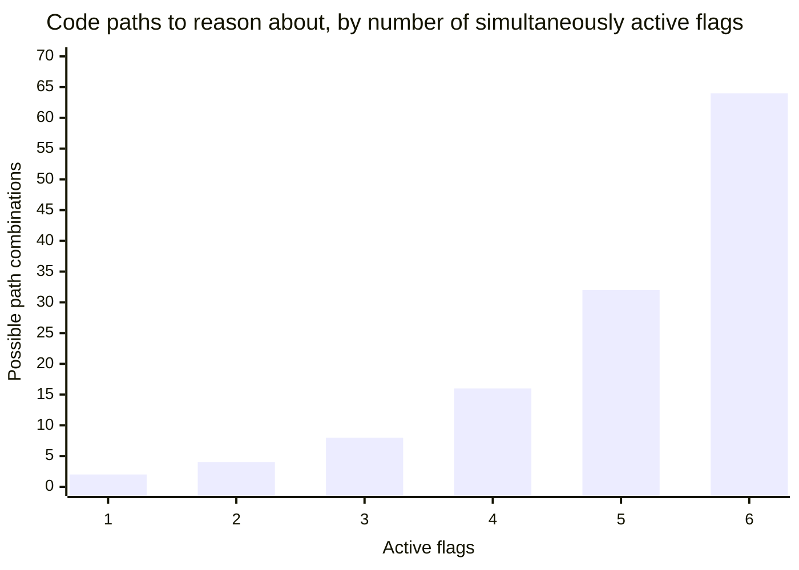

import Scenario from "../../../components/Scenario.astro";
import LevelIntro from "../../../components/LevelIntro.astro";
import Checkpoint from "../../../components/Checkpoint.astro";

<Scenario label="Rolling out the checkout redesign, with flags this time">
  <Fragment slot="facts">
    <div class="not-prose flex flex-col gap-2 text-sm text-slate-700 dark:text-slate-300">
      <div class="flex items-center gap-1.5"><span>✅</span> Day 1 — flag created, default off, small PRs merge to <code>main</code> daily</div>
      <div class="flex items-center gap-1.5"><span>📈</span> Day 3 — rollout widened to 5%; error rate on new path spikes</div>
      <div class="flex items-center gap-1.5"><span>🛑</span> Day 3, 11:42am — kill switch flipped off in under a minute, <strong>no deploy needed</strong></div>
      <div class="flex items-center gap-1.5"><span>🔧</span> Day 10 — bug fixed, rollout resumes: 5% → 25% → 100% over four days</div>
      <div class="flex items-center gap-1.5"><span>🧹</span> Day 21 — flag and the old checkout path both deleted</div>
    </div>

  </Fragment>

L1's checkout PR sat unmerged for nine days because merging felt like
the same thing as releasing to everyone at once. **Given the flag
mechanics L2 laid out — targeting rules, sticky rollout percentages, a
kill switch — what would the same nine days have looked like instead?**
Predict it before reading on: not "the PR merges faster," but
something more specific about _when risk is discovered and how it's
contained_.

</Scenario>

<LevelIntro
  items={[
    "A real, deterministic bucketing function",
    "A working flag-evaluation service with a kill switch",
    "Using it end-to-end on the checkout rollout",
  ]}
/>

## A deterministic bucket for each user

**L2's checkpoint established that a rollout has to be sticky per
user, not re-randomized per request. What actually makes that true in
code?** A hash function: something that turns a user's id into the
same number every time it's called, spread roughly evenly across a
range. Here's a real one (FNV-1a, a small, well-known non-cryptographic
hash — plenty good enough for bucketing, and fast):

```js
// bucket.mjs — deterministic, evenly-distributed bucketing, 0-99
function hashToBucket(key) {
  let hash = 0x811c9dc5; // FNV-1a 32-bit offset basis
  for (let i = 0; i < key.length; i++) {
    hash ^= key.charCodeAt(i);
    hash = Math.imul(hash, 0x01000193); // FNV prime
  }
  // Force unsigned, then compress into a 0-99 bucket
  return (hash >>> 0) % 100;
}
```

Two calls with the same `key` always return the same bucket — that's
the entire mechanism a "sticky 5% rollout" rests on. Note the input is
`key`, not just a user id: salting it with the flag's own key (below)
means the _same_ user lands in a different, independent bucket for
every different flag, instead of always being "early adopter user" or
always being "never gets anything new" across the whole product.

<Checkpoint question="If two different flags both use a 5% rollout, and this same user happens to be in the first flag's 5%, should you expect them to also be in the second flag's 5%?">

Not more than random chance would predict — because the bucketing key
combines the flag's own key with the user id (`` `${flagKey}:${userId}` ``
in the evaluator below), not the user id alone. Hashing salted this way
scrambles the result independently per flag, so being in one flag's
lucky 5% says nothing about the next flag. This matters in practice:
without the salt, a fixed percentage rollout would always select the
_same_ subset of users for every flag ever created, which defeats the
purpose of random sampling and would mean your earliest, most patient
beta testers get every single new feature first, forever, while
everyone else gets none of them until 100%.

</Checkpoint>

## The flag-evaluation service

**Given a bucket number, how does a full flag config — default,
targeting rules, kill switch — turn into one `enabled: true/false`
decision?** By checking rules in order and stopping at the first one
that matches, falling back to the default if none do:

```js
// flags.mjs
function hashToBucket(key) {
  let hash = 0x811c9dc5;
  for (let i = 0; i < key.length; i++) {
    hash ^= key.charCodeAt(i);
    hash = Math.imul(hash, 0x01000193);
  }
  return (hash >>> 0) % 100;
}

function evaluateFlag(config, context) {
  // A kill switch overrides everything else, unconditionally — this is
  // what makes it safe to flip in an incident with no deploy in the way.
  if (config.killSwitch) {
    return { enabled: false, reason: "kill-switch" };
  }

  for (const rule of config.rules ?? []) {
    if (rule.type === "userIdIn" && rule.values.includes(context.userId)) {
      return { enabled: rule.serve, reason: "userIdIn" };
    }
    if (rule.type === "planTier" && rule.values.includes(context.planTier)) {
      return { enabled: rule.serve, reason: "planTier" };
    }
    if (rule.type === "percentageRollout") {
      const bucket = hashToBucket(`${config.key}:${context.userId}`);
      if (bucket < rule.percent) {
        return { enabled: rule.serve, reason: "percentageRollout" };
      }
    }
  }

  return { enabled: config.default, reason: "default" };
}

export { hashToBucket, evaluateFlag };
```

Every branch returns a `reason` alongside the boolean — a small
addition, but it's what makes an incident like Day 3 above debuggable:
when support asks "why does this one customer see the new checkout,"
the answer is a fact you can look up (`userIdIn`, `percentageRollout`,
`planTier`, or `default`), not a guess.

## Simulating the actual rollout

**Does a "5% rollout" really mean close to 5% of real users, or is
that just an approximation that could be badly off for any one flag?**
With enough users, the hash's even distribution makes it converge
close to the configured percentage — here it is checked directly, not
asserted:

```js
// simulate.mjs
const config = {
  key: "new-checkout",
  default: false,
  killSwitch: false,
  rules: [
    {
      type: "userIdIn",
      values: ["internal-qa-1", "internal-qa-2"],
      serve: true,
    },
    { type: "percentageRollout", percent: 5, serve: true },
    { type: "planTier", values: ["enterprise"], serve: false },
  ],
};

let enabledCount = 0;
const totalUsers = 10_000;
for (let i = 0; i < totalUsers; i++) {
  const result = evaluateFlag(config, {
    userId: `user-${i}`,
    planTier: "standard",
  });
  if (result.enabled) enabledCount++;
}

console.log(
  `${enabledCount} / ${totalUsers} enabled (~${((enabledCount / totalUsers) * 100).toFixed(1)}%)`,
);
// -> 505 / 10000 enabled (~5.1%)
```

That reads within a few tenths of a percent of the configured 5% —
close enough that a real rollout can trust "5%" to mean roughly 500
real users out of 10,000, not "somewhere between 1% and 20%." The kill
switch from Day 3 is the same function, one field flipped:

```js
const incidentConfig = { ...config, killSwitch: true };
evaluateFlag(incidentConfig, { userId: "user-42", planTier: "standard" });
// -> { enabled: false, reason: "kill-switch" }
```

No redeploy, no git operation at all — an ops dashboard flips
`killSwitch` in the stored config, and the very next evaluation for
every single user returns `false`, regardless of which bucket or rule
would otherwise have matched. This is the concrete mechanism behind
"contained in under a minute" from the scenario above.

<Checkpoint question="Suppose Day 3's error spike had instead been caught by widening the rollout gradually (5% -> 25% -> 100%) with careful monitoring at each step, rather than jumping straight to 100%. What does the gradual widening actually buy you that jumping straight to 100% wouldn't?">

It bounds the blast radius of a bug to whatever percentage was live
when it's caught, and it buys detection time before the largest
population is exposed. At 5%, a spike in errors affects roughly 500 of
10,000 users and is far more likely to be caught by monitoring or a
support ticket before most customers ever see it — the same bug at
100% would have hit all 10,000 simultaneously, with no earlier warning
step to catch it on a smaller population first. Gradual widening
doesn't prevent bugs; it converts "a bug affecting everyone with no
warning" into "a bug affecting a known, bounded slice, with a kill
switch on standby" — which is exactly the difference between Day 3's
incident being a five-minute non-event and a full outage.

</Checkpoint>

## The cost side: why cleanup is not optional

**L2 claimed an unremoved flag becomes its own kind of debt — what
does that cost concretely as flags accumulate?** Every _active_ flag
doubles the number of distinct code paths a change could interact
with, because any given request is either in or out of that flag,
independently of every other active flag:



| Active flags | Combinations | What that means in practice                                    |
| ------------ | ------------ | -------------------------------------------------------------- |
| 1            | 2            | Trivial — test old path, test new path                         |
| 3            | 8            | Still testable by hand, but easy to miss a combination         |
| 6            | 64           | No team manually verifies 64 combinations before every release |

That growth is exactly why the lifecycle's last stage — delete the
flag and the dead path once it's fully rolled out — isn't cleanup for
its own sake. It's the step that keeps this table from ever reaching
row three. A flag sitting at 100% for months isn't reducing risk
anymore; it's pure multiplication with none of the rollout benefit
left, which is why Day 21 in this unit's scenario — flag and old path
both deleted — is as load-bearing a step as Day 3's kill switch.

## Extend it yourself

The worked example above rolls out to a random 5% of _all_ users. **What
would you change in `evaluateFlag`'s rule list if the team instead
wanted to offer the new checkout first to enterprise customers who
opted into a beta program — and only fall back to random-percentage
rollout for everyone else once the beta feedback looks good?** Sketch
the rule order and `serve` values before checking your answer: does
`planTier` need to move earlier or later in the `rules` array compared
to the config above, and does its `serve` value need to flip?

The mechanism doesn't change — only the rule _order and values_ do.
Moving a `planTier` rule with `serve: true` ahead of the percentage
rule (rather than the excluding `serve: false` version used above)
means enterprise beta users get matched and return `enabled: true`
before the function ever reaches the percentage check, while every
other request falls through to the same 5% random rollout as before.
This is the same lesson as L2's "config, not just a boolean" section,
just exercised directly: the rules are a small ordered program, and
reordering or flipping one line changes who gets which experience
without touching `evaluateFlag` itself at all.
