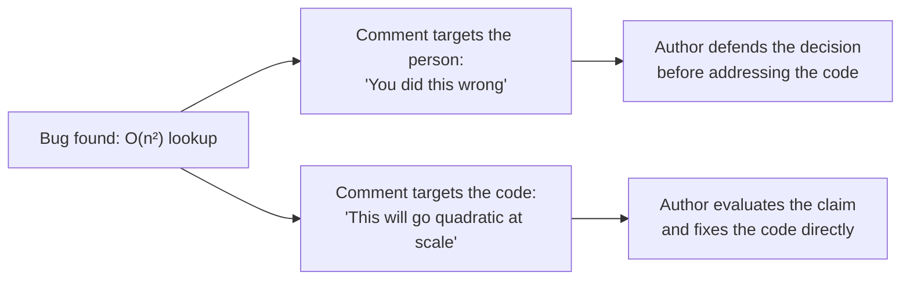
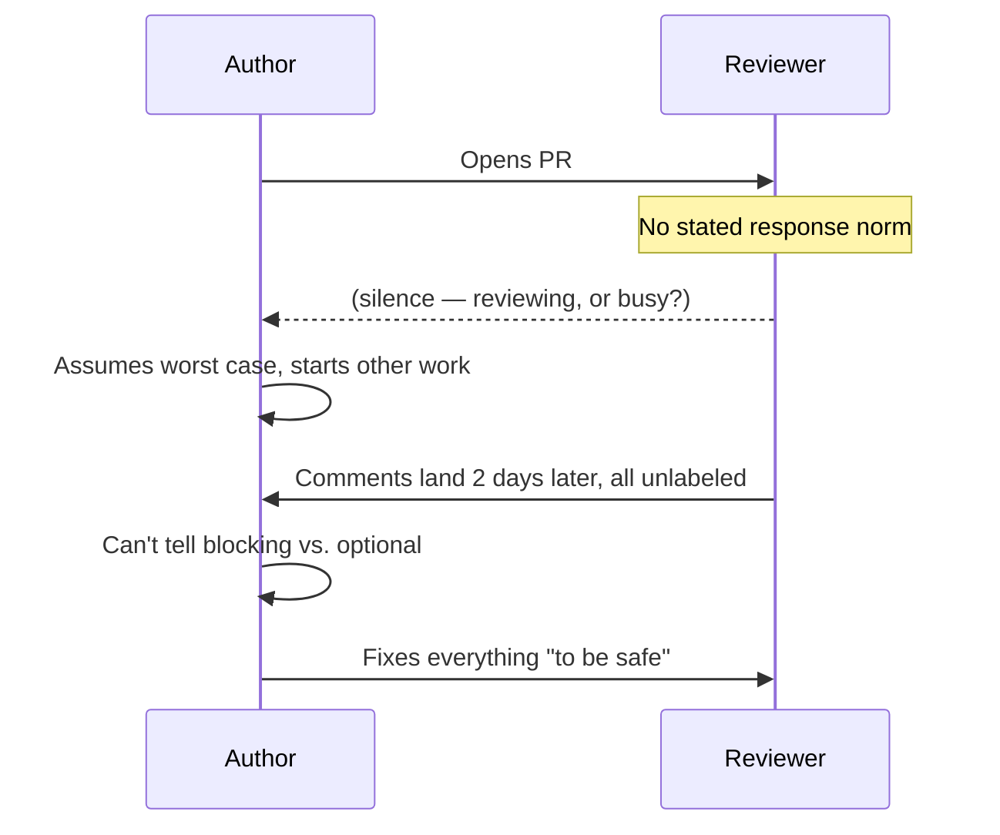

import Checkpoint from "../../../components/Checkpoint.astro";
import LevelIntro from "../../../components/LevelIntro.astro";

L1 showed that Reviewer A and Reviewer B caught the identical bug and got wildly different outcomes — three days of silence versus a twenty-minute fix. L2 turns that observation into a repeatable model: three concrete levers that separate a comment an author acts on from one they defend against, plus the async-etiquette layer that governs how a whole batch of comments lands, not just one.

<LevelIntro
  items={[
    "The three levers: subject, specificity, framing",
    "Severity labels and comment batching",
    "Response-time norms in async review",
  ]}
/>

## Lever 1: who is the grammatical subject?

Take "You did this wrong" and "This will go quadratic once `items` grows." Both point at the same defect. Before reading on: which word in each sentence is the author most likely to hear as the thing being judged?

"You did this wrong" makes the **author** the subject — the sentence is structurally about a person's action, and "wrong" is a judgment attached directly to them. "This will go quadratic" makes the **code** the subject — a behavior, predicted from a mechanism (the loop, the growth of `items`), with no person named as having failed. Same technical content, different grammatical target, different thing the author has to process before they can even start fixing anything.

This isn't a claim that tone doesn't matter, or that harsh feedback is never warranted — a genuinely blocking security issue should be marked as blocking, not softened into invisibility (L3 covers exactly that failure mode). It's narrower than that: for the same technical content, code-directed phrasing removes a step the author would otherwise have to take (deciding whether they're being judged) before they can get to the step that actually matters (deciding whether the claim about the code is correct).

<Checkpoint question="A reviewer writes: 'You forgot to handle the null case.' Rewrite the subject from person to code without changing what's being reported, and say what changed.">

"The null case isn't handled here — what happens if `user` comes back empty from this lookup?" The subject moved from "you" (a person who forgot something) to "the null case" and "this lookup" (properties of the code). Nothing about the underlying report changed — it's still flagging a missing null check — but the sentence no longer accuses the author of forgetting anything; it describes a gap in the code's behavior and invites the author to fill it in, which is a claim they can evaluate on its technical merits rather than a judgment they have to accept or push back on first.

</Checkpoint>

## Lever 2: how specific is the ask?

"This seems off" and "this lookup runs inside the loop on line 42, so it'll go quadratic once `items` grows past a few hundred" report the same underlying concern at two different resolutions. What does the author have to do differently in response to each?

A vague comment forces the author to do the reviewer's diagnostic work themselves — re-read the code, guess what "off" means, maybe ask. A specific comment (what line, what mechanism, what condition triggers it) hands the author a diagnosis they can verify or dispute directly. Specificity isn't about being verbose — a specific comment can be one sentence — it's about naming the _what_ and the _why_ instead of leaving the author to reconstruct both.

## Lever 3: statement or question?

"Use a hashmap" is an instruction. "Worth swapping to a `Map` here?" reports the same suggestion as a question. Why would the same technical suggestion land differently depending on which of these two forms it takes?

A flat instruction assumes the reviewer's solution is the only one worth considering and positions the author as the executor of someone else's decision. A question leaves room for the author to have a reason the reviewer doesn't know about yet — maybe a `Map` doesn't fit because the values need to preserve insertion order in a way the reviewer didn't see — without forcing them to argue against a directive to raise it. This isn't about hedging every comment into mush; a question still clearly states the concern and the suggested fix. It just leaves the door open for the author to answer rather than comply.

| Lever       | Costly form          | Lower-cost form                                                        |
| ----------- | -------------------- | ---------------------------------------------------------------------- |
| Subject     | "You did this wrong" | "This will go quadratic at scale"                                      |
| Specificity | "This seems off"     | "Line 42's lookup runs inside the loop — quadratic once `items` grows" |
| Framing     | "Use a hashmap"      | "Worth swapping to a `Map` here?"                                      |

## The etiquette layer: comments as a batch, not one at a time

The three levers above govern a single comment. But a real PR review is a batch of comments arriving at once, read asynchronously, often across time zones — and that batch has failure modes the single-comment model doesn't cover on its own. What could a reviewer get exactly right on every individual comment and still make the review painful?

Two batch-level problems show up constantly in async review:

- **No severity signal.** If ten comments look identical — same font, no labels — the author can't tell which one is a must-fix and which is "consider this if you have time." Everything gets treated as blocking, which either slows the merge down for optional polish or, worse, trains the author to skim past comments that actually matter.
- **No response-time expectation.** In a live conversation, silence is itself information — a pause means someone's thinking. In an async thread, silence is ambiguous: is the reviewer still looking, did they finish, are they waiting on the author? Without a stated or team-wide norm (e.g. "first pass within one business day"), both sides default to worst-case assumptions, which is exactly the kind of unstated tension a real PR conversation runs into.

Marking severity explicitly (`nit:` for optional polish, `blocking:` for must-fix before merge) and stating a response-time norm both do the same underlying job as the three levers: they replace an assumption the author would otherwise have to guess at with information the reviewer already has and can just state.

<Checkpoint question="A reviewer leaves eight comments on a PR: one flags a genuine data-loss bug, seven are style nits (variable naming, an extra blank line). None are labeled. What's the most likely outcome, and why does that outcome happen even though every individual comment was technically correct?">

The author most likely spends real time on the seven style nits and may treat the data-loss bug with the same priority as the rest — not because any comment was wrong, but because nothing in the batch told the author which one actually blocks the merge. Technical correctness at the level of each comment doesn't establish priority across the batch; that has to be communicated separately, through severity labels or explicit sequencing (mentioning the blocking issue first, or in its own comment thread), or the author is left to guess, and guessing under time pressure tends to favor whatever's fastest to fix, not what actually matters most.

</Checkpoint>

L3 takes these levers and the batch-etiquette layer and applies them to real diffs and real PR comment threads — including the case where a comment genuinely should be blocking, and softening it into a question would be the wrong move.
