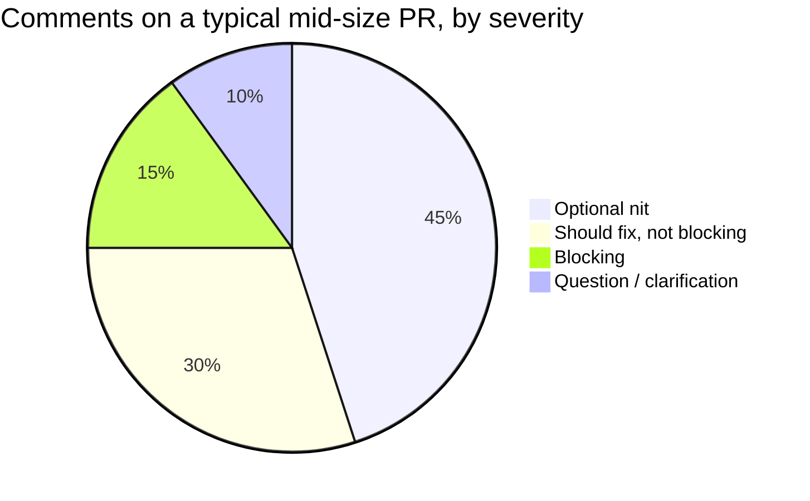
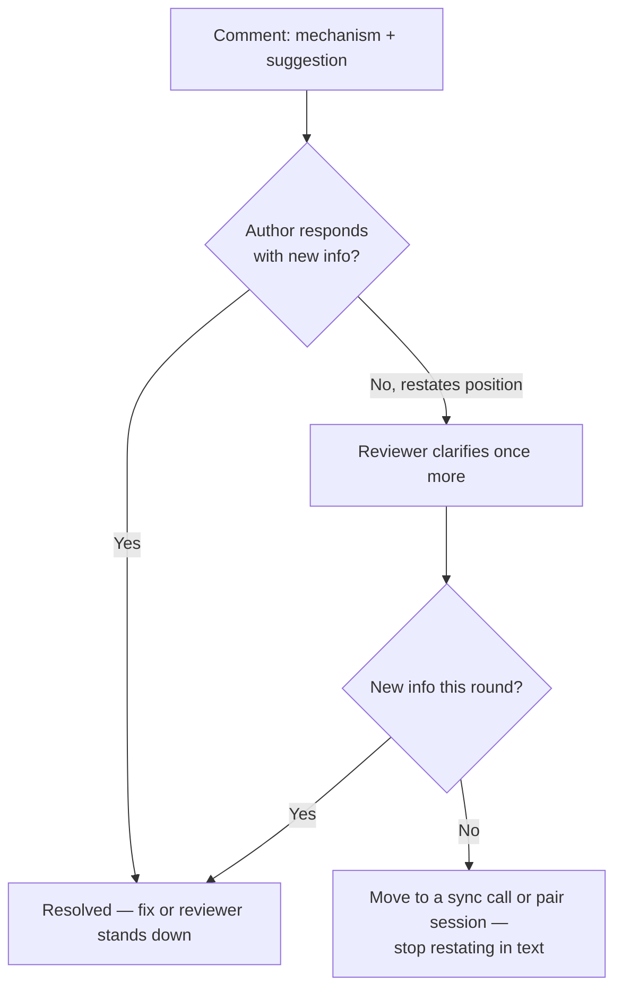

import Scenario from "../../../components/Scenario.astro";
import Checkpoint from "../../../components/Checkpoint.astro";
import LevelIntro from "../../../components/LevelIntro.astro";

<Scenario label="The thread that shouldn't have taken three rounds">
  <Fragment slot="facts">
    <div class="not-prose flex flex-col gap-2 text-sm text-slate-700 dark:text-slate-300">
      <div class="flex items-center gap-1.5"><span>1️⃣</span> <strong>Round 1</strong> — "This is wrong, just use a hashmap." No line reference.</div>
      <div class="flex items-center gap-1.5"><span>2️⃣</span> <strong>Round 2</strong> — Author pushes back defensively, explains original reasoning, no code changes.</div>
      <div class="flex items-center gap-1.5"><span>3️⃣</span> <strong>Round 3</strong> — Reviewer restates the same point more forcefully. Two days pass before anyone touches the diff.</div>
    </div>
  </Fragment>

Here's a real shape of thread this unit is trying to prevent, reconstructed from the kind of exchange that shows up on almost every team at some point. Round 1: a comment with no line reference and no mechanism, just a verdict. Round 2: the author, reading a verdict rather than a diagnosis, explains why they made the choice instead of touching the code. Round 3: the reviewer, frustrated that the "obvious" fix hasn't landed, restates the same point more forcefully. Two full days pass and the diff hasn't changed at all — not because the reviewer was wrong about the bug, but because **nothing in the first comment let the author act on it directly.** The rest of L3 rebuilds this exact exchange comment-by-comment, using the levers from L2, and then asks where those levers stop being the right tool.

</Scenario>

<LevelIntro
  items={[
    "A full comment rewrite, applied line by line",
    "Where softened framing is the wrong call",
    "Escalating out of a stuck async thread",
  ]}
/>

## The diff everyone is arguing about

Here's the actual code under review — a lookup used inside a loop that processes an incoming batch of orders:

```python
def apply_discounts(orders, discount_codes):
    results = []
    for order in orders:
        # discount_codes is a list of {"code": str, "percent": float}
        match = None
        for dc in discount_codes:
            if dc["code"] == order.code:
                match = dc
                break
        if match:
            order.total *= 1 - match["percent"] / 100
        results.append(order)
    return results
```

`discount_codes` is scanned in full for every single order — O(orders × codes). It works fine in the demo environment with eight test orders and three discount codes. It will not work fine once a real batch has thousands of orders checked against dozens of active codes.

## Rewriting the comment, lever by lever

Reviewer A's actual comment was: **"This is wrong, use a hashmap."** Applying L2's three levers one at a time to see exactly what each one fixes:

| Step                        | Comment                                                                                                                                                                                       | What's still missing                                       |
| --------------------------- | --------------------------------------------------------------------------------------------------------------------------------------------------------------------------------------------- | ---------------------------------------------------------- |
| Original                    | "This is wrong, use a hashmap."                                                                                                                                                               | No location, no mechanism, person-directed, an instruction |
| + Subject: code, not person | "This inner loop is wrong — use a hashmap."                                                                                                                                                   | Still no location, still a bare instruction                |
| + Specificity               | "The inner loop over `discount_codes` on line 6 re-scans the full list for every order — that's O(orders × codes)."                                                                           | Still an unsoftened statement, no invitation to respond    |
| + Framing as a question     | "The inner loop over `discount_codes` on line 6 re-scans the full list for every order — O(orders × codes). Worth building a `{code: dc}` dict once before the loop, so each lookup is O(1)?" | Nothing — all three levers applied                         |

The fully rewritten version is longer than the original in character count, but it's _cheaper_ for the author to act on: it names the exact line, the exact mechanism, the exact complexity class, and a concrete fix, phrased so the author can say "yes, doing that" and push a commit in the same sitting — which is what actually happened in L1's Reviewer B example. Length was never the problem with the original comment; missing information was.

<Checkpoint question="The rewritten comment above ends with a question — 'Worth building a dict once before the loop?' Suppose the author has a real reason not to do that (say, `discount_codes` is mutated mid-loop by another part of the function you haven't seen). Does the question framing still do its job in that case, or does it just delay the same instruction by one round-trip?">

It still does its job, and this is exactly the case the question framing is for. A bare instruction ("use a hashmap") gives the author nothing to push back against except the reviewer's authority — disagreeing feels like defying a directive. A question gives the author a legitimate opening to answer with the information the reviewer didn't have: "can't cache it — `discount_codes` gets mutated on line 11 by a promo-stacking rule, so it has to be re-read each time." That response resolves the thread in one round-trip with a better outcome (the reviewer now knows about the mutation) rather than two rounds of "do it" / "no" that a flat instruction would have produced. The question isn't slower when the author is right; it's exactly as fast, and it's the only form that doesn't waste a round-trip when the reviewer turns out to be missing context.

</Checkpoint>

## Where softened framing is the wrong tool

Every example so far has been a case where softening was the right move — but the three levers are not "always phrase everything as a gentle question." Take this diff, from the same codebase, a few files over:

```python
def load_user_preferences(user_id):
    query = f"SELECT * FROM preferences WHERE user_id = {user_id}"
    return db.execute(query)
```

This is a SQL injection vulnerability — `user_id` is interpolated directly into the query string. Applying the same three-lever rewrite mechanically produces something like: **"Worth using a parameterized query here, in case `user_id` isn't always trustworthy?"** That sentence is a mistake, not because it's poorly worded, but because it frames a must-fix security defect as an optional consideration the author can decline. A reader skimming a batch of comments has every reason to read "worth considering" as low-priority.

The fix isn't to abandon the levers — subject and specificity still apply — it's to drop the soft framing on the third lever and mark severity explicitly instead: **"`blocking:` this interpolates `user_id` directly into the query — SQL injection. Needs a parameterized query (`db.execute(query, [user_id])`) before merge."** Still code-directed, still specific about the mechanism and the fix, but stated as a fact with an explicit severity marker, not offered as a question. The technique in this unit is about removing _unnecessary_ friction from feedback, not about removing all directness from feedback that genuinely needs it.

| Situation                                           | Right framing                              | Why                                                                     |
| --------------------------------------------------- | ------------------------------------------ | ----------------------------------------------------------------------- |
| Style/performance improvement, not urgent           | Question, `nit:` if truly optional         | Author may have context the reviewer doesn't; low cost either way       |
| Design disagreement, reasonable people could differ | Question, invites the author's reasoning   | The "right" answer isn't settled; framing as fact would overclaim       |
| Security defect, data loss, correctness bug         | Statement, `blocking:` label, no softening | Not a matter of opinion; softening reads as "optional" and gets skipped |



The pie chart above is illustrative, not universal — a security-focused review or a first-time contributor's PR will skew the proportions differently (more blocking, more clarification). What it's meant to show is that most comments on most PRs _are_ optional or non-blocking, which is exactly why a batch with no severity marking is so costly: the reader has no way to tell the small "blocking" slice apart from the much larger "optional" one without the label doing that work explicitly.

## When the thread is stuck anyway

Reviewer A's actual thread from the opening scenario didn't stop at one badly-framed comment — round 2 and round 3 kept going with no code changes, because restating the same point, however well-framed, doesn't fix a thread that's already stuck. What signal tells a reviewer or author that a comment needs to leave the async thread entirely, rather than get rewritten one more time?

The signal isn't "the author disagreed once" — reasonable disagreement is normal and often resolves in the next reply. It's **two full round-trips with no new information on either side** — the same positions restated, not refined. At that point, the async medium itself is the obstacle: text strips out the tone-of-voice and immediate back-and-forth that would resolve a live disagreement in thirty seconds, and each additional async round costs a full response-latency cycle (hours, sometimes a full day across time zones) for zero new information.



Escalating isn't a failure of the framing technique — it's the technique correctly recognizing its own limit. A well-framed comment fixes the _first_ round-trip's cost; it doesn't manufacture information that doesn't yet exist in text form. When two rounds produce no new information, the fastest path to resolution stops being "write an even better comment" and becomes a five-minute call where both sides can ask follow-ups in real time instead of waiting a business day per exchange.

<Checkpoint question="A reviewer and author have gone two rounds on a design disagreement (should this be one function or two) with no new information either time. The reviewer's instinct is to write one more, even more carefully worded comment explaining their reasoning a third way. Based on the flowchart above, is that the right next move?">

No — the flowchart's signal has already been met (two rounds, no new information), so the right move is to escalate out of text, not refine the text further. A third comment assumes the problem is that the first two weren't clear enough, but the diagnosis here is different: both sides already understand the other's position and still disagree, which means the medium — not the wording — is the bottleneck. A quick call lets both people ask real-time follow-up questions and often resolves in minutes what a third async comment would spend another full day-long round-trip trying to do, with no guarantee it lands any better than the first two.

</Checkpoint>

## Extending past this example

Every rewrite in this unit assumed a two-person exchange: one reviewer, one author, one comment thread. What would change about the severity-labeling and response-norm etiquette from the "batch" section if the PR had **three reviewers** commenting independently on overlapping parts of the same diff, each unaware of what the others already said? Consider specifically: does "two round-trips with no new information" still mean the same thing when the author is fielding three separate threads at once, and what batch-level etiquette (beyond severity labels) would you want a team to adopt so the author isn't the one who has to reconcile three reviewers' opinions by hand?
