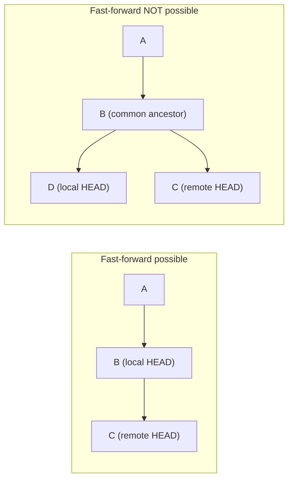

import LevelIntro from "../../../components/LevelIntro.astro";
import Checkpoint from "../../../components/Checkpoint.astro";

L1 named the three outcomes of a `pull` — clean fast-forward, merge commit, or a rebase replay — without yet showing what decides which one happens. L2 works out that decision precisely, then what merge and rebase each do once divergence has actually occurred.

<LevelIntro
  items={[
    "The exact fast-forward condition",
    "What a merge commit records",
    "What rebase replays",
  ]}
/>

## The actual condition for a fast-forward

**Is a fast-forward just "whatever happens when there are no
conflicts"?** No — it's a much narrower, structural condition:
a fast-forward is only possible when the local branch's current commit
is a direct ancestor of the remote's commit — meaning nothing new was
committed locally since the two branches were last in sync. If that
holds, "merging" the remote's changes is trivial: git just moves the
local branch pointer forward to the remote's commit. No new commit is
created because nothing actually needs reconciling — there's only one
line of history, and remote simply has more of it.

The same diagram as a story:

| Moment  | Local branch sees | Remote branch sees | Fast-forward possible?                         |
| ------- | ----------------- | ------------------ | ---------------------------------------------- |
| Monday  | `A -> B`          | `A -> B -> C`      | Yes. Local `B` is already inside remote's line |
| Tuesday | `A -> B -> D`     | `A -> B -> C`      | No. `C` and `D` are different children of `B`  |

**Why does the right-hand case above make a fast-forward impossible?**
Because `B` — the last point local and remote agreed on — now has two
separate children, `D` (local's own commit) and `C` (remote's commit).
Local's current commit (`D`) is not an ancestor of remote's commit
(`C`), and remote's commit is not an ancestor of local's either — the
two have genuinely diverged, and there's no way to "just move a
pointer" that would preserve both sides' work.

<Checkpoint question="Local's branch has made zero new commits since the last sync, but remote now has three new commits. Is a fast-forward possible?">

Yes. The fast-forward condition only cares whether local's current commit is an ancestor of remote's — it says nothing about how many commits remote added. Local never moved, so it's still sitting somewhere back in remote's line; git just slides the local pointer forward to remote's tip. The size of the gap doesn't matter, only whether local branched off on its own.

</Checkpoint>

## What merge does with divergence

**If a fast-forward isn't possible, what does a normal merge actually
create?** A new commit with **two parents** — one pointing at local's
last commit (`D`), one at remote's last commit (`C`) — recording the
fact that both histories are now combined. The resulting graph still
shows both `D` and `C` as real, distinct points that happened, with
the merge commit sitting after both. This is exactly the "Merge
branch..." commit from L1's scenario: not a bug, but git's honest
record that reconciliation was actually required.

<Checkpoint question="A merge commit has two parents instead of one. Does creating it change or rewrite the original local and remote commits (D and C) in any way?">

No. The merge commit is a brand-new commit added _after_ both `D` and `C` — it points back at both of them, but neither `D` nor `C` is modified or replaced. Their hashes and content stay exactly as they were; the merge just records, honestly, that both happened. That's the detail that makes rebase (next) genuinely different: rebase is the one that produces new commits with new hashes, not merge.

</Checkpoint>

## What rebase does instead

**Is there a way to avoid that extra commit even when divergence
happened?** Yes — rebase takes local's commits (`D` in the diagram
above) and _replays_ them, one at a time, on top of remote's latest
commit (`C`), producing new commits with new hashes but the same
changes and messages. The result is a straight line: `A → B → C → D'`,
with no merge commit and no branching point visible in the history at
all — as if the local work had been started fresh from `C` instead of
from `B`.

|                                   | Merge                                               | Rebase                                                                |
| --------------------------------- | --------------------------------------------------- | --------------------------------------------------------------------- |
| Merge commit created?             | Yes — one merge commit with two parents             | No — rebase avoids a merge commit                                     |
| New copied commits created?       | No — the original local commits stay where they are | Yes — local commits are replayed as new commits with new hashes       |
| Resulting history shape           | Shows the actual branching and reconciliation point | Straight line, as if local work started from the new base             |
| Original commit hashes preserved? | Yes, all original commits keep their hashes         | No — replayed commits get new hashes, even though content is the same |

## The real trade-off, not just a style preference

**Is choosing merge vs. rebase purely a matter of taste?** Not
entirely — rebase's rewritten hashes are the reason it's specifically
risky on commits that have already been shared with someone else:
anyone who already pulled the old commits now has history that
diverges from the rewritten version, and reconciling _that_ is its own
mess (the actual subject of a later unit, `shared-history`). Merge
never rewrites existing commits, which is exactly why it's the safer
default for history that's already been pushed and pulled by other
people — the trade-off is a cleaner-looking history (rebase) against a
smaller risk of breaking someone else's copy of that history (merge).

The `shared-history` unit focuses on that risk directly: once another
person may already have your old commit hash, rebasing it is no longer
just "cleaning up your own copy." It changes the coordinates other
people might already be using.

## The generalizable lesson

**Does "fast-forward" only apply to `git pull`?** No — the same
structural condition (is one side's position a strict ancestor of the
other's) governs every merge git performs, whether it's triggered by
`pull`, an explicit `git merge`, or a pull request being merged on
GitHub. The visible difference (a clean update vs. a merge commit vs.
a rebase) is always downstream of that one structural fact: did the two
sides actually diverge, or did one side simply have more history than
the other.
