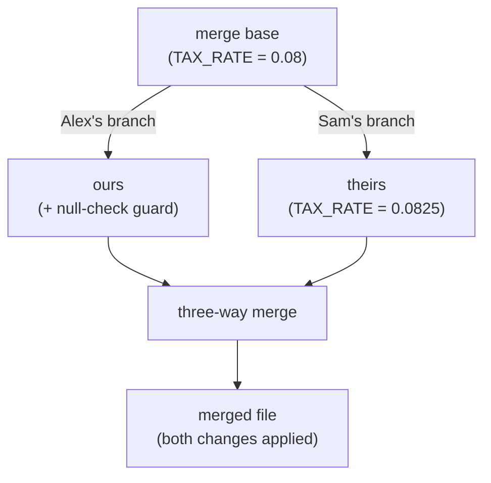

import LevelIntro from "../../../components/LevelIntro.astro";
import Checkpoint from "../../../components/Checkpoint.astro";

L1 named the mechanics — merge base, three-way merge, conflict markers —
without yet showing _why_ comparing three versions instead of two is what
actually makes auto-merge possible. L2 works through that reasoning, and
what fast-forward looks like by contrast.

<LevelIntro
  items={[
    "Why two-way diffing can't safely auto-merge anything",
    "The per-line decision procedure git actually runs",
    "How auto-merge, conflict, and fast-forward are one mechanism",
  ]}
/>

## Why not just diff the two branches against each other?

**If Alex's file and Sam's file are both different from each other, why
not just compare them directly and merge whatever's different?** Because
a direct two-way diff can't tell you _who_ changed what — it only tells
you the two files disagree at some line. It has no way to know whether
that disagreement means "Alex added this" or "Sam deleted this," and
without that, it can't safely combine them. Git instead diffs each branch
**against the shared merge base**, separately:



Diffing base→ours tells git exactly what Alex changed. Diffing base→theirs
tells git exactly what Sam changed. Now git has two independent change
lists it can compare **to each other** — and that's the actual question
that decides auto-merge vs. conflict: do the two change lists touch the
same lines?

<Checkpoint question="Why can't a plain two-way diff between Alex's file and Sam's file tell git whether it's safe to auto-merge them?">

A two-way diff only reports that the two files disagree at a given line —
it has no record of which side actually changed it and which side simply
never touched it, because it never looked at the original. Without a
third reference point (the merge base), git can't distinguish "Alex
changed this and Sam left it alone" from "Sam changed this and Alex left
it alone" from "they both changed it to different things" — and those
three situations need three different resolutions. Comparing both sides
independently against the same starting point is what recovers that
missing information.

</Checkpoint>

## The merge procedure, as a decision per line

**Walking through the base file line by line, what does git actually
decide at each line?**

Before the pseudocode, anchor the three names:

| Name   | Plain picture                                     | In the scenario                                    |
| ------ | ------------------------------------------------- | -------------------------------------------------- |
| Base   | The original photo before either person edited it | The morning commit both branches started from      |
| Ours   | The photo from the branch you are currently on    | Sam's branch while running `git merge alex-branch` |
| Theirs | The photo from the branch being brought in        | Alex's branch being merged into Sam's              |

Git compares both edited photos against the same original. That is what
lets it tell "only Alex touched this" from "both people disagreed here."

```text
for each line in the merge base:
    ours_changed  = did Alex's branch change or delete this line?
    theirs_changed = did Sam's branch change or delete this line?

    if neither changed it:
        keep the base line as-is
    elif only ours changed it:
        take Alex's version of this line
    elif only theirs changed it:
        take Sam's version of this line
    else (both changed it):
        if both changes are identical:
            take that shared change (no conflict — they agreed)
        else:
            CONFLICT — insert both versions between markers
```

The same logic applies to lines _inserted_ between two base lines (Alex
adding a new line vs. Sam adding a different new line at the same spot) —
git tracks insertions the same way, anchored to the nearest surviving base
line, not just modifications to existing lines.

## Auto-merge vs. conflict vs. fast-forward

**Are these three different mechanisms, or three outcomes of the same
one?** The same three-way comparison produces all three outcomes — they
differ only in what the comparison finds:

| Situation                                                                | What the base→ours and base→theirs diffs look like | Outcome                                                                           |
| ------------------------------------------------------------------------ | -------------------------------------------------- | --------------------------------------------------------------------------------- |
| Alex adds a guard clause; Sam changes an unrelated constant              | Different lines touched on each side               | **Auto-merge** — both changes applied, no conflict                                |
| Alex and Sam both edit `TAX_RATE`'s value, to different numbers          | Same line, different replacement content           | **Conflict** — human picks or combines                                            |
| Alex and Sam both change `TAX_RATE` to the exact same new value          | Same line, identical replacement content           | **Auto-merge** — they agreed, nothing to ask                                      |
| Sam's branch has made zero commits since branching; Alex has moved ahead | Sam's branch tip is literally still the merge base | **Fast-forward** — no three-way comparison even needed, branch pointer just moves |

<Checkpoint question="Alex and Sam both independently change TAX_RATE to 0.0825 — the exact same value. Does git flag this as a conflict, and why or why not, given the per-line decision procedure above?">

No conflict. The procedure only escalates to a human when both sides
changed the same line to _different_ content — the last branch in the
"both changed it" case explicitly checks whether the two changes are
identical first. Here they are, so git treats it the same as if only one
side had changed it: there's nothing to ask about, because there's no
disagreement to resolve, even though two independent edits happened.

</Checkpoint>

## Fast-forward: the case with no comparison at all

**If Sam's branch never actually diverged — no commits of its own — is
there anything to merge at all?** No: if the branch being merged _into_
hasn't moved since the two branches split, git doesn't need to combine
anything. It just moves that branch's pointer forward to match the other
branch's latest commit. This is why `git merge` sometimes produces a merge
commit and sometimes doesn't — it depends entirely on whether real,
independent history exists to reconcile. The `merge-rebase` unit goes
deeper on fast-forward and why it is about ancestry, not about the
absence of possible conflicts in general.

## The generalizable lesson

**Does keeping branches short-lived actually reduce conflicts, or is that
just conventional wisdom?** It's a direct consequence of the mechanism
above: the more lines a branch touches, and the longer it lives before
merging (giving other branches more time to touch the same lines too), the
higher the odds that some line ends up in _both_ change lists with
different content. Conflict risk isn't about how many people are working
on a file — it's about how much line-level overlap accumulates between
their independent change lists before either side merges.
