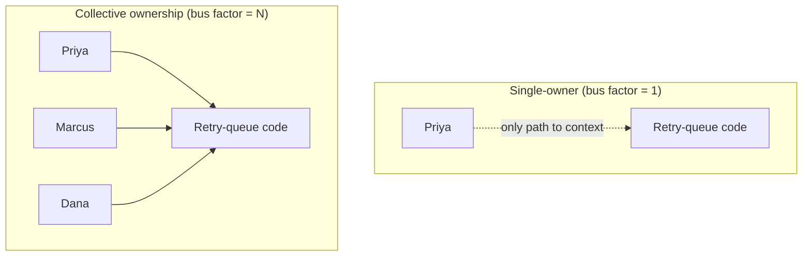
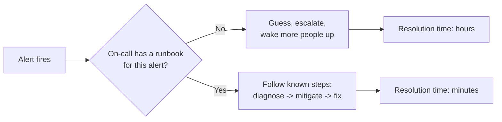

import LevelIntro from "../../../components/LevelIntro.astro";
import Checkpoint from "../../../components/Checkpoint.astro";

L1 named the failure at 2:14 AM as a knowledge-distribution problem,
not a skill problem. L2 works out the actual trade-off between how a
team distributes ownership of its code, and what has to exist beyond
a rotation schedule for on-call to actually work when the original
author isn't reachable.

<LevelIntro
  items={[
    "Single-owner vs. collective ownership, and the real cost of each",
    "What a rotation schedule alone doesn't solve",
    "The three things a runbook has to do that memory can't",
  ]}
/>

## Is single ownership just a mistake?

**If Priya being the sole owner of the retry queue caused the
outage, was making her the sole owner the mistake?** Not necessarily
— single ownership isn't a bug in how the team was organized, it's a
trade-off with a real benefit: one person who's touched every corner
of a system builds a depth of intuition that's genuinely hard to
replicate by committee, and for a genuinely complex, high-stakes piece
of code, that depth can mean _fewer_ bugs day-to-day, not more. The
mistake wasn't choosing single ownership. It was never doing anything
to reduce the bus factor it created — no pairing, no documentation,
no second reviewer who'd built real context — for eight months.

|                                             | Single-owner                          | Collective ownership                                       |
| ------------------------------------------- | ------------------------------------- | ---------------------------------------------------------- |
| Bus factor                                  | 1 (or however many owners are named)  | Whole team                                                 |
| Depth of expertise per person               | High — one person has seen everything | Lower per person, unless deliberately maintained           |
| Consistency of style/decisions              | High — one set of judgment calls      | Requires active alignment (review, conventions)            |
| Incident response when owner is unreachable | Fails, unless a runbook exists        | Degrades gracefully — someone else has _some_ context      |
| Cost to maintain                            | Low effort, high risk concentration   | Higher ongoing effort (pairing, docs, reviews), lower risk |

**So which one is correct?** Neither, in the abstract — the right
call depends on how costly it is if the single owner is unreachable
at the wrong moment, weighed against how much slower and more
inconsistent the work gets under shared ownership. A batch script run
once a quarter by request can reasonably stay single-owned forever.
A system that pages someone at 2 AM cannot — the whole premise of
on-call is that _someone other than the author_ has to be able to act
on it, which is precisely the guarantee single ownership doesn't
provide on its own.

<Checkpoint question="A team has one person who owns the retry queue and no one else has ever opened the code. Does adding a second on-call engineer to the pager rotation fix the bus-factor-1 problem?">

No — not by itself. Rotating who _gets paged_ doesn't rotate who
_understands the system_. If Marcus is now on the pager schedule but
still has zero context on the retry queue, the outage plays out
exactly the same way: he gets the alert, opens unfamiliar code, and
loses the same hours discovering what Priya already knew. A rotation
schedule distributes the responsibility for responding; it does
nothing to distribute the knowledge required to actually respond
well. Those are two separate problems, and only one of them is
solved by a schedule.

</Checkpoint>

## What a rotation schedule alone doesn't solve

**If the pager schedule isn't the fix, what is?** The gap is
specifically: whoever is paged needs a way to act with something
close to the original author's context, without the original author
being present. Three things close that gap, and a bare rotation
schedule provides none of them:

- **A runbook** — a written procedure for this specific class of
  alert: what it means, what to check first, what a safe mitigation
  looks like, and who to escalate to if those steps don't resolve it.
  Without one, on-call's only tool is reading the source code cold,
  under pressure, at 2 AM.
- **A real escalation path** — not "page more people," but a named
  order of who to contact next and what each of them actually knows,
  so escalation adds context instead of just adding people who are
  equally unfamiliar with the code.
- **Knowledge sharing before the incident** — pairing sessions,
  rotating who reviews changes to a given area, or a walkthrough
  recorded when the system was built — anything that puts a second
  person's understanding on record _before_ it's needed at 2 AM,
  since there's no time to build that understanding once the alert
  has already fired.

<Checkpoint question="A team writes a runbook for the retry queue, but it was written by Priya from memory two years ago and has never been re-checked against the actual code. Does having a runbook at all solve the bus-factor problem?">

Only partially, and it's a real risk to assume otherwise. A stale
runbook can be worse than no runbook if it's followed with false
confidence — it sends on-call down steps that matched the system two
years ago but not the system tonight, burning time on a "known fix"
that no longer applies before anyone realizes the document itself is
the problem. A runbook only closes the knowledge gap if it's kept
current, which itself has to be someone's explicit, recurring
responsibility — not a one-time artifact written once and assumed to
stay true forever.

</Checkpoint>

## The generalizable lesson

**Does this only apply to on-call incidents?** No — the same
knowledge-distribution question shows up any time a single person's
absence (vacation, illness, leaving the company) would stop the team:
who's the only one who understands the deploy pipeline, the billing
reconciliation job, or the one gnarly migration script that runs
once a year. On-call incidents just make the cost visible fastest,
because the clock is running in front of a customer. The underlying
fix is the same in every case: don't wait for the absence to happen
before finding out it was going to be a problem.
