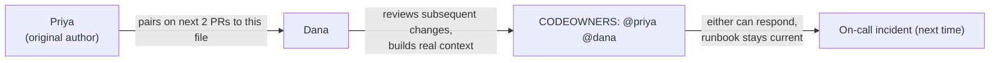

import Scenario from "../../../components/Scenario.astro";
import LevelIntro from "../../../components/LevelIntro.astro";
import Checkpoint from "../../../components/Checkpoint.astro";

<Scenario label="The full incident timeline">
  <Fragment slot="facts">
    <div class="not-prose flex flex-col gap-2 text-sm text-slate-700 dark:text-slate-300">
      <div class="flex items-center gap-1.5"><span>02:14</span> alert fires: duplicate charges detected</div>
      <div class="flex items-center gap-1.5"><span>02:19</span> Marcus opens the code, recognizes nothing</div>
      <div class="flex items-center gap-1.5"><span>02:41</span> first escalation — pages two engineers who also don't own this code</div>
      <div class="flex items-center gap-1.5"><span>04:50</span> Priya lands, reads one log line, identifies the cause</div>
      <div class="flex items-center gap-1.5"><span>04:54</span> fix shipped — 4 minutes after Priya had the right context</div>
    </div>
  </Fragment>

**Given the timeline above, where exactly did the three hours go —
and is there a single point in it where a written artifact, not a
smarter person, would have closed the gap?** This L3 walks that
incident in full: the actual bug, the runbook the team should have
had, and the ownership change they made afterward. It then works
through a second, harder case where the opposite move — spreading
ownership across everyone — was itself the mistake, to show this
isn't a "collective ownership always wins" lesson.

</Scenario>

<LevelIntro
  items={[
    "The actual bug, and why only Priya could spot it fast",
    "A real runbook, CODEOWNERS file, and escalation path the team built afterward",
    "A second case: where collective ownership caused the incident instead of preventing it",
  ]}
/>

## The actual bug

The retry queue re-submits a payment charge if it doesn't receive a
confirmation within 30 seconds, on the assumption that the original
attempt timed out silently. What it didn't handle: a confirmation
that arrives _late_ — at 34 seconds instead of within 30 — still gets
processed as a success once it lands, but the retry had already fired
at the 30-second mark and also succeeded. Both charges go through.
This is a real, specific bug — a race between a retry timer and a
slow-but-real confirmation — not a stand-in for "something broke."

```js
// retry-queue.js — the logic as it shipped
const CONFIRMATION_TIMEOUT_MS = 30_000;

async function chargeWithRetry(charge) {
  const confirmationPromise = waitForConfirmation(
    charge.id,
    CONFIRMATION_TIMEOUT_MS,
  );
  const timedOut = await Promise.race([
    confirmationPromise.then(() => false),
    sleep(CONFIRMATION_TIMEOUT_MS).then(() => true),
  ]);

  if (timedOut) {
    // Assumes the original attempt is dead. It might not be — it might
    // just be slow. This is the actual defect: no check for "did the
    // original attempt actually fail, or is it just running long?"
    return submitCharge(charge);
  }
  return confirmationPromise;
}
```

Priya spotted it in one log line because she remembered writing the
30-second timeout and immediately recognized the symptom (duplicate
charges, both with valid confirmations) as exactly what happens when
a slow confirmation crosses paths with a retry. Marcus, reading the
same log line with no history with this code, saw two successful
charges and reasonably suspected the payment provider's API, not a
race condition in a 30-second timer — a plausible read, just the
wrong one, because he had no prior model of this file to rule it out
quickly.

<Checkpoint question="Marcus spent over two hours suspecting the payment provider's API instead of the retry timer. Was that a bad diagnostic instinct on his part?">

Not really — it was a reasonable hypothesis given what he had to work
with. Duplicate successful charges are also a plausible symptom of a
flaky upstream API, and without prior context on this specific
retry-timeout design, that's a sensible place to start looking.
The actual problem wasn't Marcus's reasoning; it was that he was
reasoning from scratch under time pressure, on a system Priya could
reason about from memory. The fix isn't "make Marcus smarter" — it's
removing the need to reason from scratch at all.

</Checkpoint>

## The runbook that should have existed

After the incident, the team wrote the runbook that would have
turned this into a 10-minute fix instead of a 3-hour one:

```markdown
# Runbook: duplicate-charge alert (retry-queue)

## What this alert means

The retry queue re-submitted a charge that had already succeeded.
Root cause is almost always a confirmation arriving after the
30-second retry timeout fires, not the payment provider double-
charging on their end.

## First checks (do these before escalating)

1. Pull the charge ID from the alert. Check `confirmations` table for
   TWO successful confirmations within ~5 seconds of each other,
   30+ seconds after the original charge timestamp.
2. If both confirmations reference the SAME original charge and both
   are >30s after submission: this is the known race condition, not
   a provider-side bug. Go to "Known fix" below.
3. If confirmations are for genuinely different charge attempts, or
   the timing doesn't match: this is NOT the known issue — escalate
   to #payments-oncall immediately instead of guessing further.

## Known fix (temporary mitigation)

Disable retry for the affected charge's payment method type via the
`RETRY_DISABLED_METHODS` feature flag. This stops new duplicates
immediately; it does not need a code deploy.

## Who to escalate to, and what they know

- Priya (@priya) — wrote the original retry logic, primary owner.
- Dana (@dana) — paired on the last two changes to this file, has
  working context even when Priya is unreachable.

## Owner

Priya (@priya). Last reviewed: see CODEOWNERS.
```

Notice what this runbook actually does: step 2 lets Marcus confirm
_this specific known failure mode_ without understanding the whole
system, and the mitigation in step 3 needs no code change and no
deep context at all — just a flag flip. A runbook's job isn't to
teach on-call the whole system under pressure; it's to compress the
one path that's actually likely into something a stranger to the
code can execute correctly.

## Spreading the knowledge before the next incident

The team also added a `CODEOWNERS` entry and a pairing rule, so the
next incident doesn't depend entirely on a runbook staying current
forever:

```
# CODEOWNERS
# Payments-retry logic requires review from someone who has
# actually worked in this file recently — not just any senior eng.
/services/payments/retry-queue/  @priya @dana
```



`Dana` didn't get added to `CODEOWNERS` by decree — she got added
after actually pairing on two real changes to the file, which is
what gave her enough context to be a credible second responder. A
`CODEOWNERS` line naming someone who's never touched the code doesn't
raise the bus factor; it just adds a name that will also have to
reason from scratch at 2 AM.

## A second case: when collective ownership was the wrong call

**Does this mean the fix is always "spread ownership to more
people"?** No — here's a case from the same company, six months
earlier, where the opposite happened: the database migrations
directory had no owner at all. Anyone on the team could add a
migration, and everyone did, on the theory that a shared, well-
reviewed directory would avoid exactly the bus-factor-1 problem above.

```
migrations/
  0041_add_refund_reason.sql       (written by Alex, reviewed by Sam)
  0042_backfill_user_region.sql    (written by Sam, reviewed by Jo)
  0043_drop_legacy_status_col.sql  (written by Jo, reviewed by Alex)
```

Migration `0043` dropped a column that `0041`'s refund logic still
read from — because no single person had end-to-end context on how
the refund path used that column, and each individual review looked
locally reasonable: the reviewer of `0043` checked that nothing in
the _current_ codebase referenced the column by name, but missed
that `0041`'s refund logic read it through a join, one file away from
where they were looking. Collective ownership meant every change had
_a_ reviewer, but no one held the accumulated cross-cutting context
that a single long-term owner of the migrations directory would have
built up specifically by having reviewed all of `0041`, `0042`, and
`0043` in sequence.

|                    | Payments-retry queue (single-owner)         | Migrations directory (collective)                                   |
| ------------------ | ------------------------------------------- | ------------------------------------------------------------------- |
| What failed        | On-call had no way to act without the owner | No one had accumulated cross-cutting context                        |
| What made it worse | 8 months with zero knowledge sharing        | Diffusion of responsibility — "someone reviewed it" felt sufficient |
| The actual fix     | Runbook + a second real co-owner (Dana)     | A named owner for cross-cutting review, on top of per-PR reviewers  |

The lesson isn't "single-owner bad, collective good" or the reverse
— it's that **both models fail the same way**: no one held enough
context to catch the specific failure, just via different
mechanisms. Single ownership concentrates context in one place and
provides nothing when that place is unreachable. Collective
ownership without a coordinating owner distributes review but not
necessarily _accumulated_ understanding — everyone can see any one
change is locally fine while nobody sees the pattern across changes.

<Checkpoint question="The migrations directory had reviewers on every single PR. Why wasn't that enough to catch the conflict between migration 0041 and 0043?">

Because per-PR review only checks that one change against the code
that exists _at that moment_ — it doesn't require anyone to hold the
history of related changes in mind across PRs. The reviewer of 0043
correctly checked the current codebase and found no direct reference
to the dropped column; what they didn't have was the accumulated
memory that 0041's refund path used that column through a join,
because no single person had reviewed the whole sequence and built
that cross-cutting picture. That's exactly the gap a rotating "cross-
cutting owner" role closes without going back to single ownership.

</Checkpoint>

## Extend it yourself

**Both cases above involve a single incident. What would you expect
to change if the payments-retry queue instead had three co-owners
from day one, all equally experienced with it — does the bus-factor
problem fully disappear, or does it just take a worse night (all
three unreachable at once) to reproduce?** And for the migrations
case: if the team had picked a single rotating "migration owner"
for one quarter at a time instead of leaving the directory fully
open, what new single point of failure would that introduce, and
would it be a better trade than the one that actually caused the
outage?

## Failure modes

| Failure mode                                                | What it gets wrong                                                                                              |
| ----------------------------------------------------------- | --------------------------------------------------------------------------------------------------------------- |
| Treating bus factor as only about employee attrition        | It shows up any time the owner is unreachable — vacation, a flight, a different fire, not just quitting         |
| Writing a runbook once and never updating it                | A stale runbook sends on-call down steps that no longer match the system, with false confidence                 |
| Assuming a pager rotation alone spreads knowledge           | It spreads who responds, not what they know — those are separate problems                                       |
| Assuming collective ownership has no bus-factor risk        | It replaces "no one can act" with "no one holds the cross-cutting picture" — a different failure, not zero risk |
| Adding names to CODEOWNERS without real context behind them | A name with no working history in the file adds no actual response capacity at 2 AM                             |
| Treating this as a one-time fix after an incident           | Knowledge sharing has to be ongoing (pairing, rotating reviewers) or the bus factor quietly returns to 1        |
