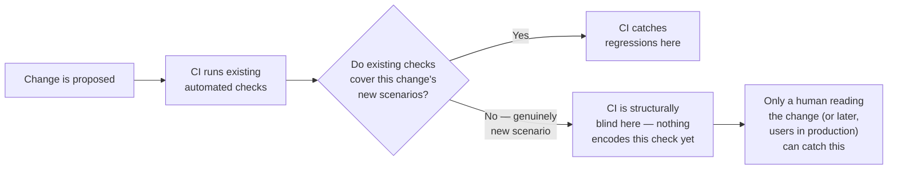
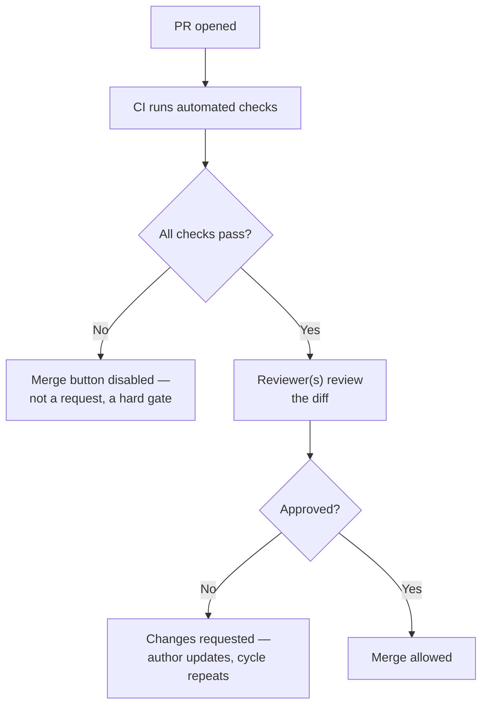

## Why "the tests passed" isn't the same as "this is correct"

**If CI ran every test and every test passed, what's left for a
human reviewer to actually check?** Precisely the things no test
happens to check yet — a passing test suite proves the code does
what the _existing_ tests expect, and says nothing about a scenario
nobody encoded as a test:

**Does this mean CI is less valuable than review?** No — they cover
different territory almost entirely. CI is exhaustive over what it
knows to check and runs it every single time, tirelessly, on every
PR. Review is the only mechanism that can catch something nobody
thought to write a check for yet — but it depends on a human
actually engaging with the change, which doesn't scale the same way
and isn't guaranteed to happen carefully.

## What each one is actually good at

**Given they cover different territory, what should a reviewer
actually spend their limited attention on, if CI already handles
regressions?** The things CI structurally can't:

|              | CI gating                              | Human review                                                    |
| ------------ | -------------------------------------- | --------------------------------------------------------------- |
| Catches      | Regressions in already-tested behavior | Missing test coverage, design issues, "what about X?" questions |
| Runs         | Every time, automatically, tirelessly  | Only as carefully as the reviewer actually engages              |
| Blind to     | Anything nobody wrote a check for      | Anything too subtle or too large to notice by reading           |
| Cost to skip | Immediate, obvious (build fails)       | Delayed, easy to rationalize ("I'll review it later")           |

A reviewer who re-verifies things CI already checked (does it build,
do the existing tests pass) is spending attention on exactly the
territory that's already covered — the reviewer's actual value is in
asking "what wasn't tested," "why this approach," and "what happens
at the edges" — the questions no automated check can ask on its own.

## Beginner reviewer checklist

| Reviewer question                                     | Why it catches what CI may miss                                  |
| ----------------------------------------------------- | ---------------------------------------------------------------- |
| What new scenario does this change enable?            | New behavior may not have any tests yet                          |
| What happens at zero, empty, huge, or invalid inputs? | Edge cases often reveal assumptions hidden in normal examples    |
| Is there a simpler way to express this?               | Correct code can still be hard for the next person to understand |
| Are tests added for the new behavior?                 | Review can turn a human insight into future automated protection |
| Could this break callers outside the diff?            | The changed lines may not show every dependency in the codebase  |

Good review culture is specific and collaborative: "What should happen
if both discounts apply?" helps the author reason. "Bad approach" gives
no path forward. A useful review leaves the code safer and leaves the
author clearer about the system.

## Blocking checks: why "please run the tests" isn't enough

**If a team asks engineers to run tests before merging, why do teams
still configure CI to physically block a merge on failure, rather
than trusting people to check?** Because a request that depends on
someone remembering, under deadline pressure, is a request that will
eventually get skipped — not out of bad faith, but because "I'm
confident this is fine" is always available as a justification in the
moment. A **blocking check** removes that decision entirely: the
merge button is disabled, not discouraged, until the check passes.

Real tools often run CI and review in parallel, or rerun CI after the
author pushes review fixes. The important invariant is not the exact
order in the diagram. The important invariant is: before merge, the
required automated checks have passed and the required reviewers have
approved the final version.

## Failure modes at this level

- **Treating a green CI checkmark as "this PR is correct."** CI only
  confirms nothing already-tested broke — it says nothing about
  whether the change is actually the right one, or whether it's
  missing coverage for its own new behavior.
- **Making review purely a formality (rubber-stamp approval).** A
  review that doesn't actually engage with the diff provides none of
  review's actual value — it just adds latency without adding the
  scrutiny it's supposed to provide.
- **Configuring checks as non-blocking "for visibility" and expecting
  them to function like blocking ones.** A check that can be
  overridden or ignored under time pressure will be, eventually —
  the whole point of gating is removing that choice.
