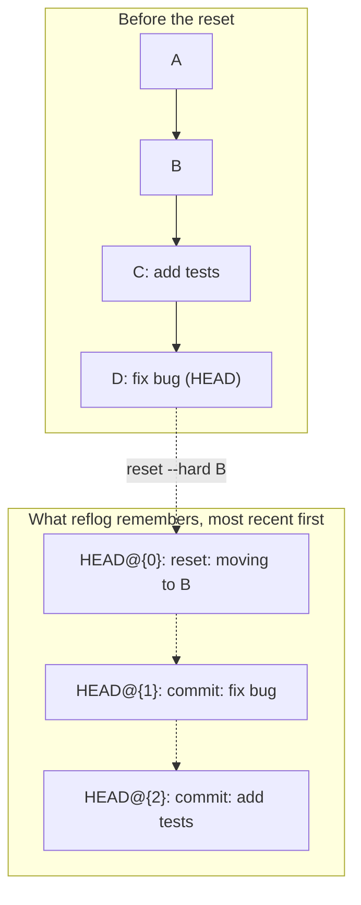
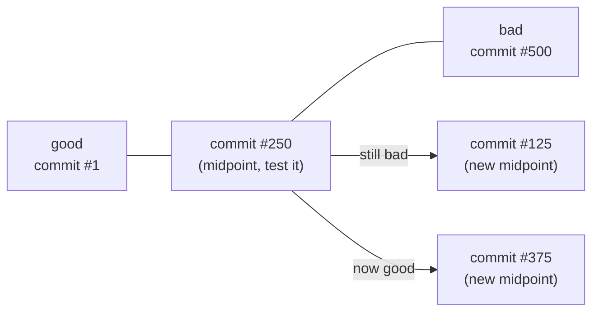

import LevelIntro from "../../../components/LevelIntro.astro";
import Checkpoint from "../../../components/Checkpoint.astro";

L1 established that `reset --hard` doesn't delete commit objects, and
that `git reflog` is what remembers where a ref used to point. L2 works
out exactly what a reflog entry records, why the dropped commits stay
recoverable for a real window of time and not forever, and then turns
to a second, unrelated tool that gets confused with reflog constantly:
`git bisect`, for finding _which_ past commit broke something.

<LevelIntro
  items={[
    "The exact structure of a reflog entry",
    "Why 'still recoverable' has an expiry date",
    "Bisect's binary search, step by step",
  ]}
/>

## What a reflog entry actually records

**If `git log` already shows commit history, what does `git reflog`
add that `git log` doesn't have?** `git log` shows the graph reachable
from a ref's _current_ position — parent-child relationships between
commits. `git reflog` shows something orthogonal: a timeline of every
position `HEAD` (or a branch) has occupied, in the order it moved
there, regardless of whether that position is still reachable now.

Each entry pairs a **commit id** with a **reason** (`commit`, `reset`,
`checkout`, `pull: Fast-forward`, `merge`, `rebase`, ...) and a
relative index — `HEAD@{0}` is always "where HEAD is right this
second," `HEAD@{1}` is "where it was one move before that." After
`reset --hard B`, `git log` shows only `A → B`; `git reflog` still
shows that `C` and `D` existed and exactly when HEAD left them behind.

| What you're asking                                     | Reach for    |
| ------------------------------------------------------ | ------------ |
| "What led up to this commit?"                          | `git log`    |
| "Where has this ref pointed to before, and when?"      | `git reflog` |
| "What did HEAD point to immediately before this move?" | `ORIG_HEAD`  |

<Checkpoint question="After git reset --hard B, does git log show commit D (the dropped 'fix bug' commit) anywhere in its output?">

No. `git log` only walks backward from wherever the ref currently points, and after the reset, `HEAD` points at `B` — `C` and `D` are no longer in that chain at all, even though the objects still physically exist on disk. That's exactly the gap `git reflog` fills: it's the only one of the two that still lists `D` as `HEAD@{1}`, because it records _moves_, not just the current graph.

</Checkpoint>

## Why "still recoverable" has an expiry date

**If commit objects aren't deleted by `reset`, are they recoverable
forever?** No — two separate clocks are running against them. First,
each reflog entry itself expires (default: 90 days for entries still
reachable some other way, 30 days for entries that are the _only_
thing referencing an otherwise-unreachable commit). Second, `git gc`
— run manually or automatically — prunes any object that's both
unreachable from a live ref _and_ past its reflog-expiry window. Until
both conditions are true, the commit sits untouched.

| Setting                             | Default | What it governs                                                    |
| ----------------------------------- | ------- | ------------------------------------------------------------------ |
| `gc.reflogExpire`                   | 90 days | Reflog entries for commits still reachable some other way          |
| `gc.reflogExpireUnreachable`        | 30 days | Reflog entries whose commit has no other ref pointing to it at all |
| `git gc` (auto-triggered or manual) | —       | The step that actually prunes objects past both expiry windows     |

So the teammate from L1's scenario isn't racing a clock measured in
minutes — a `reset --hard` from two days ago is nowhere near either
expiry window. The urgency is about not running more history-rewriting
commands on top of the mistake, not about the reflog entry vanishing
imminently.

## Bisect: a different problem, a different mechanism

**Reflog answers "where has this ref been." A teammate now asks a
completely different question: "somewhere in the last 500 commits, a
regression got introduced — which one?" Can reflog answer that?** No —
reflog only knows about ref _movements_ on your machine, not about
which of 500 already-merged commits introduced a bug. That's what
`git bisect` is for: a binary search over a linear range of commits,
using "good" and "bad" markers you supply by actually testing each
candidate.

Each test halves the remaining range: mark the midpoint good or bad,
and bisect throws away the half that can't contain the first bad
commit. Over `n` commits, that converges in roughly `log2(n)` tests —
for 500 commits, about 9 tests, not 500 one-by-one checks.

<Checkpoint question="Bisect tests commit #250 out of 500 and it's bad. Does that mean the culprit is commit #250 itself?">

Not necessarily — it means the culprit is commit #250 _or earlier_: somewhere in commits #1 through #250. Bisect only narrows the remaining range on each step; it doesn't claim the midpoint itself is the answer until the range narrows all the way down to one commit with no more room to split. The next test picks a new midpoint inside that narrowed half, #125, and continues.

</Checkpoint>

## Reflog vs. bisect: two tools for two different failure shapes

|                        | `git reflog`                                     | `git bisect`                                        |
| ---------------------- | ------------------------------------------------ | --------------------------------------------------- |
| Question it answers    | "Where did this ref used to point?"              | "Which commit, among many, first introduced a bug?" |
| What it needs from you | Nothing — git records it automatically           | You test candidate commits and mark good/bad        |
| Scope                  | Local only — never shared or pushed              | Works over any range of commits, local or shared    |
| Typical trigger        | Recovering after a reset/rebase/checkout mistake | Investigating a regression report                   |

## The generalizable lesson

**Does either tool "undo" anything by itself?** No — both are
_information_ tools, not undo buttons. Reflog tells you where to point
a ref back to; you still issue the `reset`/`checkout`/`branch` command
to actually get there. Bisect tells you which commit is the culprit;
fixing the regression is a separate step after that. The shared idea
underneath both: git rarely deletes anything immediately, and rarely
tells you exactly what you need to know without you asking the right
question — reflog and bisect are two different ways of asking.
