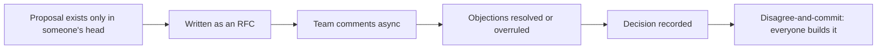

import Scenario from "../../../components/Scenario.astro";
import LevelIntro from "../../../components/LevelIntro.astro";

<Scenario>
  <Fragment slot="facts">
    

      
💬 Argued in a thread, 40+ replies

      
🔁 Same 2 points repeated by both sides

      
🚫 No decision, no owner, no deadline

    

    
People

    

      
🧑‍💻 Priya — wants to move the job queue to SQS

      
🧑‍💻 Marco — wants to keep Redis, add retries

      
🧑‍🏫 Nobody with authority to decide

    

  </Fragment>

Priya and Marco disagree about whether the job queue should move from
Redis to SQS. It starts as a two-line Slack exchange, then grows into a
40-message thread over three days: Priya keeps citing SQS's built-in
retry and dead-letter handling; Marco keeps citing the migration cost
and the team's zero AWS experience. Neither argument changes. Nobody
outside the thread can tell what's actually being decided, and by day
three, three other engineers have quietly started avoiding the channel.

**Both engineers have good points. So why does this conversation make
things worse instead of better?**

</Scenario>

Not because either of them is wrong — because nothing about the format
forces the disagreement toward a decision. A live thread has no place
to put the full context, no way to close on one option, and no rule for
what happens when reasonable people still don't agree once every
argument has been heard.

<LevelIntro
  items={[
    "What an RFC / design doc is for",
    "Disagree-and-commit as a decision rule",
    "When to escalate instead of loop forever",
  ]}
/>

- A **live argument** (Slack thread, hallway conversation, PR comment
  chain) is good at surfacing objections fast, but bad at ever
  _closing_ — there's no shared document holding the full picture, and
  no natural moment where the conversation ends with a decision instead
  of just going quiet.
- An **RFC** ("Request for Comments") or **design doc** fixes that by
  putting the proposal, the alternatives considered, and the trade-offs
  in one written document that people comment on asynchronously and
  that ends with an explicit decision recorded in the document itself.
- **Disagree-and-commit** is the rule that makes a decision actually
  possible even when consensus never arrives: once a decision-maker has
  heard the objections and decided, everyone — including whoever argued
  against it — commits to executing it as if it were their own idea,
  instead of re-litigating it in every future conversation.
- Disagreeing productively is not the same as staying quiet. The goal
  isn't fewer objections — a real blocking objection caught during
  review is far cheaper than the same mistake caught in production. The
  goal is objections that are **written down, specific, and resolved by
  a decision**, instead of repeated forever in real time.

| Format                | Good at                                    | Bad at                                      |
| --------------------- | ------------------------------------------ | ------------------------------------------- |
| Live thread / hallway | Fast back-and-forth, low friction to start | Closing — no natural end, context scatters  |
| RFC / design doc      | Holding full context, forcing a decision   | Speed — writing one takes real time upfront |

**Why does closing matter as much as raising the objection in the first
place?** Because a team that argues well but never decides pays the
argument's full cost (time, tension, stalled work) without getting the
one thing arguing was supposed to produce — an actual direction to
build in.

- **When a live disagreement is actually fine to leave live:** small,
  reversible, cheap-to-undo choices (variable naming, which linter
  rule) don't need a document — writing one would cost more than the
  decision is worth. RFCs earn their overhead on choices that are
  expensive to reverse: a data store, a public API shape, a service
  boundary.
- **When to stop debating and escalate:** if the same two people keep
  restating the same two positions with no new information after a
  couple of rounds, that's the signal to name a decision-maker (the
  proposal's owner, a tech lead, an architecture group) rather than
  keep arguing — see L2 for exactly how that handoff works.
