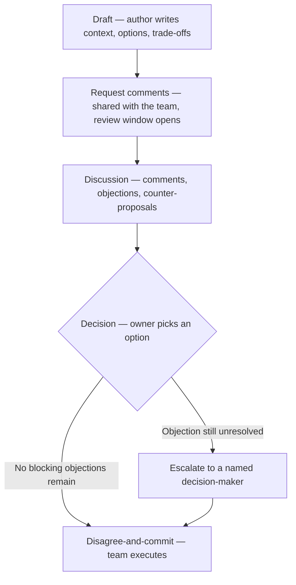

import LevelIntro from "../../../components/LevelIntro.astro";
import Checkpoint from "../../../components/Checkpoint.astro";

L1 named the problem with arguing live (no closing mechanism) and the
two fixes: an RFC as the shared document, disagree-and-commit as the
rule that ends the argument. L2 works out the actual mechanics — what
sections a real RFC needs, what a review comment should look like, who
gets to decide, and what disagree-and-commit requires from the people
who lost the argument.

<LevelIntro
  items={[
    "The 5-stage RFC lifecycle",
    "What separates a blocking objection from noise",
    "Who decides, and what commit actually requires",
  ]}
/>

## The lifecycle: from idea to decision

**If a live thread's failure mode is "never closes," what does an RFC
process add that forces a close?** A small number of named stages,
each with a clear exit condition — the document doesn't stay in
"discussion" forever because the process itself defines when discussion
ends.

| Stage               | What happens                                                                         | Exit condition                                   |
| ------------------- | ------------------------------------------------------------------------------------ | ------------------------------------------------ |
| Draft               | Author writes the proposal alone or with a small group                               | Author believes it's ready for wider eyes        |
| Request comments    | Doc is shared with the relevant team, a review window opens (e.g. 3–5 business days) | Window closes, or every open thread is addressed |
| Discussion          | People comment inline: questions, objections, alternatives                           | No new blocking objections are being raised      |
| Decision            | The named owner accepts, rejects, or amends the proposal                             | A decision is written into the document itself   |
| Disagree-and-commit | Everyone — including those who objected — executes the decision                      | Work starts; re-litigating requires new evidence |

**Why does the review window need an explicit length instead of just
"until people stop commenting"?** An open-ended window never closes for
the same reason a live thread never closes — there's no moment where
silence means agreement instead of "I haven't gotten to this yet."
A stated window (and a norm that silence by the deadline counts as
no-objection) is what turns "discussion" into a stage with an actual
exit.

<Checkpoint question="A proposal has been open for comments for two weeks with no new objections, but the author never wrote a decision into the document. Has the RFC process actually finished?">

No. Reaching silence isn't the exit condition — a recorded decision is. Without an explicit "accepted" or "rejected, here's why" written into the document, there's nothing for someone to point to later when they ask "wait, did we actually agree to this?" — which puts the team right back in the live-thread failure mode L1 described, just with extra steps. The document has to close itself out, not just go quiet.

</Checkpoint>

## What actually goes in the document

**Does an RFC need to be long to do its job?** No — it needs to contain
the specific things a reviewer needs to form an opinion, and nothing
that's just narrative padding. A minimal but real structure:

| Section                | Answers                                                                            |
| ---------------------- | ---------------------------------------------------------------------------------- |
| Context / problem      | What's actually broken or missing right now, and why it matters                    |
| Options considered     | At least two real alternatives, not one option dressed as two                      |
| Trade-offs per option  | Cost, risk, and what you give up — for every option, including the recommended one |
| Recommendation         | Which option the author is proposing, and why                                      |
| Non-goals              | What this proposal is explicitly _not_ trying to solve                             |
| Decision (added later) | The outcome, who decided, and the date                                             |

**Why does "options considered" matter even when the author already
knows which one they want?** Because a document that presents only one
option isn't asking for review — it's asking for approval of a decision
already made elsewhere. Showing the alternatives that were seriously
weighed (and why they lost) is what lets a reviewer actually evaluate
the reasoning instead of just the conclusion, and it's often where a
real blocking objection gets caught: a reviewer who knows _why_ option
B was rejected can point out a fact the author got wrong about it.

## What makes a comment a blocking objection instead of noise

**If everyone's entitled to comment, how does a reviewer avoid getting
buried under opinions that don't need to change anything?** By
separating comments into two kinds, and treating them differently:

| Type               | Looks like                                                                            | Requires before commit                                              |
| ------------------ | ------------------------------------------------------------------------------------- | ------------------------------------------------------------------- |
| Blocking objection | "This breaks X because Y — here's evidence" plus a concrete alternative               | Must be addressed: resolved, or explicitly overruled with reasoning |
| Non-blocking (nit) | Style preference, "have you considered," a question with no specific concern attached | Author may take it or leave it, no gate                             |

A comment that says "I don't love this" isn't blocking — it has no
concrete failure mode attached, so there's nothing for the author to
actually respond to. A comment that says "this will silently drop
messages under load because SQS's visibility timeout defaults to 30s
and our job runtime is 90s" is blocking, whether or not the reviewer
outranks the author, because it names a specific, checkable failure.

<Checkpoint question="A senior engineer comments 'I'm not convinced' on an RFC with no further detail. A junior engineer comments 'this will double our AWS bill based on the SQS pricing page — here's the math' on the same RFC. Which one is the blocking objection, and why?">

The junior engineer's comment, not the senior engineer's — seniority isn't what makes an objection blocking, a concrete, checkable claim is. "I'm not convinced" gives the author nothing to investigate or respond to; it's a feeling, not a finding. The pricing-math comment names a specific consequence the author can verify, argue against with numbers, or accept and revise the proposal around. Treating the senior engineer's vague discomfort as more authoritative than the junior engineer's worked-out math is exactly the failure mode a written RFC process is supposed to prevent — it forces objections to earn their weight through content, not through who's speaking.

</Checkpoint>

## Who decides, and what commit actually requires

**If reviewers disagree with each other, who breaks the tie?** Every
RFC needs a **named decision owner** before review even opens — usually
the author, or (for proposals crossing team boundaries) a tech lead or
small architecture group named in the document itself. Without a named
owner, "decision" quietly becomes "whoever argues longest," which is
the live-thread failure mode wearing a document's clothes.

**Does disagree-and-commit mean the person who lost the argument has to
pretend they agree?** No — and treating it that way is what makes the
rule fail in practice. Commit means: state your objection once, clearly,
in the document; let the owner make the call with that objection on the
record; then build the decided thing at full effort, without relitigating
it in stand-ups, without a slower "I told you so" implementation, and
without repeating the same objection in the next three related
decisions. The objection stays visible in the record — it just stops
being an active blocker once a decision is made with it accounted for.
