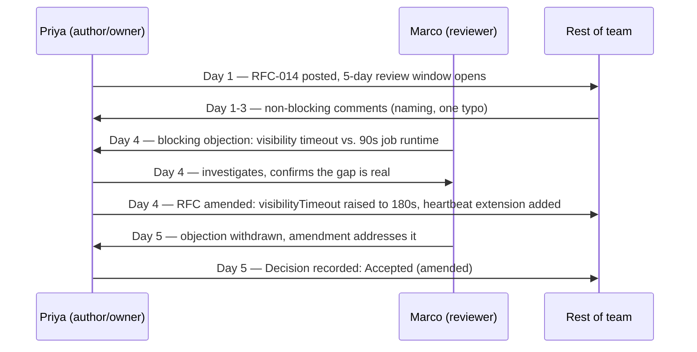

import Scenario from "../../../components/Scenario.astro";
import LevelIntro from "../../../components/LevelIntro.astro";
import Checkpoint from "../../../components/Checkpoint.astro";

<Scenario label="The RFC, start to finish">
  <Fragment slot="facts">
    <div class="not-prose flex flex-col gap-1 text-sm text-slate-700 dark:text-slate-300">
      <div class="flex items-center gap-1.5"><span>📄</span> RFC-014: Redis queue → SQS</div>
      <div class="flex items-center gap-1.5"><span>👤</span> Owner: Priya (author + decision owner)</div>
      <div class="flex items-center gap-1.5"><span>🗓️</span> 5-day review window</div>
      <div class="flex items-center gap-1.5"><span>🚧</span> 1 blocking objection, day 4</div>
      <div class="flex items-center gap-1.5"><span>✅</span> Amended, then accepted, day 5</div>
    </div>
  </Fragment>

L2 described the RFC lifecycle in the abstract. This level walks through
one real document end-to-end — the actual sections Priya wrote, the
actual objection Marco raised, and the actual line in the decision log
that closed it. Not a summary of what an RFC contains, but what one
genuinely reads like, objection and all.

**L1's version of this disagreement went nowhere after 40 messages. What
specifically does putting it in this format change about the outcome?**

</Scenario>

<LevelIntro
  items={[
    "The RFC document, section by section",
    "The actual objection thread and how it resolved",
    "Anti-patterns that quietly break the process",
  ]}
/>

## The document Priya actually wrote

```md
# RFC-014: Migrate background job queue from Redis to SQS

Status: Accepted (amended) — 2026-02-13
Owner: Priya Nair

## Context

Our Redis-based job queue has lost jobs twice in the last quarter during
Redis restarts — jobs mid-flight when Redis went down were never
retried, because Redis itself has no durable at-least-once delivery
guarantee without extra work we haven't built. Both incidents were
low-severity (retried manually, no customer impact) but the second one
took 40 minutes to notice.

## Options considered

**Option A — Move the queue to Amazon SQS.**
SQS gives at-least-once delivery, a visibility timeout with automatic
redelivery, and a built-in dead-letter queue for jobs that fail
repeatedly, all managed by AWS.

**Option B — Keep Redis, add our own durability layer.**
Write jobs to Postgres before enqueueing, poll Postgres to detect
lost jobs, and requeue them. Keeps our current tooling.

**Option C — Do nothing, rely on manual detection.**
Accept the current risk; the two incidents so far were low-severity.

## Trade-offs

| Option                         | Cost                                                                   | Risk                                                                                                   | What we give up                                              |
| ------------------------------ | ---------------------------------------------------------------------- | ------------------------------------------------------------------------------------------------------ | ------------------------------------------------------------ |
| A: SQS                         | ~~2 eng-weeks migration, ongoing AWS cost (~~$40/mo at current volume) | Team has zero production AWS queue experience                                                          | Local dev parity — needs a local SQS emulator                |
| B: Redis + Postgres durability | ~3 eng-weeks, no new infra cost                                        | Homegrown durability code is exactly the kind of thing that's hard to get right and easy to under-test | Team time better spent elsewhere; ongoing maintenance burden |
| C: Do nothing                  | ~0                                                                     | Third incident is a when, not an if, and it may not stay low-severity                                  | Nothing given up now; risk deferred, not removed             |

## Recommendation

Option A (SQS). The migration cost is real but bounded; Option B asks
us to build and maintain the exact class of durability bug we're
trying to eliminate. Option C only postpones the failure.

## Non-goals

This RFC does not cover migrating the _scheduled_ (cron-style) jobs
system — that's a separate queue with different durability needs,
tracked in RFC-015.
```

**Why does the trade-off table include a column for Option A — the
option Priya is actually recommending — instead of only listing
downsides for B and C?** Because a table that only lists costs for the
options being rejected isn't a trade-off table, it's a sales pitch
wearing one — a reviewer can't trust the comparison if the author's own
preferred option gets a pass on scrutiny. Rating every option, including
your own, the same way is what lets a reader like Marco (below) form an
independent judgment instead of just reacting to Priya's conclusion.

## The blocking objection, and how it actually resolved



Marco's actual comment, inline on the "Trade-offs" section:

> **Blocking.** SQS's default visibility timeout is 30 seconds — after
> that, if the consumer hasn't deleted the message, SQS assumes it
> failed and makes it visible to another consumer again. Our image-
> processing jobs run 60–90 seconds. As written, this migration would
> cause every image job to be picked up _twice_, because the first
> worker is still running when the message becomes visible again.
> Source: AWS SQS docs, "Visibility Timeout." This isn't addressed
> anywhere in the RFC.

Priya's reply, six hours later:

> Confirmed, good catch — I hadn't accounted for the default. Two
> fixes are possible: (1) set `VisibilityTimeout` to 180s statically,
> or (2) call `ChangeMessageVisibility` as a heartbeat every 30s while
> a job is still running, so slow jobs never get silently duplicated.
> Going with both — a 180s floor plus a heartbeat extension for jobs
> that occasionally run longer than that. Updating the RFC now.
> Marking this resolved once the doc reflects it — flag me if it
> still doesn't cover your concern.

<Checkpoint question="Marco's objection was blocking and it delayed acceptance by a full day. Was raising it still worth the cost, given the RFC eventually got accepted almost exactly as originally proposed?">

Yes — and the fact that the final shape is close to the original proposal doesn't mean the objection didn't matter, it means the objection got fixed cheaply because it was caught before implementation. If Marco had stayed quiet (or only said "I'm not sure about this" without the specifics), the same gap would have surfaced in production instead: every image job silently double-processed, discovered only after customers noticed duplicate results. One day of review delay against a production incident and a rollback isn't a close call. The objection's value isn't measured by how much it changed the final document — it's measured by where the bug got caught.

</Checkpoint>

**What would have happened if Priya, as the decision owner, had
disagreed with Marco's math instead of confirming it?** She still could
have proceeded — an owner can overrule a blocking objection — but
disagree-and-commit would then have required her to write the reasoning
into the document ("timeout mismatch confirmed, but our jobs already
have idempotent writes, so double-processing is a performance cost, not
a correctness bug — accepting that trade-off") rather than simply
outvoting Marco by staying silent on his point. The objection has to be
answered on the record, even when the answer is "acknowledged, and
overruled, for this specific reason."

## Anti-patterns that quietly break the process

| Anti-pattern                    | Looks like                                                                                            | Why it breaks the process                                                                                                             |
| ------------------------------- | ----------------------------------------------------------------------------------------------------- | ------------------------------------------------------------------------------------------------------------------------------------- |
| Silent disagreement             | Reviewer has real doubts, says nothing, then criticizes the decision after it ships                   | The objection never existed on the record, so nobody could weigh or address it — this is worse than a loud objection, not more polite |
| Relitigating after commit       | Bringing the same rejected argument back up in an unrelated meeting weeks later, with no new evidence | Disagree-and-commit specifically requires new evidence to reopen a decision — otherwise every decision stays permanently provisional  |
| Vague objection, no alternative | "I don't think this is right" with no specific failure named                                          | Gives the author nothing to investigate or respond to — indistinguishable from a mood, not a finding                                  |
| Approval theater                | Reviewer skims, leaves a 👍, never actually checks the trade-off table                                | Defeats the point of async review — the document gets a stamp without getting the scrutiny that catches a Marco-style bug             |
| No named owner                  | RFC posted to a channel with no explicit decision-maker                                               | Decision defaults to "whoever argues longest," which is the live-thread failure mode in a document's clothes (see L2)                 |

<Checkpoint question="A teammate approves an RFC with a 'looks good to me!' comment, but later says in a retro that they'd actually had doubts about the SQS cost estimate the whole time. What specifically went wrong here, separate from whether the cost estimate turns out to be accurate?">

The process broke at the review step, regardless of whether the cost estimate turns out right or wrong. An approval is supposed to mean the reviewer actually weighed the trade-offs and found no blocking issue — "approval theater" from the table above is exactly a stamp with no scrutiny behind it. The teammate's silence didn't just fail to help; it actively misinformed the process, because their approval was read as "I checked this and it's fine" when it actually meant "I didn't want to raise it." A wrong-but-stated objection is recoverable — someone can check the math. An unstated one is invisible until it resurfaces as after-the-fact blame, which is worse for the team than the disagreement itself would have been.

</Checkpoint>

## Beyond this one example

Priya and Marco's exchange resolved cleanly: one blocking objection,
one round of investigation, one amendment, done. **What would need to
change about this same process if the objection had come from someone
outside the immediate team — say, a security reviewer flagging that
SQS queue contents aren't encrypted at rest by default — and Priya
disagreed that it mattered for this data?** Or, differently: what
changes if two reviewers raise _conflicting_ blocking objections, each
with solid evidence, that can't both be satisfied by the same design?
Neither case is answered by anything shown above — the mechanics here
(name the objection, investigate, amend or overrule with reasoning) are
the same, but a cross-team or conflicting-objection case usually needs
the escalation path from L2 (a named decision-maker above both
reviewers) rather than the author resolving it alone. The worked
example above is one instance of the process, not the whole shape of
what it has to handle.
