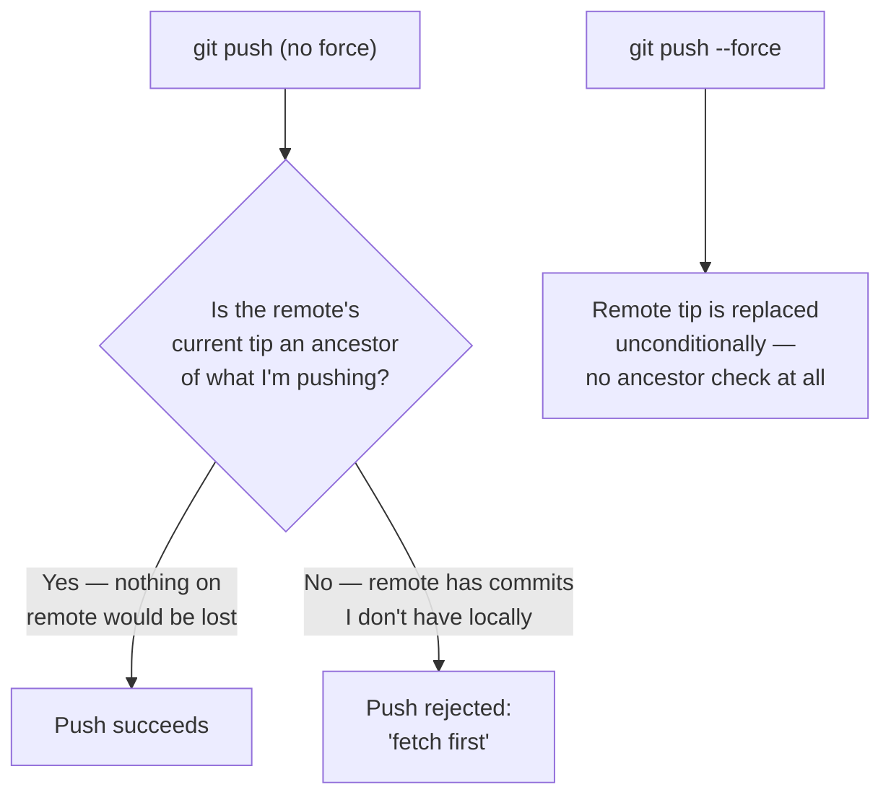

## Why a normal push protects against this, and force explicitly disables that protection

**If losing a teammate's commit is this dangerous, why does `git
push --force` exist at all?** Because rewriting your own not-yet-shared
history (squashing commits, fixing a typo in a commit message before
anyone's built on it) is a completely normal, safe operation — the
danger only appears once someone else has already based work on the
commits being rewritten. A normal push has a built-in safety check for
exactly this:

A normal push checks whether the remote's current tip is an ancestor
of the commit being pushed — if it is, nothing on the remote would be
lost, so the push is safe. If it isn't (because the remote moved
since the last fetch), git rejects the push rather than guess.
`--force` exists specifically to skip that check — which is
necessary for legitimate history rewrites, but also removes the one
protection that would have caught the Scenario's problem.

## What "the remote branch's ref" actually is

**When people say a force-push "overwrites history," what's actually
being overwritten?** A branch, on the remote, is really just a named
pointer to one specific commit (its "tip"). Force-pushing doesn't
delete any commit objects directly — it just moves that pointer to a
different commit. Any commits that were only reachable by walking
backward from the _old_ pointer position, and aren't reachable from
the _new_ one, become effectively invisible on that branch — still
technically in the repository's object database for a while, but
nothing points to them anymore, and nobody browsing the branch will
ever see them.

**Does this mean the teammate's lost commit is unrecoverable?** Not
immediately — it likely still exists as an object in the repository,
and the _original author's own local copy_ still has it. But from the
remote branch's perspective, and for anyone who doesn't have a local
copy of that specific commit, it's gone — which is exactly why this
unit's Scenario describes it as the commit "disappearing," even
though nothing was technically deleted.

## Failure modes at this level

- **Treating "I only rebased my own commits" as proof nothing else
  could be affected.** The rebase itself only touches the rebaser's
  commits — but the force-push that follows can still discard
  someone else's commits if the remote moved in the meantime.
- **Assuming a rejected push means something is broken.** A normal
  push rejection ("fetch first") is git's safety check working
  correctly, not a sign of a git problem — the fix is fetching and
  reconciling, not reaching for `--force` reflexively.
- **Force-pushing to a shared branch out of habit from personal
  branches.** A workflow that's perfectly safe on a branch nobody
  else touches becomes genuinely dangerous the moment that branch is
  shared, without the command itself looking any different.
