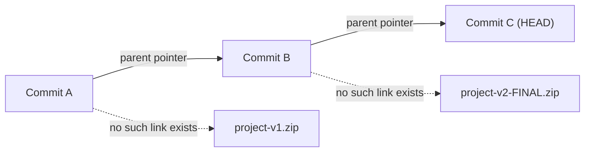

import Scenario from "../../../components/Scenario.astro";

<Scenario>
  <Fragment slot="facts">
    

      
📁 <code>project-v2-FINAL.zip</code> — Priya's copy, has the login fix

      
📁 <code>project-v2-FINAL-REAL.zip</code> — Alex's copy, made without seeing Priya's

      
❓ Neither filename says which fix is inside, or which is newer

    

    
What's missing

    

      0 of 3
      questions a zip file can answer
    

    

      

    

    

      
1️⃣ Why did this change?

      
2️⃣ Which copy has both people's work?

      
3️⃣ Exactly when did the bug appear?

    

  </Fragment>

Priya finishes the login fix and emails `project-v2-FINAL.zip` to Alex. Alex,
working from an older copy he'd already unzipped, makes an unrelated tweak and
saves his own folder back as `project-v2-FINAL-REAL.zip` — without ever
opening Priya's file. Two hours later, nobody can say which zip has both
fixes. Priya's login change is simply absent from Alex's copy: no message
explaining why, no diff showing what's different, no record of when it went
missing.

**Both files are named "final." Neither is complete, and there's no way to tell that from the filenames alone. What information would you need to have been recorded automatically, at the moment each save happened, to answer any of the three questions above?**

</Scenario>

The answer version control gives: record every save as a labeled, comparable,
permanent snapshot — automatically, not by hand.

- The naive alternative to version control is manual copies: `project-final.zip`, `project-final-v2.zip`, `project-final-v2-REAL.zip`. It fails for three reasons at once: no record of _why_ something changed, no safe way to combine two people's edits, and no way to find the exact moment a bug was introduced.
- Git's core idea: instead of tracking _changes_ file-by-file (like "track changes" in a word processor), it takes a **full snapshot** of the entire project every time you commit. Unchanged files aren't re-copied — they're referenced by content hash, so snapshots are cheap even though they're "full."
- Three states every tracked file moves through: **working directory** (what's on disk right now) → **staging area** (what you've marked to include in the next snapshot) → **repository** (the permanent, committed history).
- A **commit** is an immutable snapshot plus metadata: who, when, why (the message), and a pointer to the previous commit — that chain of pointers is the entire history of the project.
- Because every commit points to its parent, history is a chain (usually a graph, once branching enters the picture) you can walk backward through — that's what makes "undo to any past state" possible, not just "undo the last action."
- A **branch** is nothing more than a movable label pointing at a commit — creating one is instant and cheap precisely because it doesn't copy any files, just adds a pointer.
- Distributed means every clone has the _entire history_, not just the latest snapshot — there's no single point of failure, and you can commit, branch, and view history entirely offline.

## Manual copies vs. Git, side by side

Every one of the three questions from the scenario above maps to something manual copies genuinely cannot do, and something a commit does automatically:

| Question a zip file can't answer   | What a commit records instead                            |
| ---------------------------------- | -------------------------------------------------------- |
| Why did this change?               | A commit message, written at the moment of the change    |
| Which copy has both people's work? | A merge — a new snapshot combining both parent snapshots |
| Exactly when did the bug appear?   | `git log` / `git bisect` walk the commit chain directly  |

A zip file sitting in a folder has no pointer back to the zip it was copied
from — Alex's `-REAL` copy and Priya's `-FINAL` copy are two dead ends with no
recorded relationship. A commit's parent pointer is exactly the link that's
missing on the left side of the diagram above, and it's what the rest of this
unit builds on.
