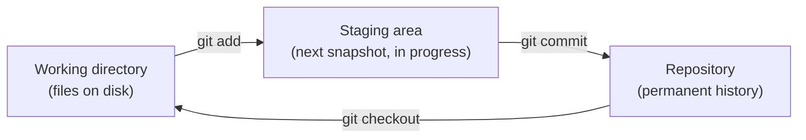

## The manual-copies failure mode, made concrete

```
project/
  main.js
  project-backup.js
  project-backup-fixed.js
  project-FINAL.js
  project-FINAL-v2.js
  project-FINAL-v2-actually-final.js
```

This isn't a strawman — it's what every team without version control converges on, because the underlying need (go back to an earlier state, know what changed and why, let two people work without overwriting each other) doesn't go away just because there's no tool for it. Every one of those files is a **whole-file manual snapshot**, taken by hand, at the mercy of whoever remembered to make it.

## What a commit actually is


Each box is a full, addressable snapshot of the project at that point — not a diff from the previous one. Git _computes_ diffs on demand for display (`git diff`, `git log -p`), but what's actually stored is snapshots, deduplicated by content: a file that didn't change between commit B and C is stored once and referenced twice, not copied twice. This is why committing is fast regardless of project size — it's proportional to what changed, not what exists.

## The three-state model



The staging area is the part manual-copy workflows have no equivalent for: it lets you build a commit out of _some_ of your current changes, not all-or-nothing. Edit five files, but only three of them belong to the fix you're about to describe? Stage those three, commit, then stage and commit the other two separately — each commit stays a coherent, describable unit instead of "various changes."

## Why branches are cheap

```python
function create_branch(name):
    current_commit = resolve(HEAD)
    write_ref(f".git/refs/heads/{name}", current_commit)
    # That's it — no files copied, no snapshot taken.
    # A branch is a 40-character pointer to a commit, nothing more.
```

Compare this to the manual-copies equivalent of "try an experimental change without risking the working version" — copying the entire project directory. Git's branch creation is O(1) regardless of project size because it never touches the working files; it's purely a new named pointer into history that already exists.

## Content-addressing: why identical content is never stored twice

Every object Git stores (a file's content, a directory listing, a commit) is identified by the SHA-1 hash of its own content, not by a filename or path. Two files with identical content — even in different commits, different branches, or different parts of the tree — hash to the same value and are stored exactly once. This is also what makes a commit hash a trustworthy fingerprint of an entire project state: if even one byte anywhere in the tree changed, the commit's hash is different, guaranteed.
