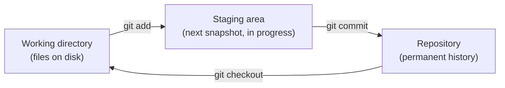
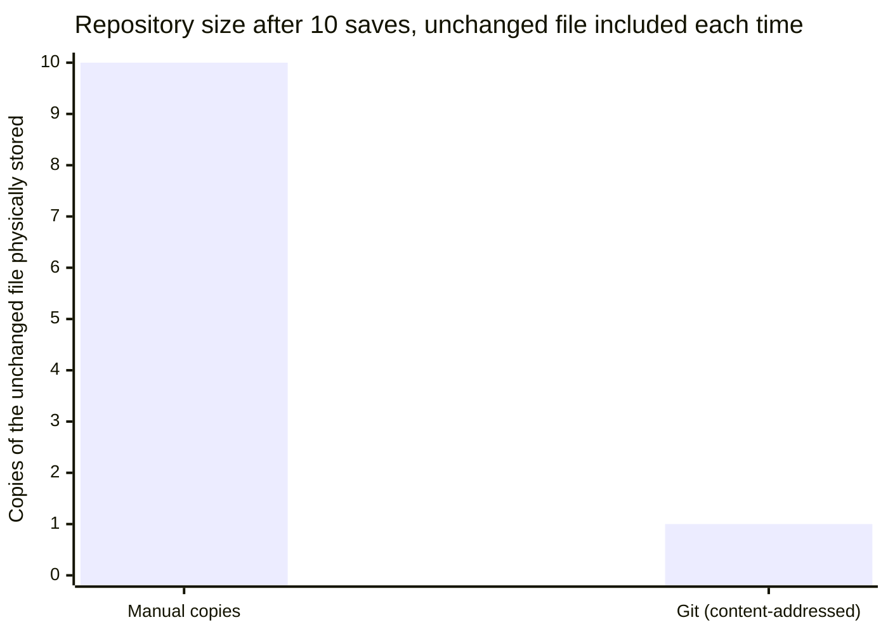

## The manual-copies failure mode, made concrete — what does the mess actually look like at scale?

```
project/
  main.js
  project-backup.js
  project-backup-fixed.js
  project-FINAL.js
  project-FINAL-v2.js
  project-FINAL-v2-actually-final.js
```

This isn't a strawman — it's what every team without version control converges on, because the underlying need (go back to an earlier state, know what changed and why, let two people work without overwriting each other) doesn't go away just because there's no tool for it. Every one of those files is a **whole-file manual snapshot**, taken by hand, at the mercy of whoever remembered to make it. Six files, and there's still no way to answer "which one is safe to delete?" without opening every single one.

## What does Git actually store when you commit — a diff, or something else?


Each box is a full, addressable snapshot of the project at that point — not a diff from the previous one. Git _computes_ diffs on demand for display (`git diff`, `git log -p`), but what's actually stored is snapshots, deduplicated by content: a file that didn't change between commit B and C is stored once and referenced twice, not copied twice. This is why committing is fast regardless of project size — it's proportional to what changed, not what exists.

## If commits are full snapshots, why doesn't the repository grow one full-project-copy per commit, the way the zip folder did?

Because "full snapshot" describes what a commit _represents_, not what gets physically copied to make one. The three-state model below is the mechanism — watch which arrow actually moves file bytes around, and which ones just move pointers:



The staging area is the part manual-copy workflows have no equivalent for: it lets you build a commit out of _some_ of your current changes, not all-or-nothing. Edit five files, but only three of them belong to the fix you're about to describe? Stage those three, commit, then stage and commit the other two separately — each commit stays a coherent, describable unit instead of "various changes."

## Why is creating a branch nearly instant, no matter how large the project is?

Compare this to the manual-copies equivalent of "try an experimental change without risking the working version" — copying the entire project directory, which takes longer the bigger the project gets. A Git branch doesn't do that:

```python
function create_branch(name):
    current_commit = resolve(HEAD)
    write_ref(f".git/refs/heads/{name}", current_commit)
    # That's it — no files copied, no snapshot taken.
    # A branch is a 40-character pointer to a commit, nothing more.
```

Git's branch creation is O(1) regardless of project size because it never touches the working files; it's purely a new named pointer into history that already exists.

## What actually stops "two files, byte-for-byte identical" from being stored twice?

Every object Git stores (a file's content, a directory listing, a commit) is identified by the SHA-1 hash of its own content, not by a filename or path. Two files with identical content — even in different commits, different branches, or different parts of the tree — hash to the same value and are stored exactly once. This is also what makes a commit hash a trustworthy fingerprint of an entire project state: if even one byte anywhere in the tree changed, the commit's hash is different, guaranteed.

| Storage model              | Identical content across N snapshots | Growth as project size increases          |
| -------------------------- | ------------------------------------ | ----------------------------------------- |
| Manual copies (whole file) | Stored N times, once per zip         | Linear in project size, every single save |
| Git (content-addressed)    | Stored once, referenced N times      | Proportional to what actually changed     |



Ten manual saves of a project that includes one never-edited file means that file sits on disk ten separate times — once per zip. Ten Git commits over the same unchanged file mean it's hashed, found to already exist in the object store, and referenced ten times from one stored copy. This is the concrete mechanism behind "snapshots are cheap even though they're full" from L1 — try dragging the numbers in this page's interactive demo to see how the gap between manual copies and Git changes as the project gets bigger or a larger share of it changes each time.
