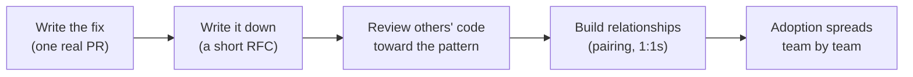

import Scenario from "../../../components/Scenario.astro";
import LevelIntro from "../../../components/LevelIntro.astro";

<Scenario label="Three retry loops, zero shared code">
  <Fragment slot="facts">
    

      
🧑‍💻 <strong>Dana</strong> — senior engineer, no direct reports, no authority over the other teams

      
🔁 <strong>3 teams</strong> — payments, notifications, search-indexing — each hand-wrote their own retry/backoff logic

      
🐛 <strong>2 of 3</strong> retry a non-retryable 400 error, hammering a downstream service during its worst incidents

      
📅 <strong>6 weeks</strong> — how long it took all three teams to adopt one shared retry library, without Dana filing a single ticket demanding it

    

  </Fragment>

Dana notices the same bug pattern in three unrelated codebases within a
month: payments, notifications, and search-indexing have each hand-rolled
their own retry logic for calling downstream services, and two of the
three retry on **every** failure — including a `400 Bad Request` that will
never succeed no matter how many times it's retried. During an incident
on the payments side, that bug turns a downstream service's five-minute
blip into a twenty-minute pile-up, because payments' retry loop keeps
hammering it with the same doomed requests. Dana isn't payments' tech
lead, doesn't manage anyone on notifications or search-indexing, and has
no mechanism to force any of the three teams to change anything.

**Six weeks later, all three teams are using one shared, well-tested
retry library, and none of them were told to. What did Dana actually do
between noticing the bug and that outcome — and why does "write a Slack
message asking people to be more careful" reliably fail at the same
problem?**

</Scenario>

<LevelIntro
  items={[
    "Why influence without authority is the staff-level default, not an edge case",
    "The four channels: code, writing, review, and relationships",
    "Adoption as evidence — the only proof influence worked",
  ]}
/>

## Why "just tell people" doesn't work

A message like "hey, everyone's retry logic should check whether an
error is retryable before retrying" is technically correct and changes
nothing. It has no owner, no deadline, no artifact anyone can point to
later, and it asks three separate teams — each with their own backlog,
their own priorities, and their own already-working code — to go do
unscheduled work for a problem they haven't personally been burned by
yet. **The bug is real. The message alone has no mechanism for turning
"real" into "someone's Tuesday."**

## The shape of the actual problem

| What Dana has                                        | What Dana doesn't have                           |
| ---------------------------------------------------- | ------------------------------------------------ |
| Deep knowledge of the bug and a working fix          | Authority to assign it to any of the three teams |
| Credibility from past, unrelated good work           | A shared manager with the three team leads       |
| Time to write code, docs, or review other teams' PRs | The ability to block anyone's release on this    |

This is the exact position most staff-level influence happens from: real
expertise and real stakes, with no reporting line to lean on. The
technique this unit covers isn't a workaround for that gap — it's the
actual job description at that level. A staff engineer who can only
drive change through people who report to them has a much smaller radius
than the org chart suggests they should.

## The four channels, at a glance

Dana didn't use one lever — she used four, in sequence, each doing a
job the others can't:

- **Code** — a real, working example in one codebase, not a proposal.
  Proof the fix exists and works, not just an argument that it should.
- **Writing** — a short RFC turning "Dana thinks this is a problem" into
  a document other people can read, comment on, and point back to later.
- **Review** — nudging the pattern into other teams' code one pull
  request at a time, at the moment it's most useful to the author.
- **Relationships** — the trust built over many small, unrelated
  interactions that makes a team lead actually read Dana's RFC instead
  of letting it sit unread in a queue of forty others.

L2 covers each channel's actual mechanism — what it does that the others
can't, and why skipping straight to "write the RFC" without the working
code first tends to fail. L3 walks through Dana's real six weeks
end-to-end, including the one team that pushed back and what changed
their mind.
